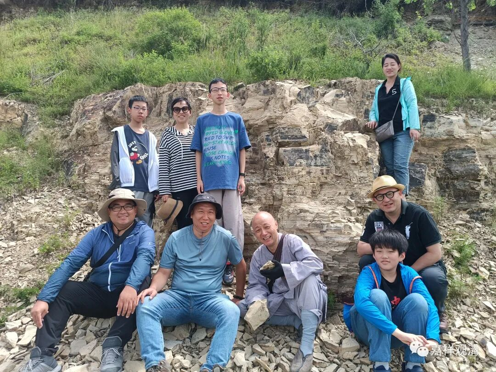

**野外的科考和尚**

今天继续科考……

今天的项目是“化石的亲密接触”。

一早就来到某化石点，小队员们提着小锤子就上了。

李博士说，辽西“热河生物群”最常见的生物化石种类有三种：1、狼鳍鱼；2、东方叶肢介；3、三尾拟浮游。

李博士和杨老师带着我们找……（其实“大力出奇迹”还不如四处找碎片）

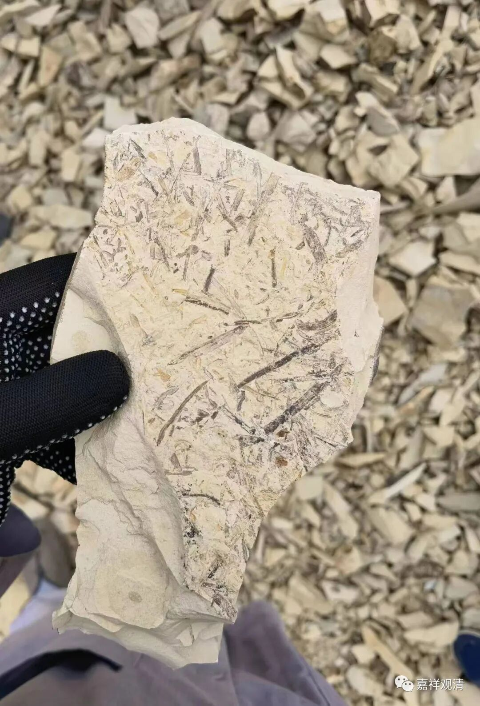

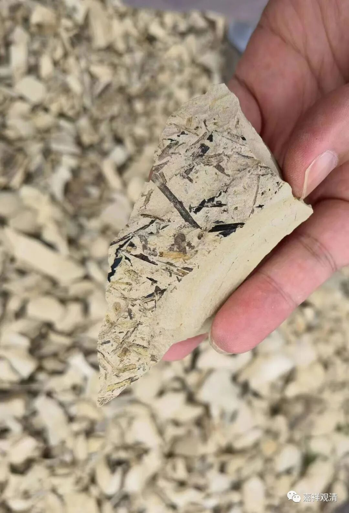

最初找的是这种植物碎片的化石。凿了一批，发现有一个土层里很多这种植物碎片。

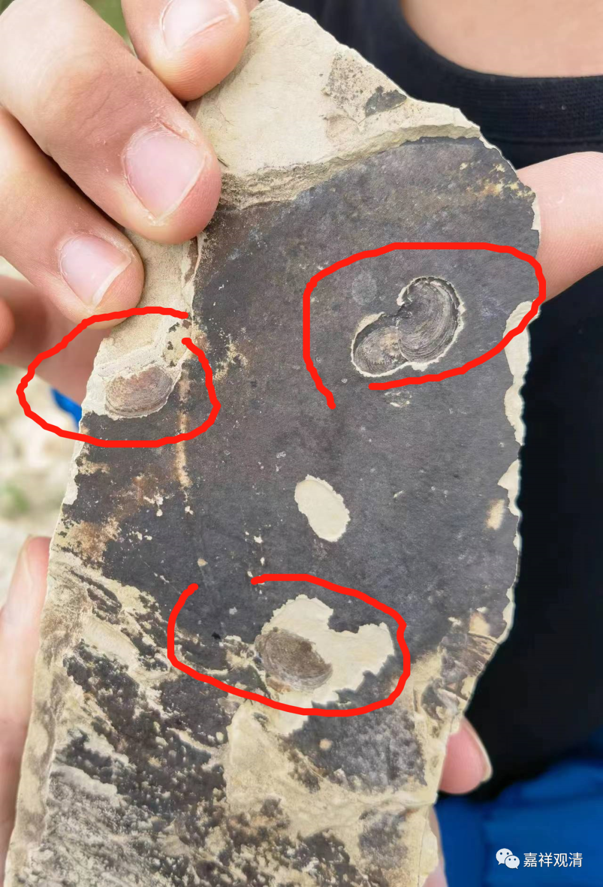

这就是东方叶肢介的化石。

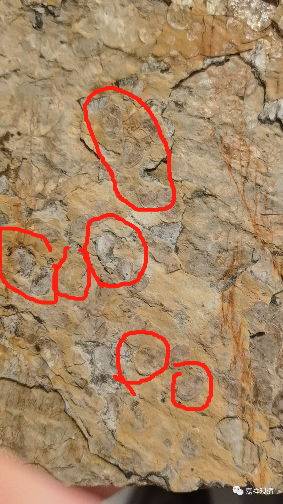

这也是东方叶肢介化石（这是后来在某博物馆门口捡的）。这是一种无脊椎节肢动物。

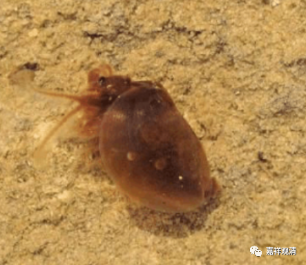

今天的叶肢介长上面这样，据说现在经常被当作鱼食。

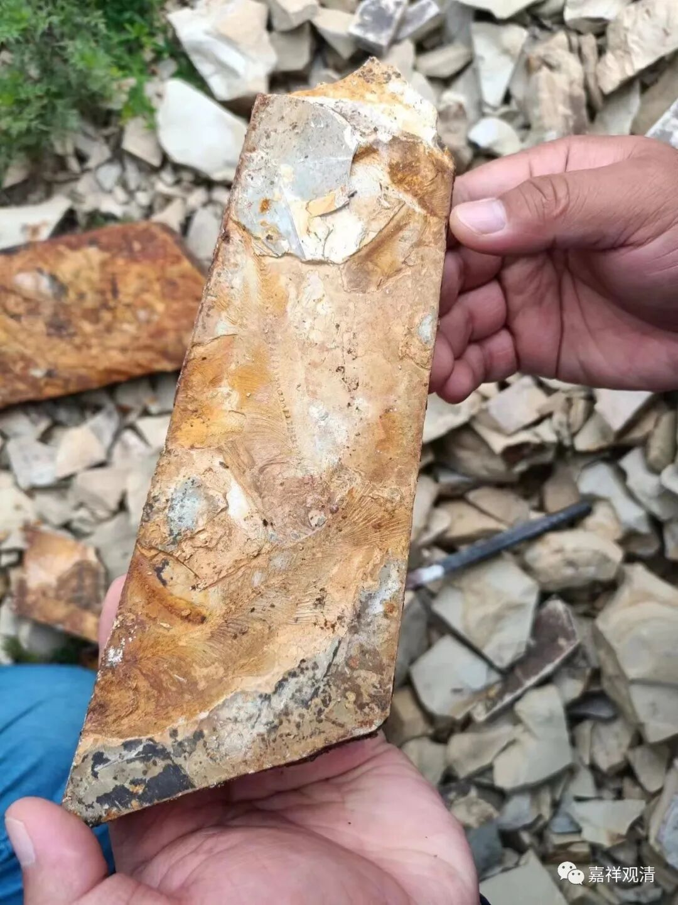

狼鳍鱼

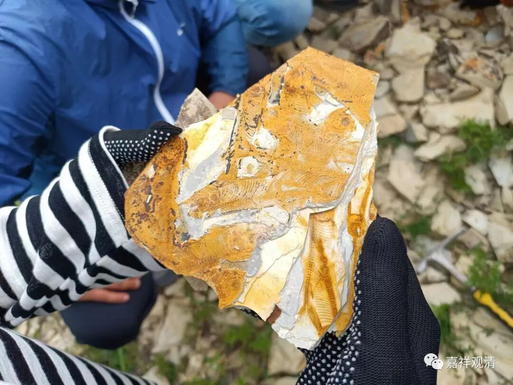

都是狼鳍鱼

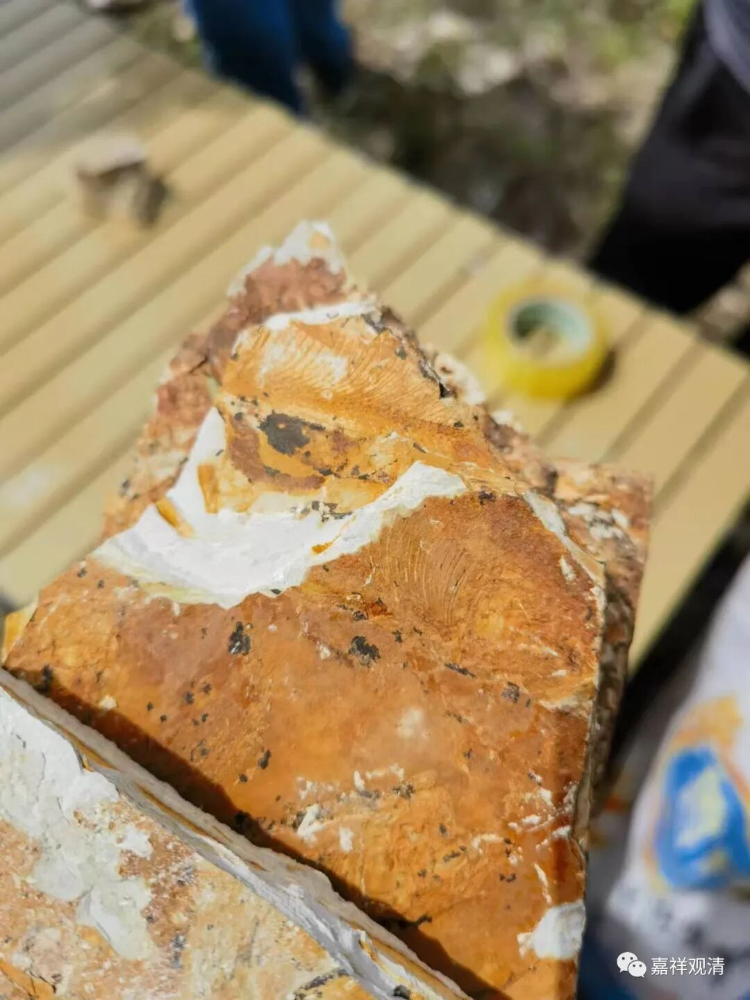

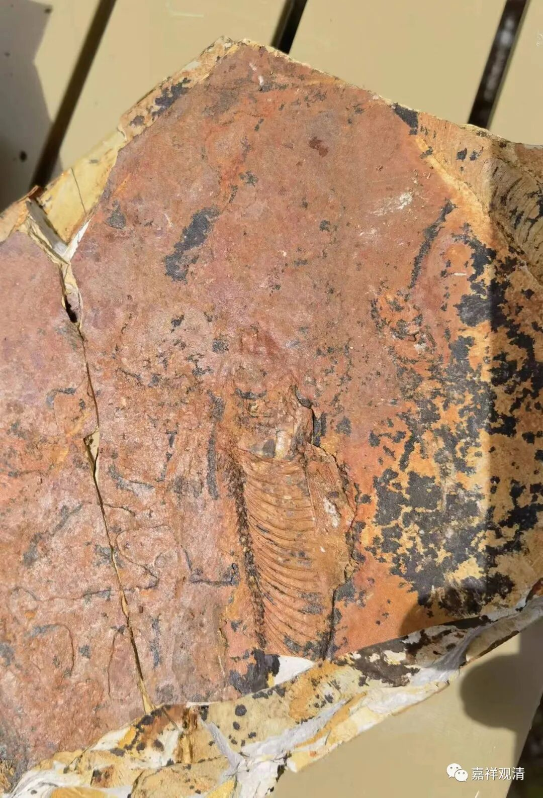

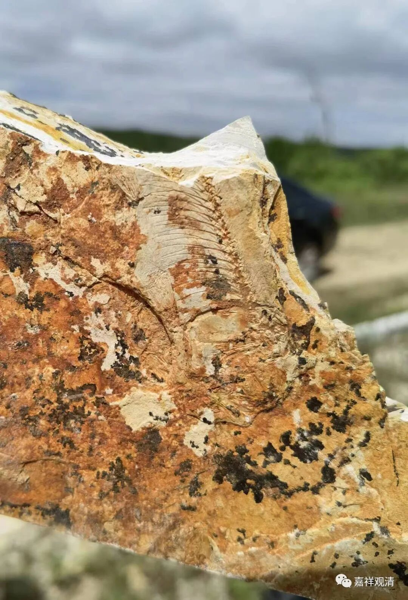

这些狼鳍鱼化石需要修理。

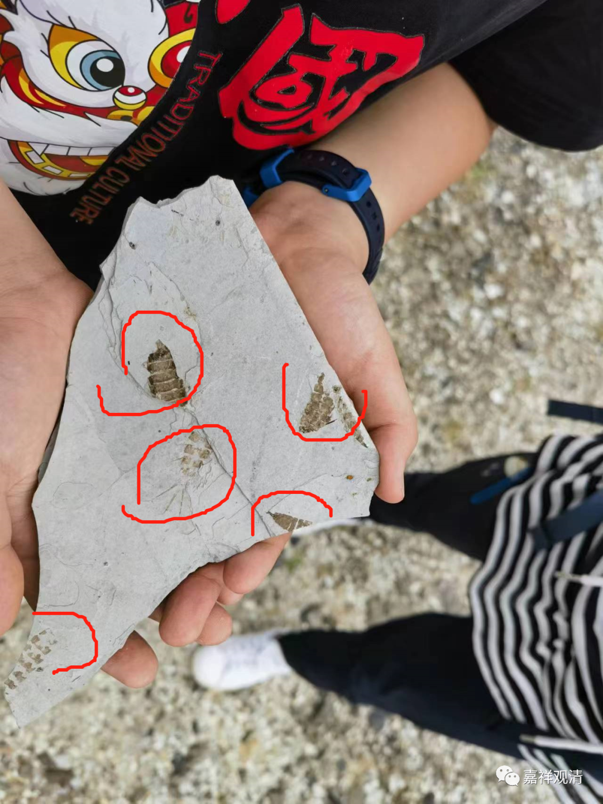

这是三尾拟浮游（有三根尾巴），我们最博学的小朋友在博物馆门口捡的——他来之前就做了很多功课，也参加过很多化石夏令营，俨然是我们团的“专家”了，博士们不在的时候，我们都通过他来“鉴定”呢。（前排我左边就是他。）

