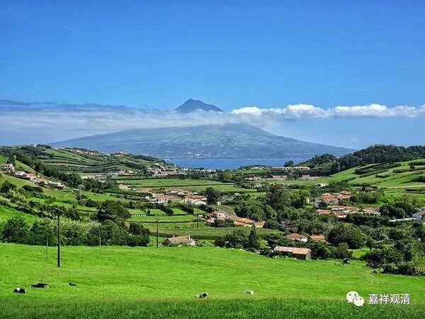

**微课堂佛教史 386·1

如果被写碑铭的是一位禅宗的大师的话，你要找一些品级低一点的名人好像都下不去手，一般都得是相当高级的名人，基本上得是宰相级的官员或者地方大员——这个地方大员基本上是相当于节度使（省长）这一级的人物。就是说，得由这一类的人来写墓志或者像什么《鲁迅先生二三事》等等，必须要由这种级别的人物来写。在禅宗成为佛教的主流以后，这种情况就越来越多了。

但是他们所写的这些东西，其实可信度没有那么高。如果在没有其他证据的背景之下，这些东西的可信度是可以考虑的，当然是可以用的。不过，也没有那么……就是说，它不算铁证。

关于六祖大师的故事有很多碑文，这些碑当中，有些是真的故事，有些是假的故事。并不是写在碑上的就一定是真的故事，并不是只要王维写的就是对的，不是这样的。王维虽然也信佛，也接触过禅宗，但是他所写的碑铭，并不就是“说一不二”的。

所以，对于这种情况，我说它是两面性的。一方面，有士大夫阶层在介入创作，就有了更多的文献来记载，留下更多的历史线索。但是另一方面，错误的东西也因此而出现了。比如说天王道悟禅师和天皇道悟禅师，实际上“天王”和“天皇”本来就是一个方言的差异，是吧？

另外还有一个什么情况呢？就是外行来写的话，有些东西他会理解错。比如说对在座的绝大部分人而言，肯定是搞不清楚在哪位师父跟前学习和在哪位师父跟前嗣法有什么差别。但是在禅宗当中，是有差别的。比如说天皇道悟禅师，他以前有没有去过马祖道一禅师那里学习？去过的，去问过学。你说他是马祖道一禅师的学生，没有问题。但是他嗣的法是谁的呢？他继承的是石头希迁禅师的法。

这里面就会出现问题。假如你是一个半吊子，对禅宗不是很了解，即使像我们在座的很多人，可能对佛教已经很了解了，但是你对这个事情不了解，你脑子里面记错了，你就记载错了。你直接说天皇道悟禅师是马祖道一禅师的弟子，这句话本身是没错的，因为他确实在马祖道一禅师那里学习过。但是真正要说“嗣法弟子”的话，就得是在石头希迁禅师门下，绝不能说“嗣法于马祖道一”。但外行不懂……

那么这个事情经过一传二传，传到后面的时候，又从天皇道悟出现一个天王道悟，然后就变成禅宗内部要打架了——这个事情是现实存在的，就是有人说后期的云门宗和法眼宗都是从马祖道一禅师门下传下来的，这样以讹传讹，还偏执地不容置疑……（唉，跟外行吵架是很累的，法尊法师说：“宁跟明白人打架，不和糊涂人说话”就是这个意思。）

我前面讲过，马祖道一禅师门下的弟子去石头希迁禅师那里学习的情况并不是没有，但是相对来说比较少，而石头希迁禅师门下这几位著名的禅师，基本上都曾经在马祖道一禅师门下浸淫过或者待过很长时间。从法脉的传承上来说，天皇道悟禅师应该是算是石头希迁禅师门下的。

有些圈内的规矩，外人是不懂的，不懂而硬写，就会有硬伤……

