**深入保护区**

从承德出发，深入茅荆坝国家级自然保护区……

上面这张图，很多人已经看到了。这是保护区里的石海。石海是第四纪冰川的遗迹，同样的石海在茅荆坝自然保护区有好多个，我们看到了两个，这个是两个中较小的一个，最大的石海大约是这个石海的十倍面积。

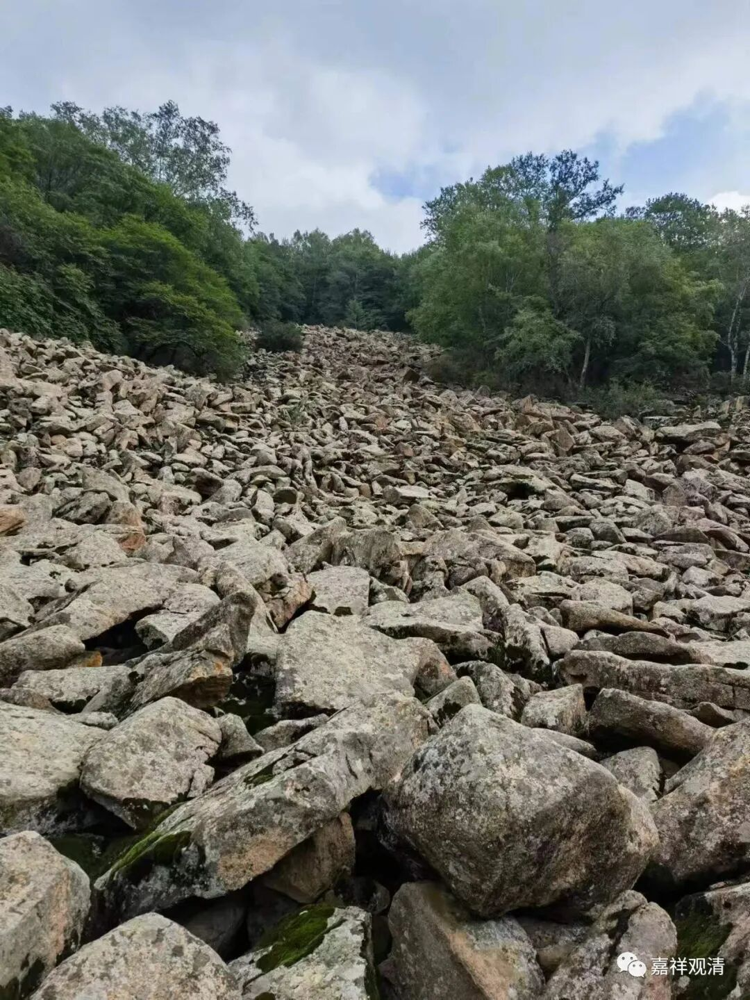

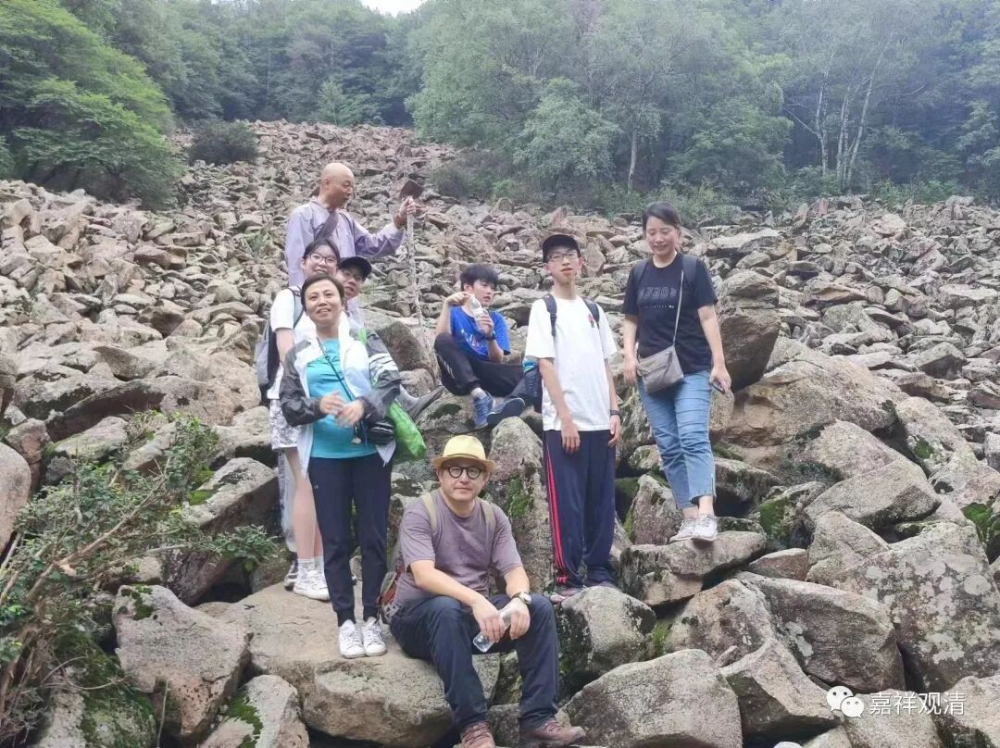

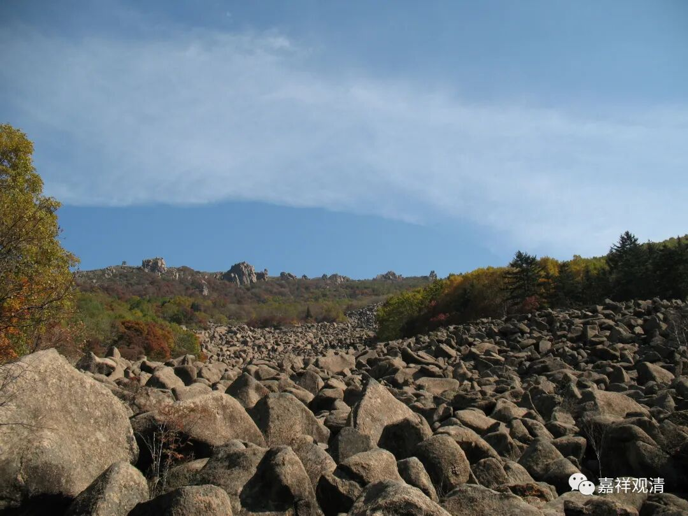

网上找的别人拍的保护区的石海

我们有此地的资深护林员老张带我们深入茅荆坝国家级自然保护区，这位“资深外援”在这里干了二十年了。

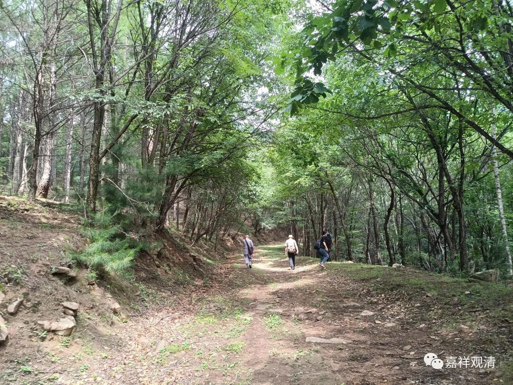

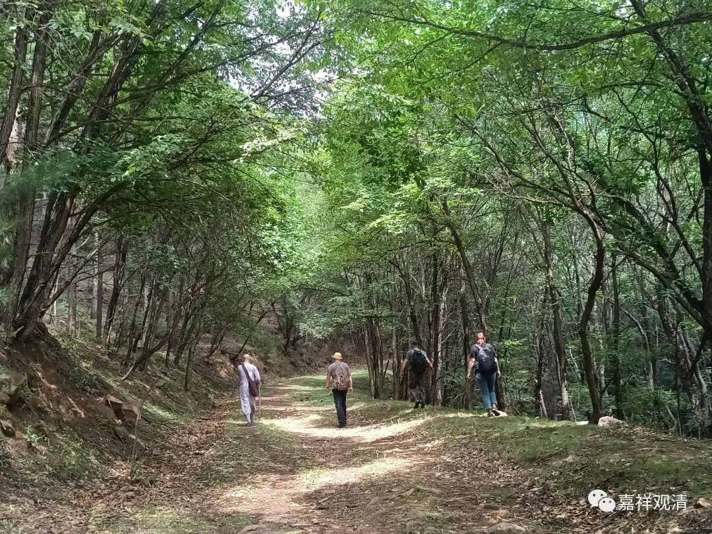

他说，原来这里是林区，伐木外运，作为自然保护区以后外人就禁止入内了，原先可以开大车的路渐渐荒废为山林的“山路”。我们问能看到野兽吗，比如熊，他说，野兽基本看不到，要看到那得很巧才行。山里有豹子，老张说豹子活动范围很大，能有百十里的范围，其他都是些小野兽——山鸡、野猪、狍子（我们在路上还看到獾的尸体，大概中小型犬大小）……

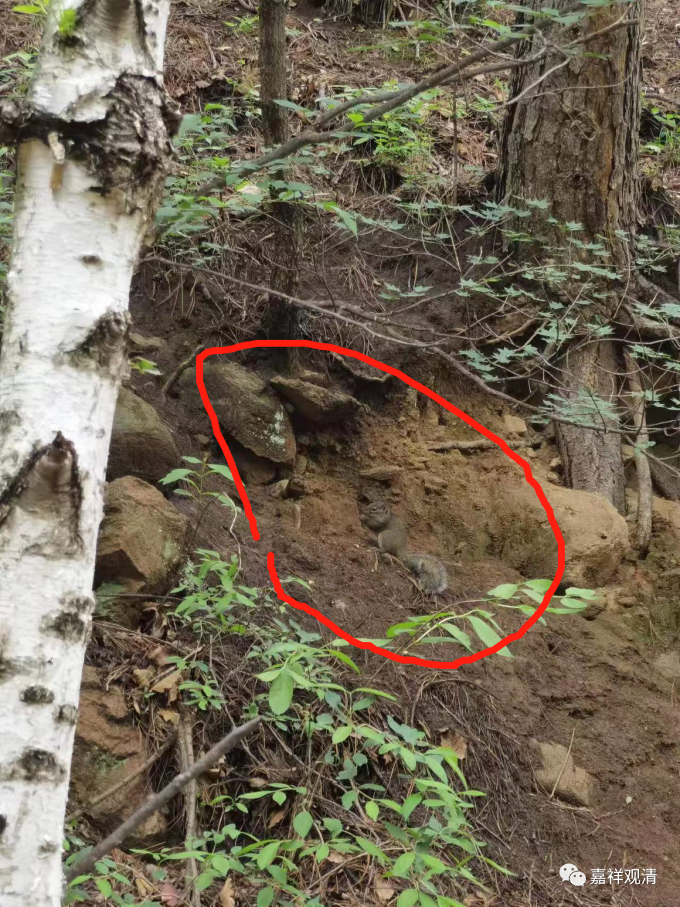

偶遇松鼠，三次

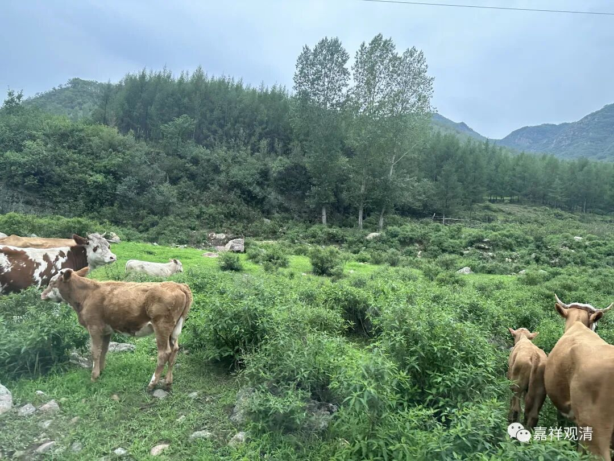

山里有村民放的牛，山上还有，管不了

今年山里旱得非常厉害，昨天下了点雨，水沟里流的都是黄泥浆，老张说，往年这些溪水水量很大，也很清，今年都没水了——我们甚至走了一段以前的水道作为上山的捷径。

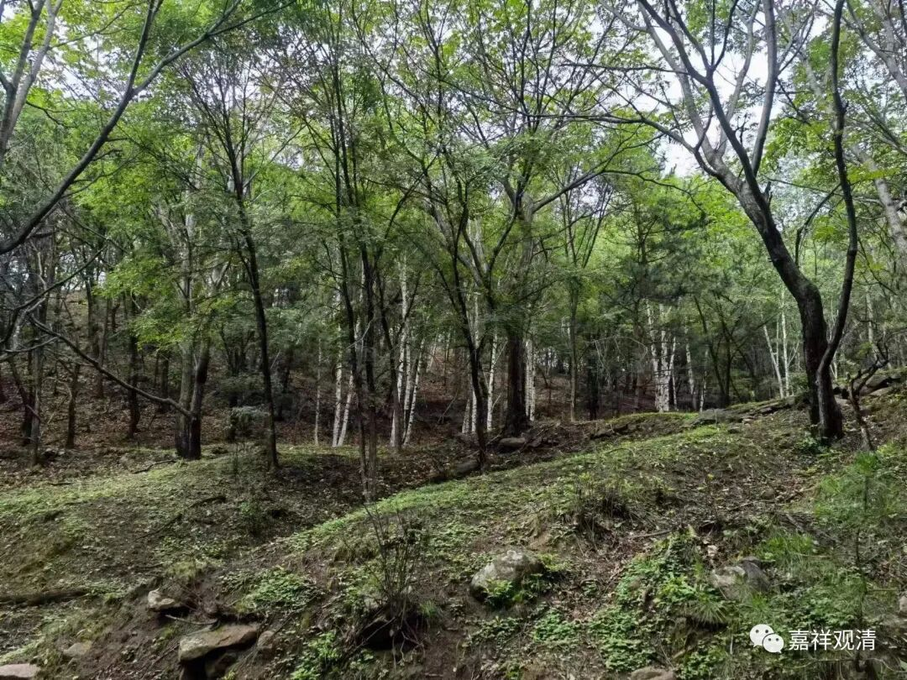

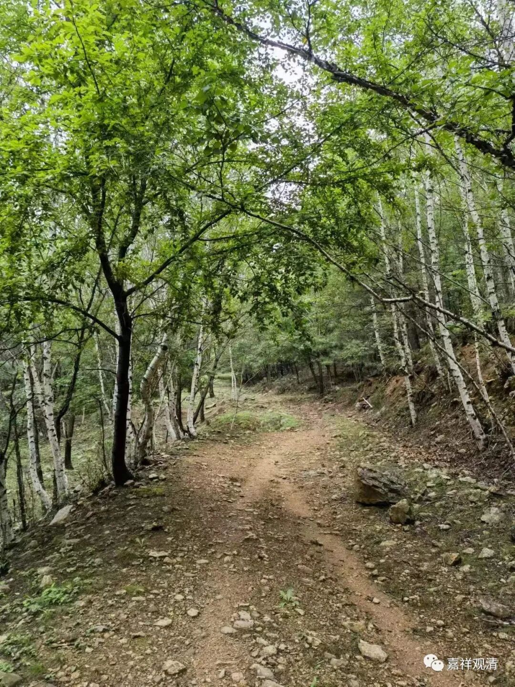

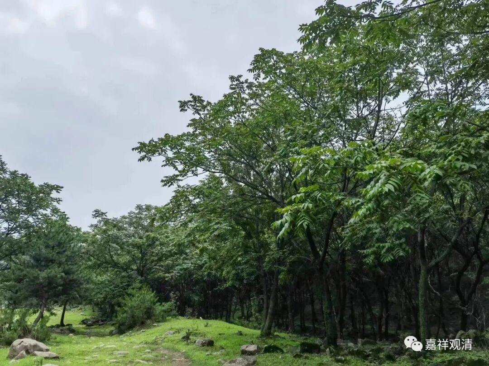

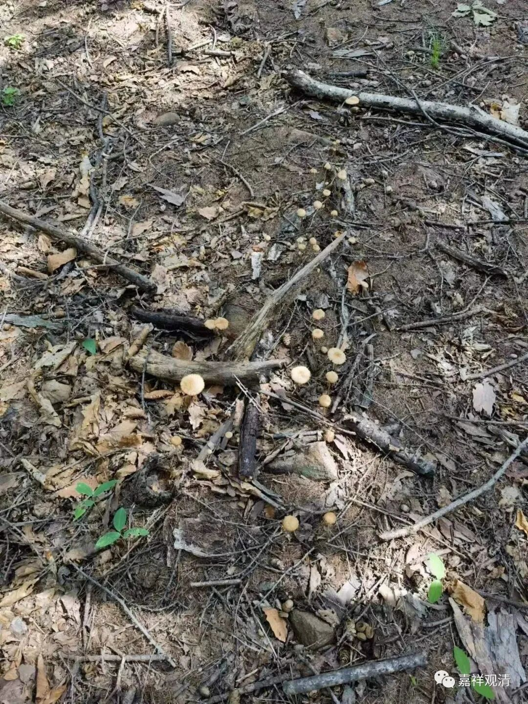

刚下过雨，新出的蘑菇

老张忽悠我们，说去石海只有六七百米，结果，那段路来回走了两个多小时，他又说“走捷径六百米”，反正我们不信。

