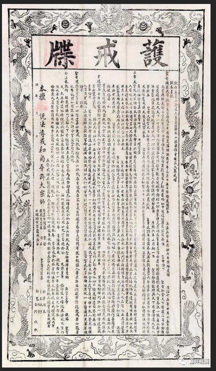
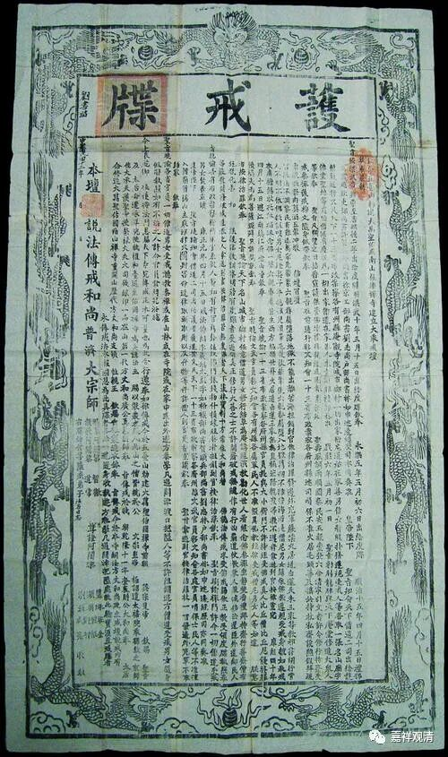
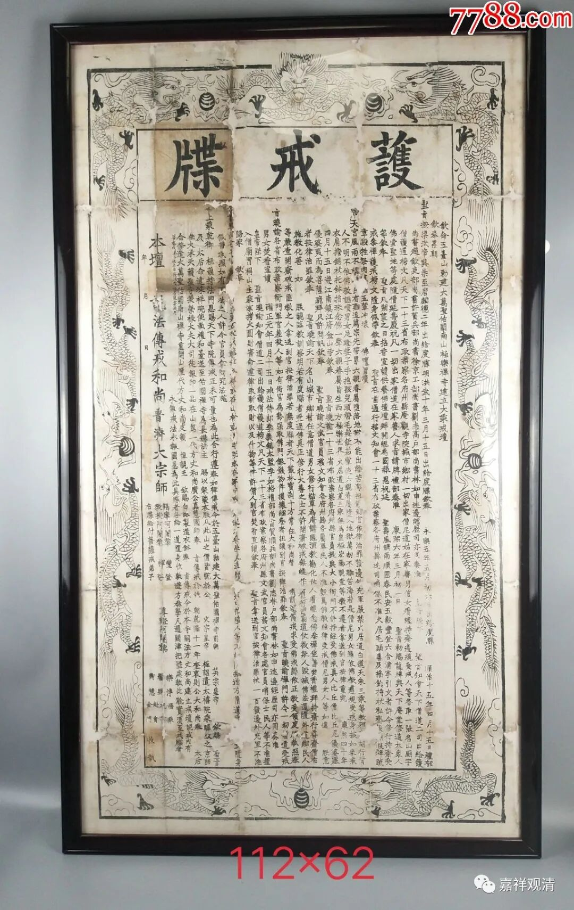
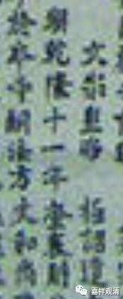
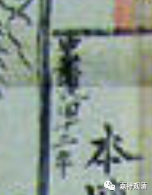

**一份拍卖会上出现的“护戒牒”**

今天讲到戒牒，我们随便挑一件拍品聊聊……

这是一件常见的“护戒牒”，曾经在不同的拍卖场上出现过好几件同一批次的，品相也都接近——

有的拍卖会上标注为乾隆年间，也有标注为清末，甚至有判定年代更早的，其实这些年代都不对，错误的原因都是误读了这张乱七八糟的“榜文”似的“护戒牒”。

拍卖会都介绍这是五台山的戒牒，这一点虽然还没错，但（非常）仔细看就知道，其实这（传戒收弟子发戒牒）是清末民初的一个民间宗教头子（普济大宗师）借“传戒”而使自己正统化（被正统佛教界和地方社会认同）的一个手段。“普济大宗师”在五台山还有个塔，但这改变不了他民间宗教的本质（所以不要看到塔就拜，有的需要搞清楚来历）。

他这版“护戒牒”前面一段对佛教历史和传戒历史的“洋洋洒洒”“娓娓道来”基本可以理解为没有清净依据的胡说八道，但有的卖场就根据这些文字而把这份“护戒牒”的年代上述很久。而其中有读为“乾隆十一年”的是因为看到了这句——“本 朝乾隆十一年”

其实上下文看来这完全不是传戒的日期。

传戒日期在这份“护戒牒”（第一张）的左上角——

“中华民国十二年”！

        修改于