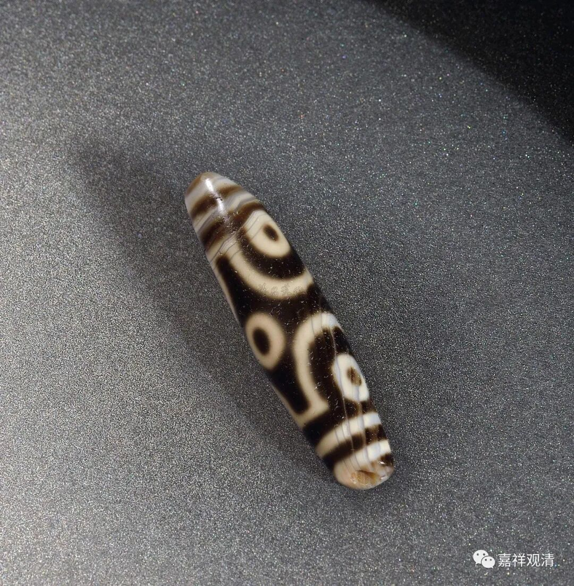
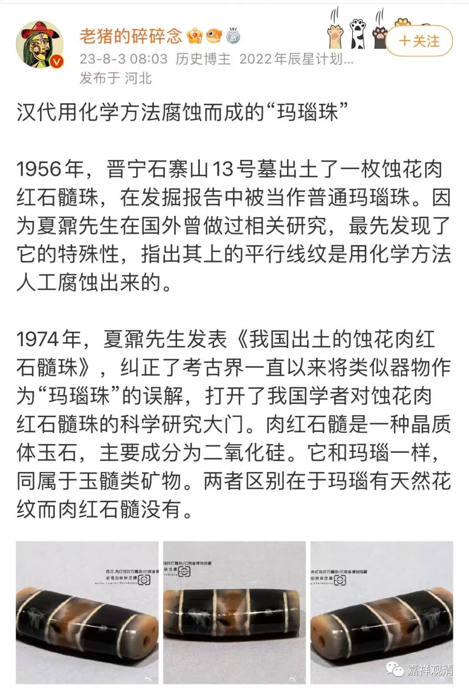
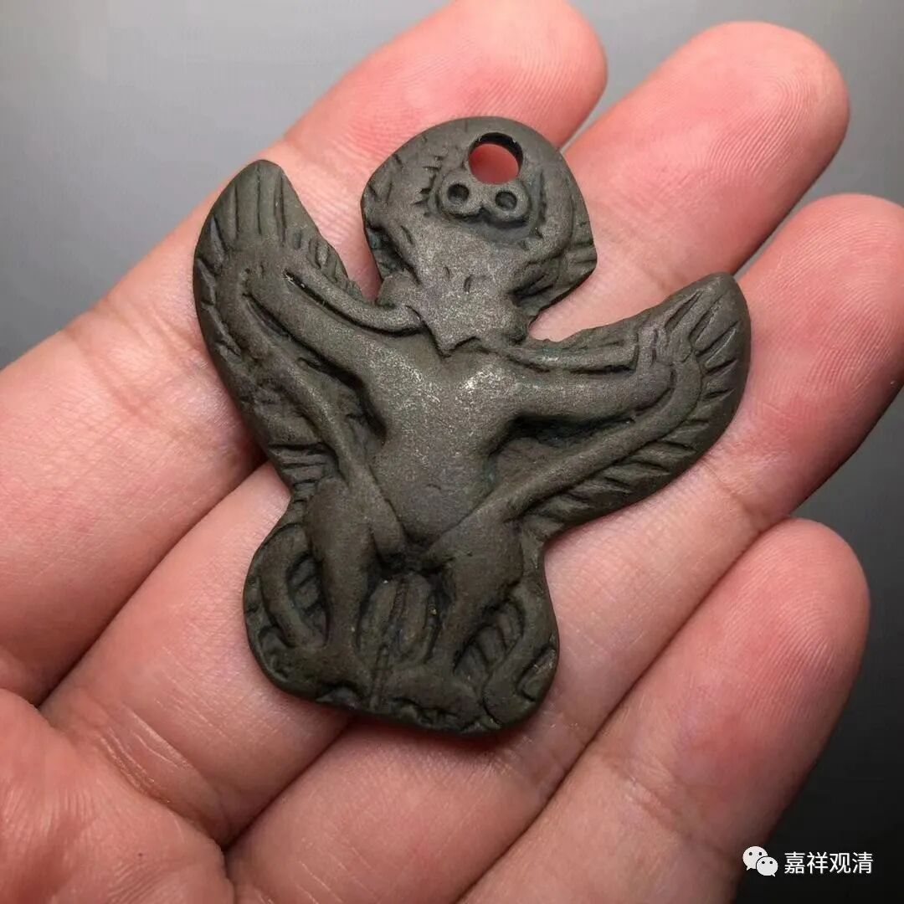

**“天珠”、“天铁”、“天晓得”**

今天没时间写八卦，就聊聊“天珠”、“天铁”、“天晓得”吧。

“天珠”，三三十年以前被某岛的人炒作起来，飙到天价，其实“天珠”自古以来就是人工加工的宝石工艺品，炒作者利用大家集体的知识空白+神秘主义噱头，在某圈子内通过编制大量的故事、传说加以神秘化，最后莫名其妙地把这类不应该值钱的东西包装成高端奢侈品收割富豪、明星和信众。

这段说的是用化学方法蚀刻的天珠，还有用玛瑙烧制加工的。我在海南谭门一个珊瑚玉加工厂和他们老板喝茶的时候聊过，他说他以前就是“做天珠”（不单是卖天珠，是烧制天珠）的，他说那时候他在藏地做天珠，如鱼得水一般，说最爽的是——做出来的“天珠”可以直接拿到银行去抵押贷款……

关于“天铁”“天珠”，我问过一位拉然巴格西，他大笑。据他说，所谓的“天”，就是当地人不知道这东西的来源，就冠名叫“天”——比如野地里不知名的小的铜佛像，就叫“天铁”（也被某岛的炒家炒作成神秘法宝），不知道来源和制作方法的这种人造宝石就叫做“天珠”，而山里面不知道谁刻的佛像，就说“天然形成的”、“自然显现的”……一切都没有那么神秘……

其实我们汉地的俚语当中其实也有这个用法，“不知道”，就说“天晓得”、“天知道”！

