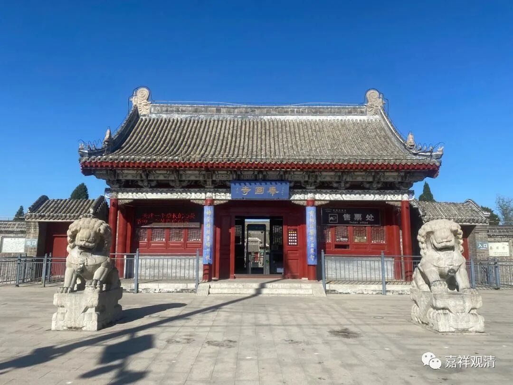
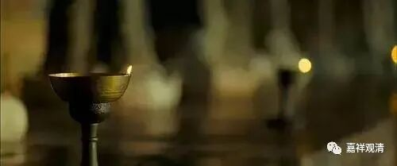
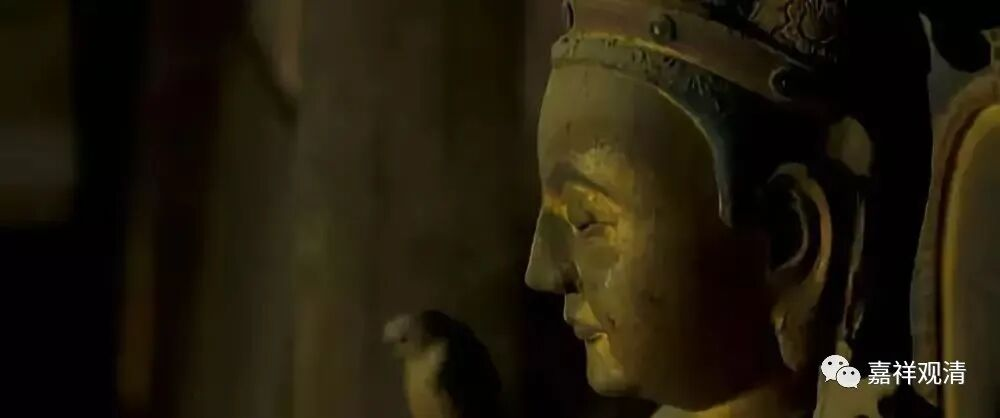
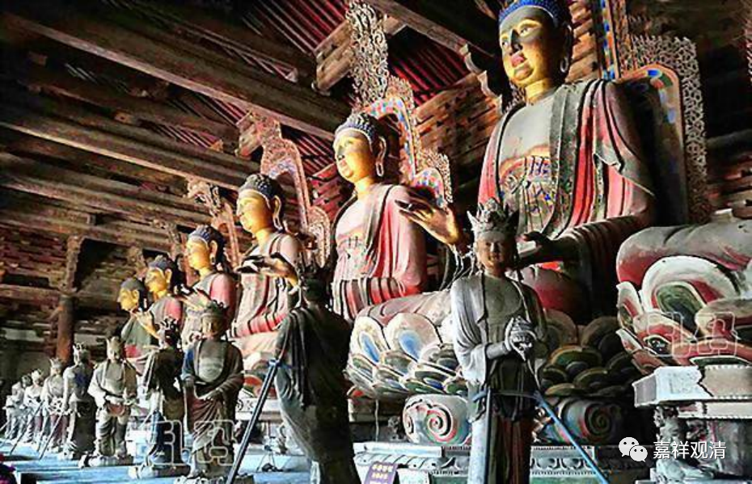
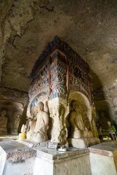
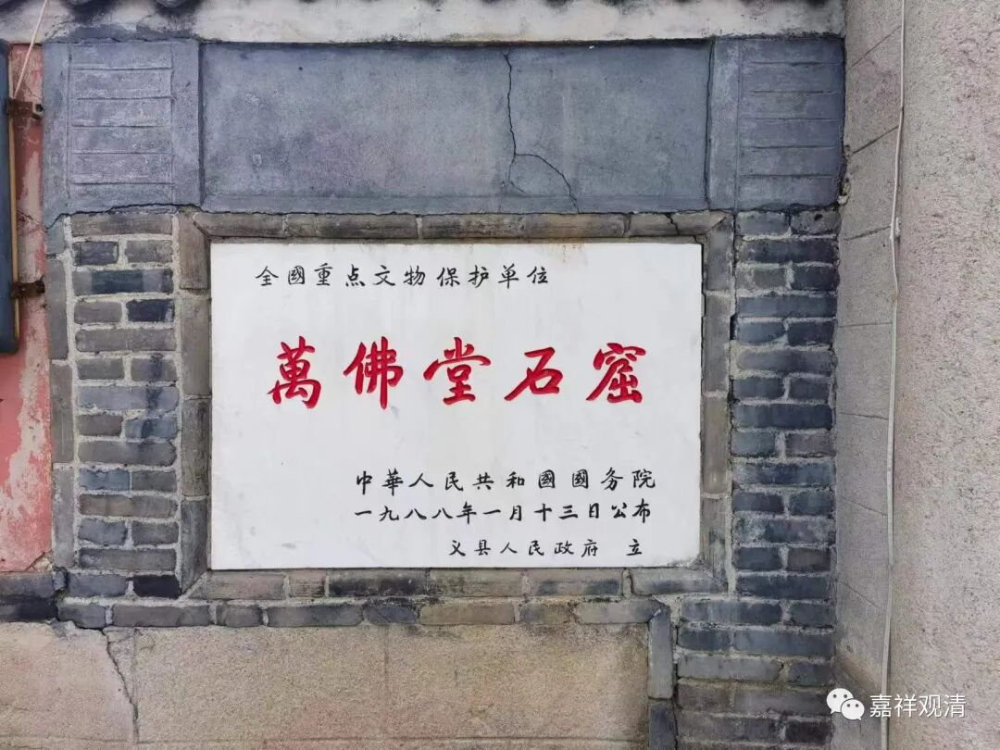

**义县奉国寺**

这次辽西科考之旅，我们还去了义县奉国寺。

奉国寺最近的风头，来自王家卫的一部电影——《一代宗师》。章子怡镜头下奉佛，便出自义县奉国寺。

 

 

奉国寺始建于辽代（公元1020年），寺院里有建寺一千年的纪念香炉。当今中国现存的辽代建筑中，最著名的便是应县木塔（去过了）、义县奉国寺、蓟县独乐寺观音阁，它们真应该庆幸被梁思成、林徽因寻着并记录下来，因为有了这些记载，这些辽代的木结构建筑便被保存、保护了下来……

这七尊佛像，分别代表了释迦佛（含）以前的七位如来，即“过去七佛”：毗婆尸佛（Vipaśyin）、尸弃佛（Śikhin）、毗舍浮佛（Viśvabhu）、拘留孙佛（Krakucchanda）、拘那含牟尼佛（Kanakamuni）、迦叶佛（Kaśyapa）、释迦牟尼佛（Śākyamuni）。网上看到介绍奉国寺的资料里有其他几种顺序，都有点瑕疵，按我这个来。

据说此七佛形象为照辽圣宗之前（含）帝王相而塑造，以附近万佛堂昙曜建有北魏摩崖石窟来看，这算是一种文化继承。昙曜在云冈的昙曜五窟也是北魏帝王形象的大型佛窟造像。中国北方民族一直有以皇帝形象铸、塑、造佛像的传统，赵翼《二十二史札记》里曾经总结过这一现象。我记得《金史》里也记载有皇帝参观这几尊佛像的故事，好象是大臣中间有人问要不要换掉，人家皇帝说也不必了……

奉国寺佛像身上积灰甚巨，有人说是香灰造成的，还写了论文，我却不以为然——有和尚管理的寺院点灯、烧香更多也没见积灰，你这没和尚的“寺院”连烧香点灯的人都没有……明明是没人管理没人清扫，还嘴硬！

