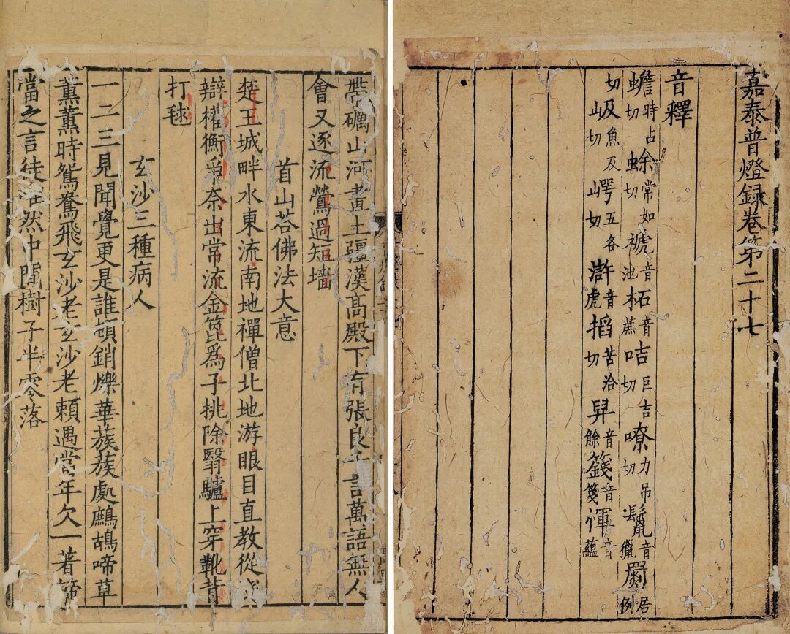
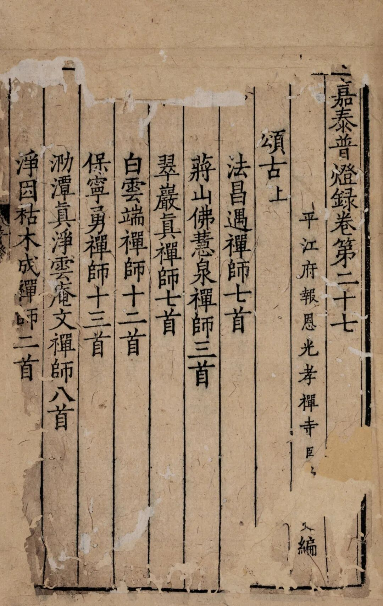

**杨亿和陆游《灯录序》**

宋代文人与禅宗之间交往甚密，比如我们熟知的苏轼与云门宗的佛印了元禅师就关系匪浅（留下了很多传说），今天提到的杨亿也是北宋的著名诗人、朝廷高官，据说对禅宗也颇有心得，或者说和禅门诸师交往甚多。比如上来提到的唐明智嵩禅师、石霜楚圆禅师。

著名的禅宗传记书《景德传灯录》也有杨亿的参与，据后来著名的禅宗史书《五灯会元》说——“真宗诏翰林学士杨亿裁正而叙之”，说宋真宗交给杨亿等人厘定《景德传灯录》，杨亿等名臣参与了裁定校正（其实就是删去一些年代有出入明显不符合史实的，也删去了一些涉及居士、官员的），并为之作序。

《五灯会元》还说“嘉泰中，雷庵受禅师作《普灯录》陆游叙……”，《续藏经》《景泰普灯录》中无陆游《普灯录叙》，查陆游《渭南文集》卷十五则有《普灯录序》（去年今年的几篇拍卖资料中皆谓出自《渭南文集》卷五，属于不仔细查资料的以讹传讹。）

两位北宋著名文人都为禅宗史书作序，但二书在材料的取舍上似乎可以发现二人综合能力上的差异，杨亿在史料的选择、裁剪上“至有儒臣居士之问答，爵位姓氏之着明，校岁历以愆殊，约史籍而差谬，咸用删去，以资传信”，把儒臣居士的问答一并删去，而《普灯录》恰巧正是补上了此前“圣君贤臣之事有不能具载者”——杨亿所裁去的正是陆游夸赞的，如果并不把这些文字当作应酬文章的话，那么，看来杨亿的佛教水平和史才上似乎都要超过陆游了。

