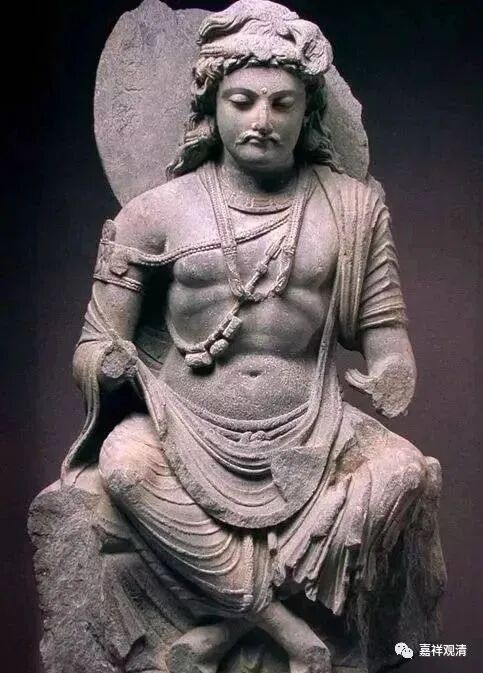

**万佛堂石窟的错误标识牌**

一起科考的“化石小王子”一家回头正在再走一遍辽西，这回去了上次没去成的义县万佛堂石窟。

结果临时关闭了……

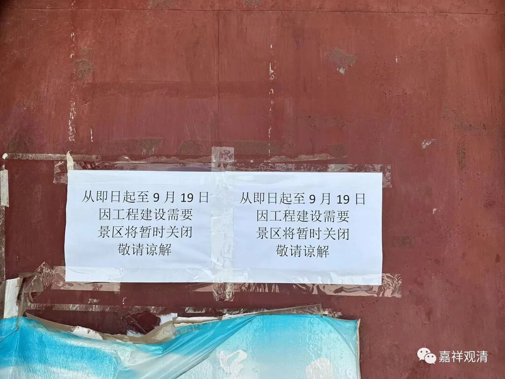

排除万难之下，终于还是“参观了”。

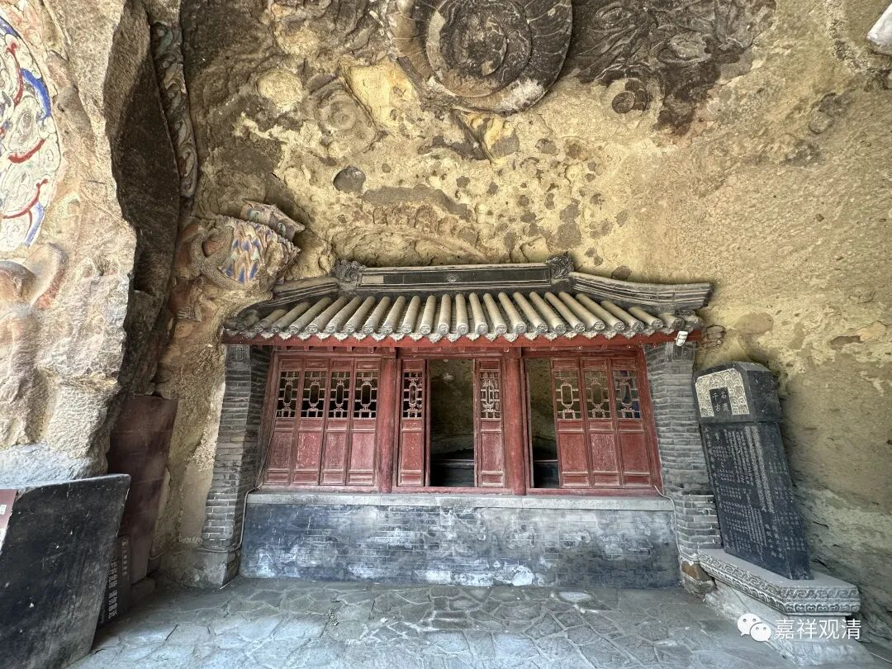

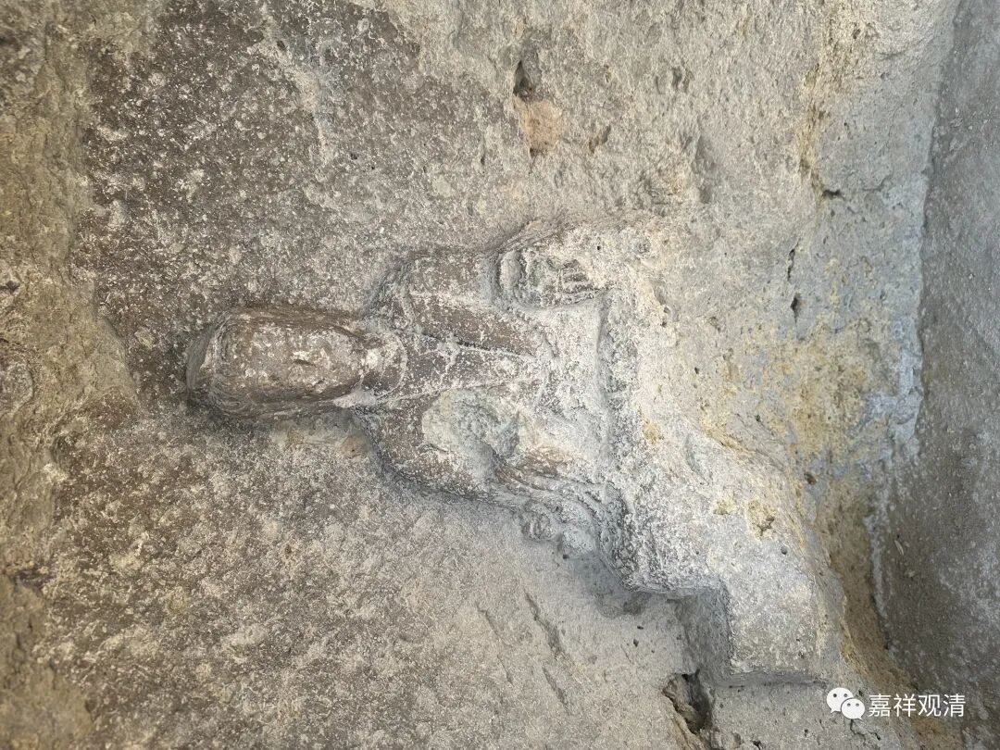

只是看到他们发来的一则介绍令我一皱眉头——

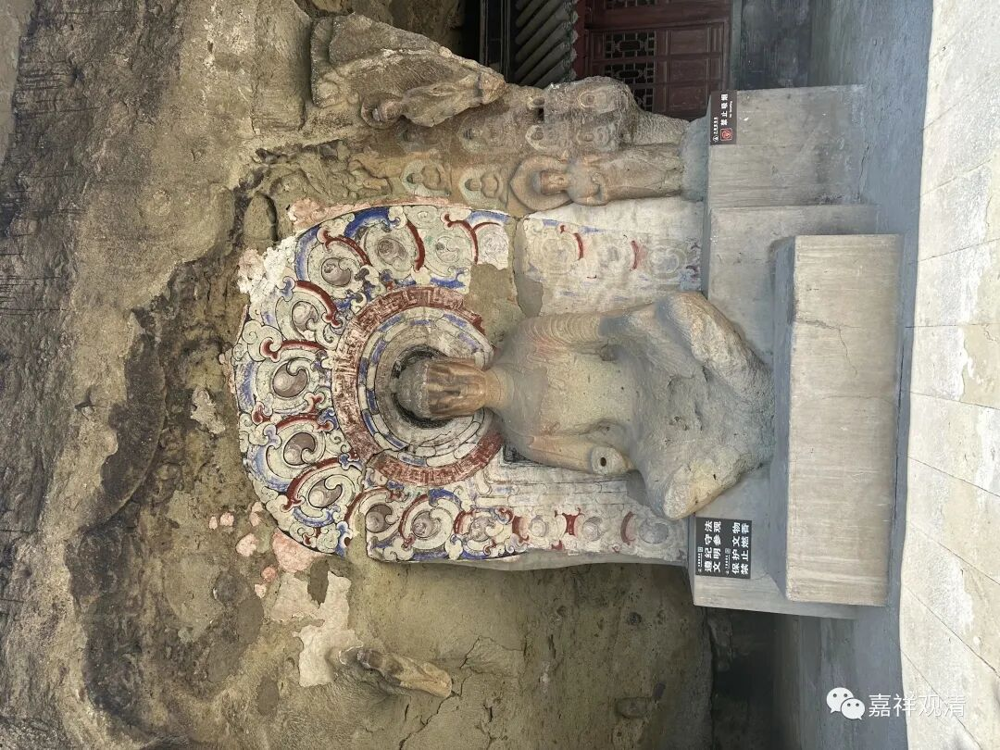

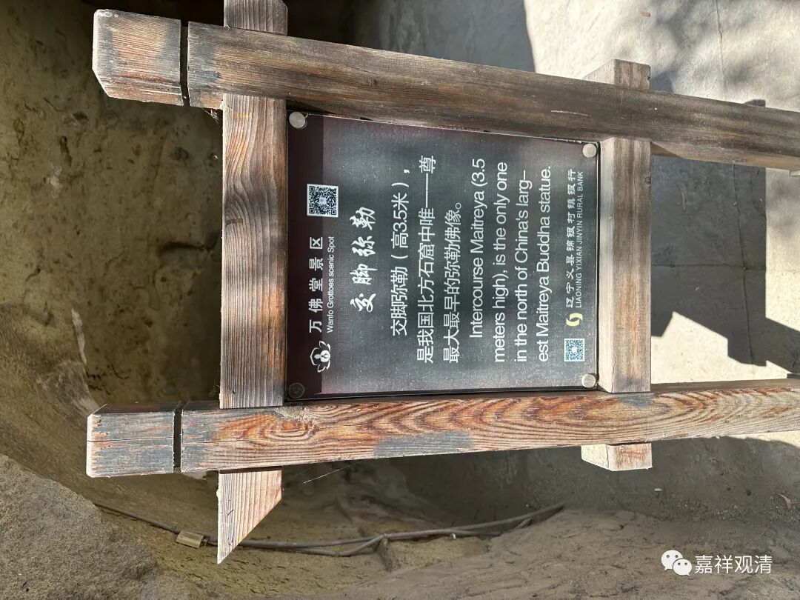

“交脚弥勒：

交脚弥勒(高3.5米)是我国北方石窟中唯一一尊最大最早的弥勒佛像。”

这就很尴尬了，“北方石窟中唯一一尊最大最早的弥勒佛像”，呵呵，论弥勒佛像（哪怕限于“交脚弥勒”像）排名的话，别说“唯一”了，哪怕是论“大”或者“早”，应该都未必能排进前十吧。这个“第三批全国重点文物保护单位”的学术水准简直要探底了！

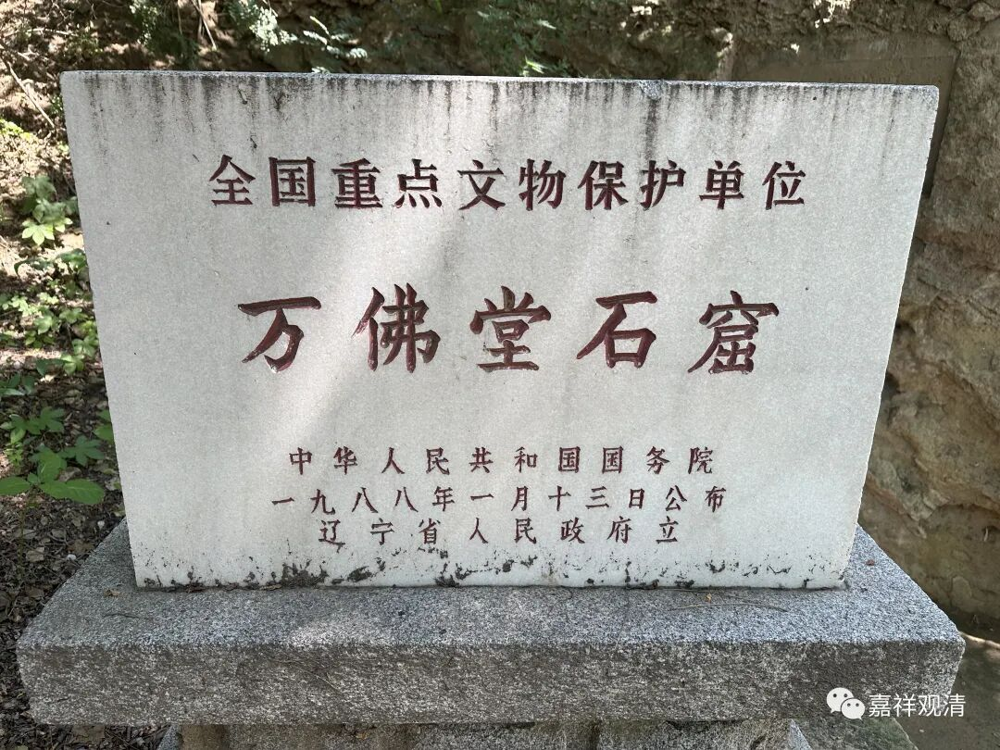

万佛堂这尊3.5米交脚弥勒像在西区第六窟，是万佛堂石窟中最大的一尊佛像，但放在全国范围、放在中国北方，都不算是非常特异的“第一”级别的存在……

云冈第五窟交脚弥勒

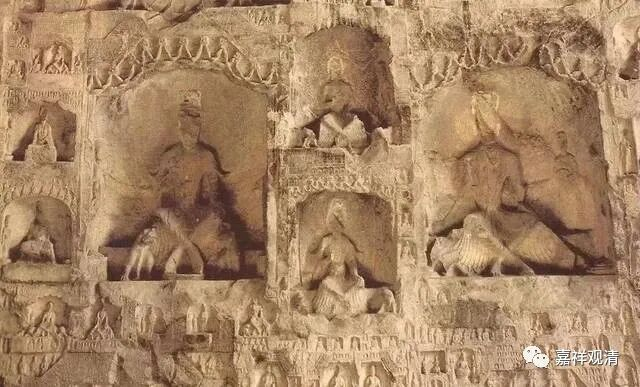

龙门古阳洞交脚弥勒

中国石窟，由新疆（克孜尔石窟）而河西走廊（敦煌石窟、麦积山石窟），再有龙门、云冈……石窟造像在我国北方就非常常见，而弥勒像，包括交脚弥勒像，本就是各大石窟很常见的形象，形制巨大的也不在少数，敦煌275窟交脚弥勒像高3.65米（一说3.35米），云冈17窟交脚弥勒高15.6米，13窟交脚弥勒高13米……高度都超过了义县万佛堂石窟（北魏时期）的这一尊交脚弥勒像，时间上也不晚于北魏……

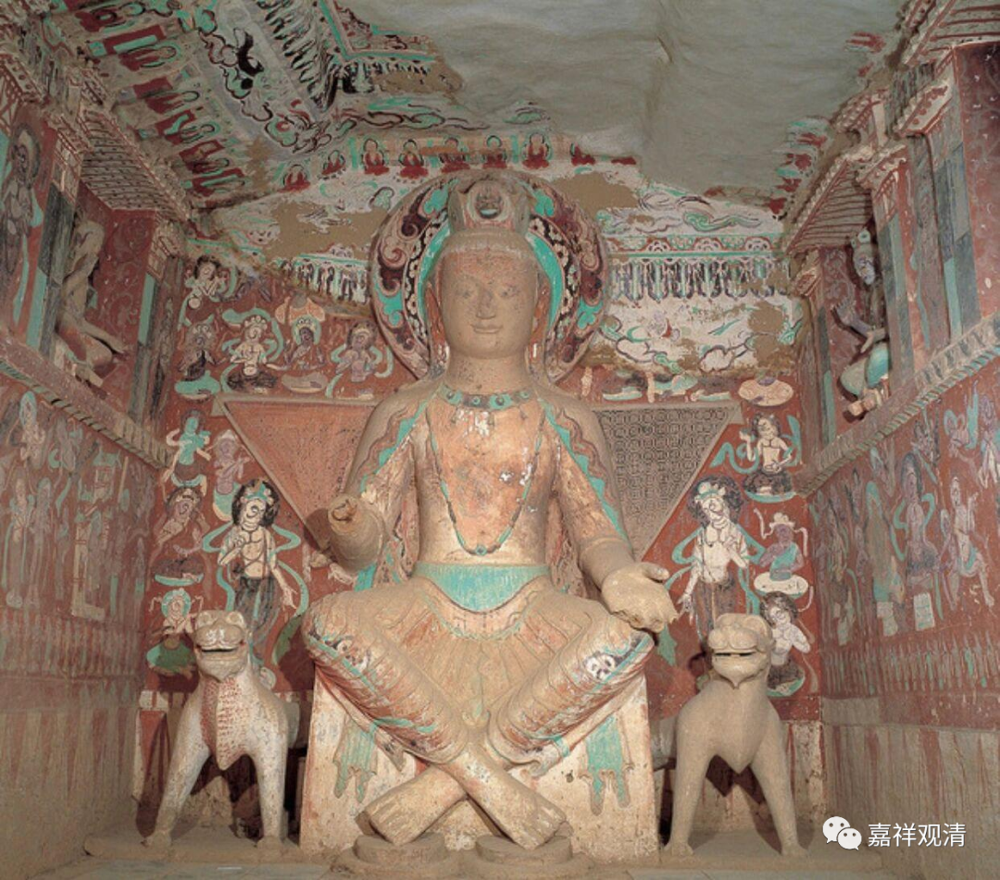

敦煌275窟交脚弥勒，3.6米

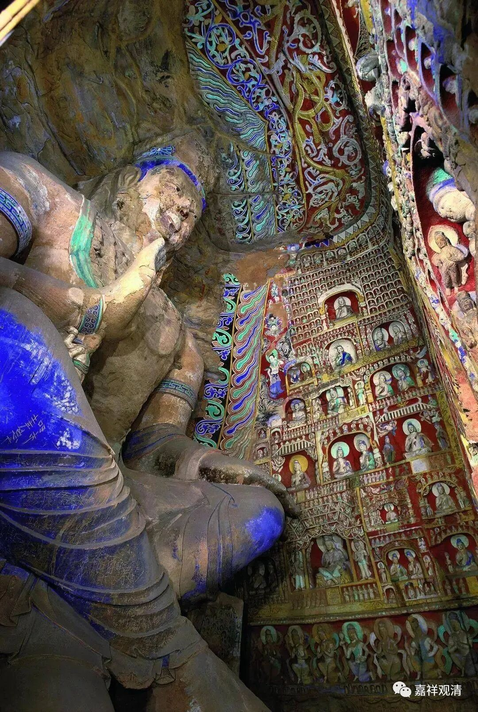

云冈13窟，北魏，13米

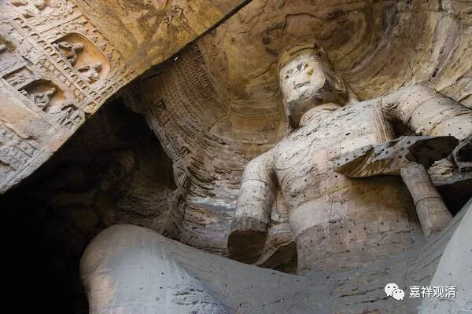

云冈17窟交脚弥勒，15.6米，北魏

所以很明确的，义县万佛堂石窟西区第六窟的这一尊3.5米高的（交脚）弥勒像，远非“北方”“唯一”“最大”“最早”！万佛堂景区是想拿“第一”想疯了吧！（如果像告示牌上写的不说“交脚弥勒像”，单纯说“弥勒像”更是排到不知道第几页去了！）可能的推测是，他想说“……是万佛堂石窟中唯一、最大、最早的弥勒像”（连“东北”地区都玄）吧。

