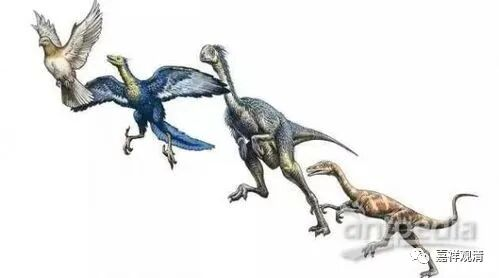

**庙里“和谐”名场面——鸡犬安宁**

自从在“辽西科考之旅”的课堂上（博物馆里）被王博士科普了点恐龙和鸟类的相关知识以后，回来看到我们这只走地鸡，猛然觉得它高大了起来——这不就是恐龙（的后裔）吗！！！

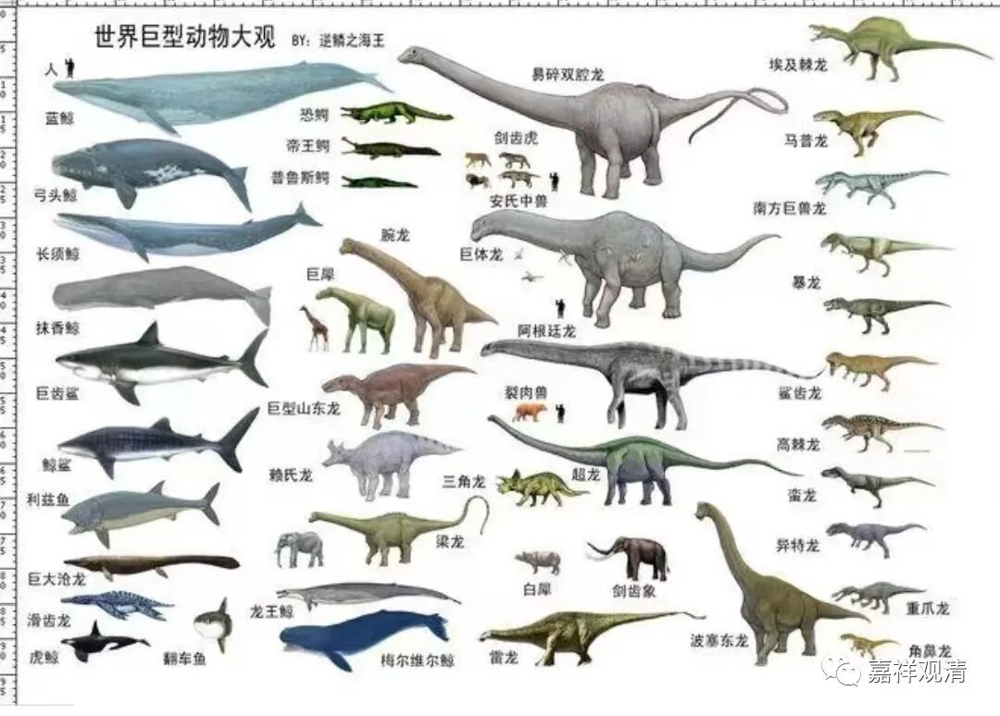

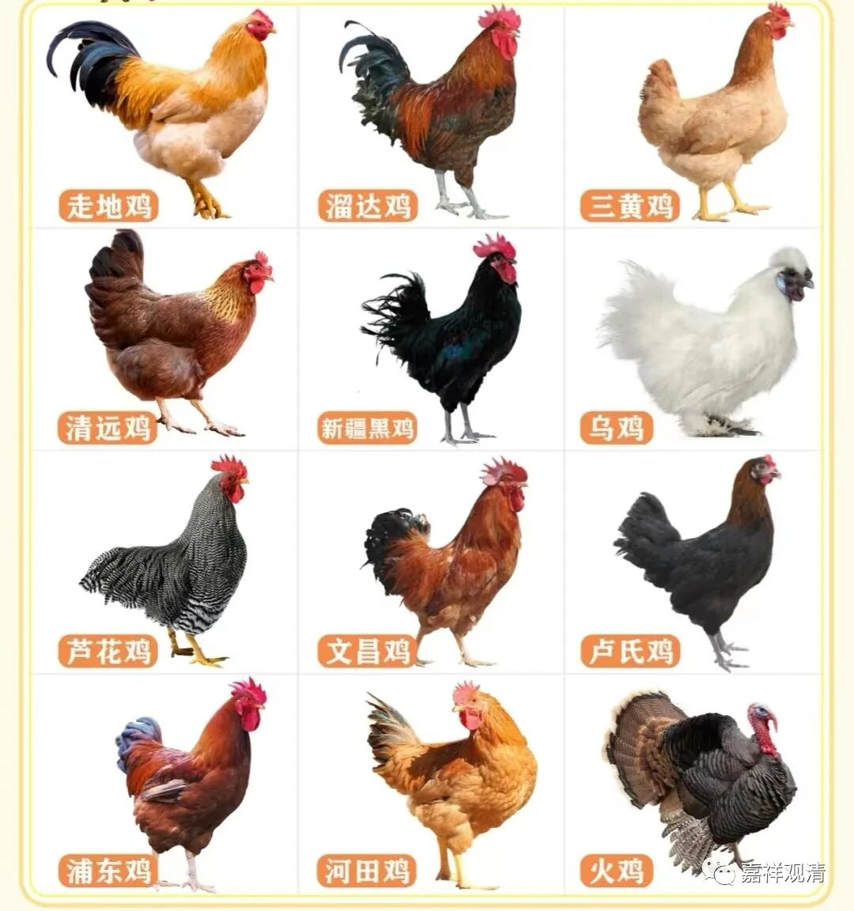

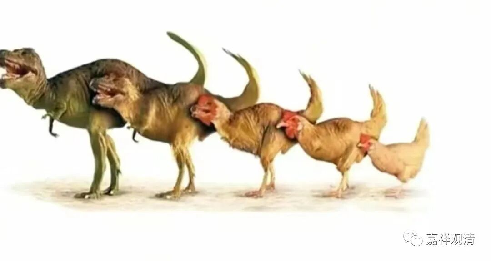

乃至在出现它抢食小黑的餐食的时候，我都不敢再赶跑它了——你说恐龙吃点你个小哺乳动物的零食咋了……

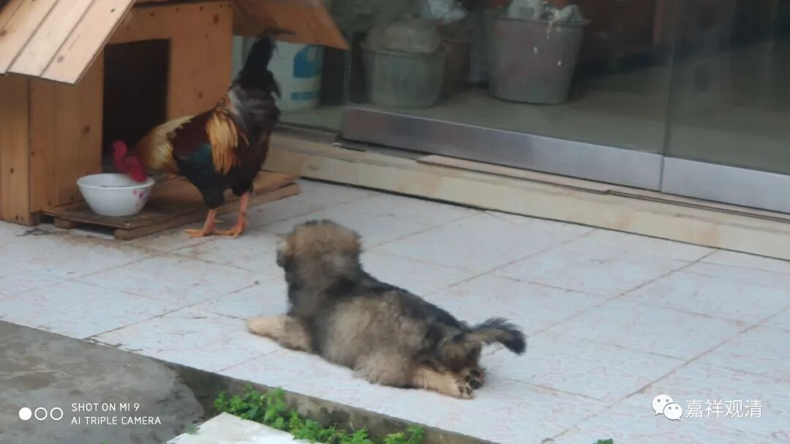

所以……现在我认为这个场面是和谐，和谐不是欺凌，是和谐不是欺凌，是和谐不是欺凌……

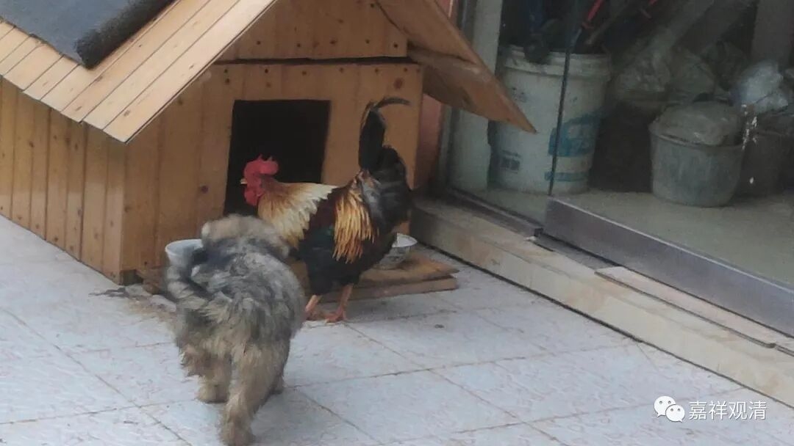

特别和谐，特别和谐，特别和谐！！！

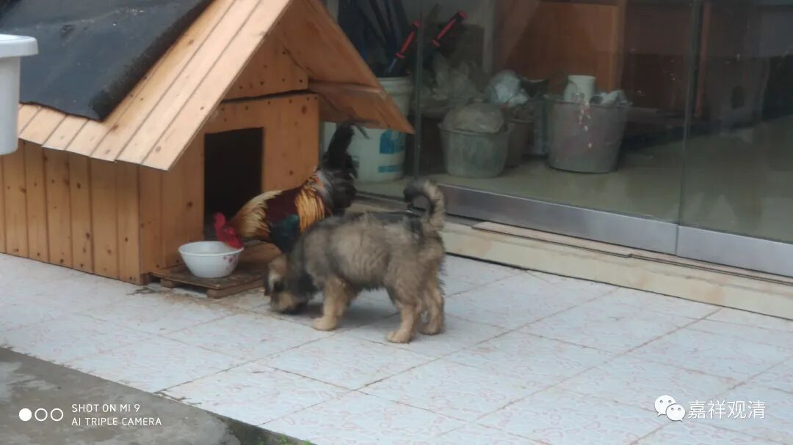

特别……老实……（小黑：你是在说我吗？）

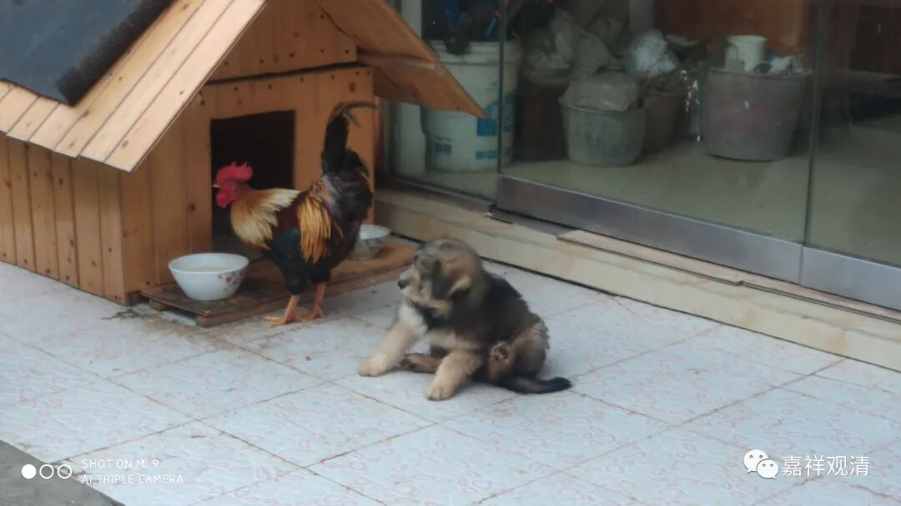

好像这张小黑表现得有点可怜啊……（小黑：打不过它……）

这是看到恐龙敢怒不敢言啊！“大哥，你吃完了吗？”

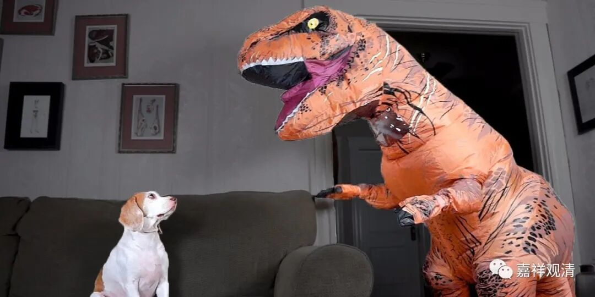

“你说啥？！我看你就挺好（hao第三声）吃的！”

“可那是我的狗粮啊！”

“我看你像鸡食！”

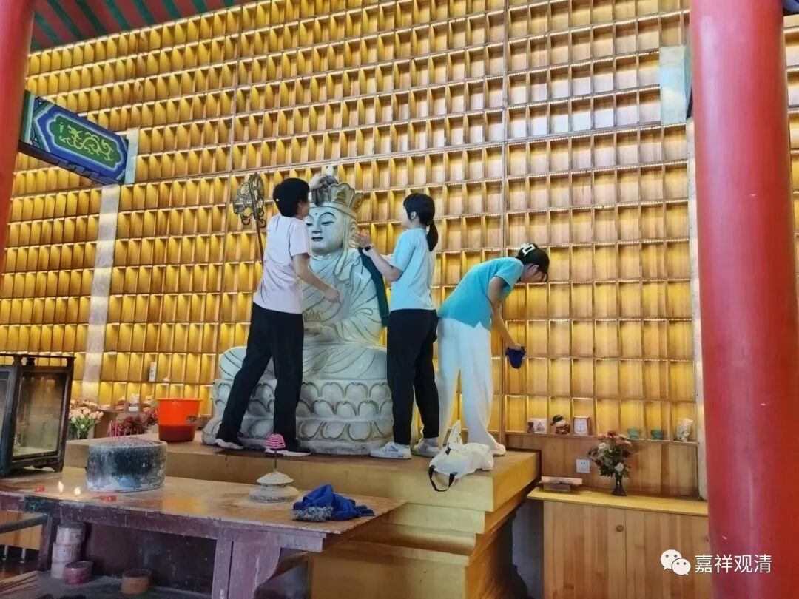

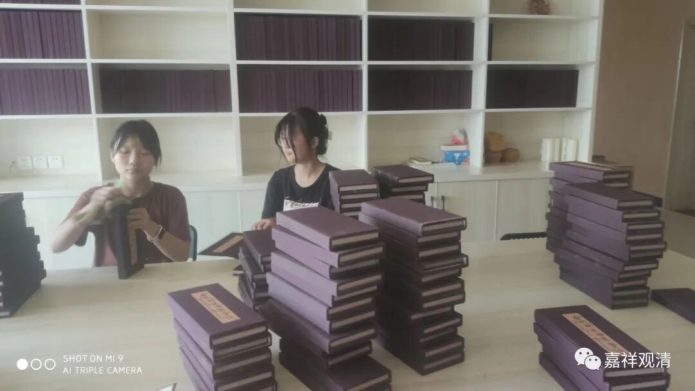

这几天山上又来了几个小朋友，孩子们在家长们带领下帮忙干了不少活儿，这是积累了不少“功德”啊……（早上给她们科普了一节恐龙和鸟类，哈哈，现炒现卖。）

ps：

山上（庙里）现在还是人少啊，有来做义工的不？！欢迎报名！

