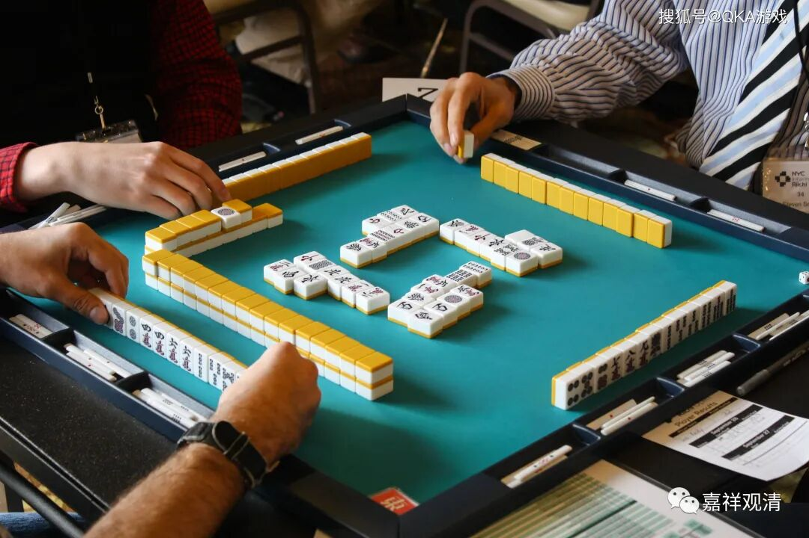

**“麻将是什么东西？！”**

今天七月初一，“老菩萨们”又上来上香拜佛念经了……

吃完午饭，和居士们聊天……

有两个老居士暗戳戳在让烟，另一个悄悄指指我、摆摆手……

哈哈，你们当我是瞎的吗？

我说“怎么样，你们还抽烟，打麻将？”

老居士们全都说自己冰清玉洁，恨不得问我“麻将是什么东西？！”“我麻某与黄毒不共戴天！”

我说没关系，我是在社会调查，不是抓你们。我说现在还有大学生回老家专门写一篇村里麻将馆经营状况的论文……

老居士们显然轻松了。

在我的再三“开导”下，给我提供了如下之初步资料——

一般她们都是自己在家里打。村里也有聚集打麻将的人家，一般一天分三场，早上、下午、晚上；一场，每人收五块钱，也就是一桌麻将一上午四个人一共收二十块。如果“来得大”，每人可以收到二十。

有些地方可以安排饭食，一餐二十、二十五。

我说江西有些地方麻将馆可以帮忙接孩子、安排孩子做作业的，他们说他们这里没有。

村里面的简单一些，还谈不上馆子。乡镇就比较“高档一些”，有明确的类似馆子。当然我们这些居士们是“不会去的”。（哇哈哈哈……）

我说有空我来深入调查，今天有事，我要送人……

老居士们如释重负，也不挤一块儿聊天了，背起小包逃下山去也……

