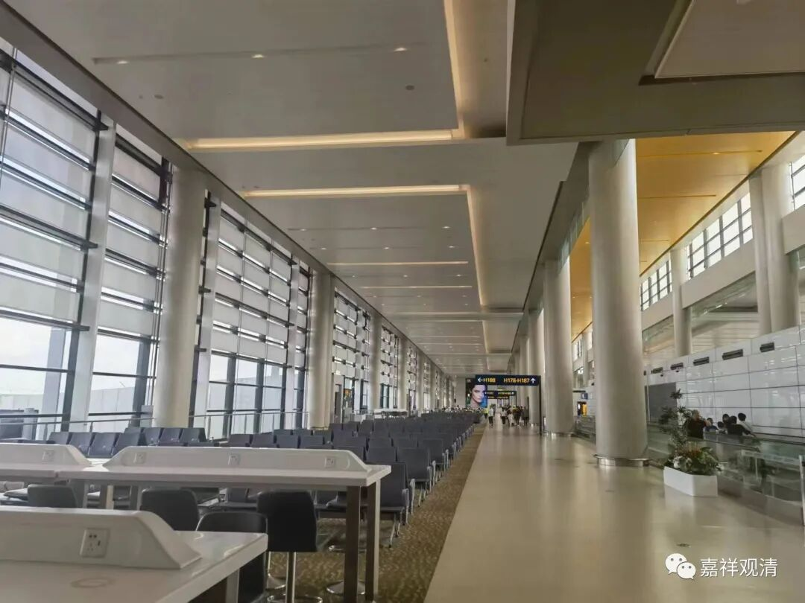
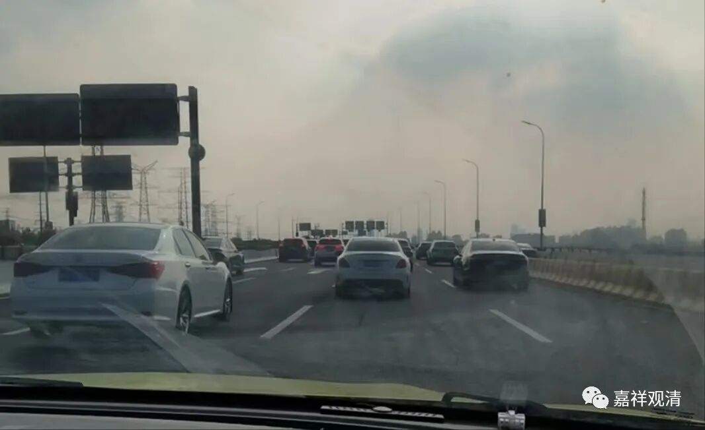
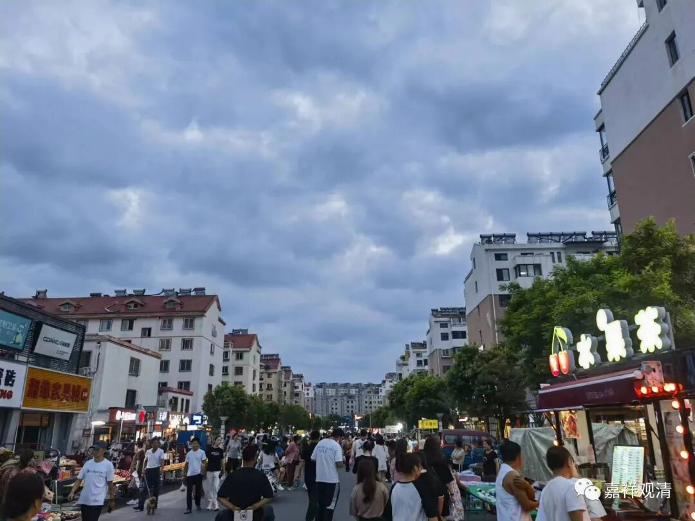

**消费降级**

出门打车，我爱和司机兄弟聊天。最近聊到他们的工作状况，正反两面，都表现为社会上的消费降级了——

一个说，现在接单不容易，以前几分钟就一个单子，现在甚至要半个小时。说是因为新进来开网约车的多了，所以卷起来了。公司的提成、奖励措施变得越来越对司机们不利，但是不停有新人加入，根本就不缺司机，不怕他们跑。

前几天另一个司机给了一个答案——他说现在公司都很难做，很多写字楼空了。以前到了下班的时候，写字楼里出来的人叫车的很多，现在都没了，总体的单子少了。

也就是说，一方面打车的人少了，一方面网约车多了，所以网约车司机就越来越难做了。这表现为某种程度的消费降级——打车的（几十块钱）改坐地铁（几块钱）了。

今天某老师跟我说，他预约的两个旅游团都没成团，取消了——一个日本团只有两个人报名，另一个河西走廊的团就他一个人报名，加上之前的xts的考察团因为报名人数不够也没成团，我周围这都三个“局”取消了——这是旅游消费降级。

最近大家都在谈“消费降级”，“凛冬将至”

我说：你们的意思是，我最近是不能建庙了吗？

不要吓我……

