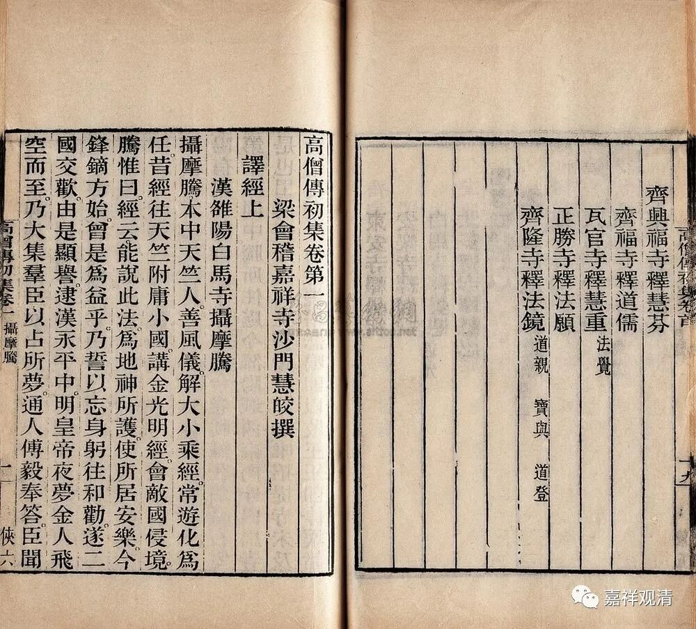

**刘宋四代僧正**

南朝宋有僧官，称僧正或僧主，看到一些文章取材《高僧传·僧瑾传》，谓“敕（僧））瑾使为天下僧主，给法伎一部，亲信二十人，月给三万。冬夏四赐，并车舆吏力。”

其实同传（《僧瑾传》）及此后《昙度传》，可以读出连续的四代“僧正”、“僧主”，略记如下。

一．昙岳，生卒年不详，经历不详；

二、智斌，生卒年不详，昙岳后继任僧正，善三论（《中论》《百论》《十二门论》）、《维摩诘经》、庄老，不知其师从，《名僧传》谓住中兴寺。后因被怀疑有政治立场问题被摈，贬赴交州。《隋书·經籍志三》谓释智斌有《解寒食散方》二卷，当即此僧正智斌。有径谓此“释智斌”为隋人，不当。

三、释僧瑾，沛县人，善三藏及庄老，曾从道生受学，刘宋明帝（未即位时）之师，智斌被摈后被封为“天下僧主”（僧正），固辞不免。僧瑾与《三宗论》作者周顒交往甚密，或皆三论师竺道生一系传人。

四、昙度，琅琊人，继僧瑾为僧主，住新安寺。

按：摄山高丽朗公的三论系师承不明，《高僧传》说为法度弟子，而法度为净土行者不在三论师承之中；《中论疏记》谓朗公从“昙慶”学，“慶”“度”形近，或“昙慶”“法度”即此“昙度”。《高僧传》说僧正昙度擅长“三藏”及庄老，若“三藏”为“三论”之误（因为“善三藏”对于僧人来说太泛泛，不值得单论），则智斌——僧瑾——昙度三人所学极其相近，皆为三论师资。（明天再查一下昙度与道朗的年代，看是否能对上。）

        修改于