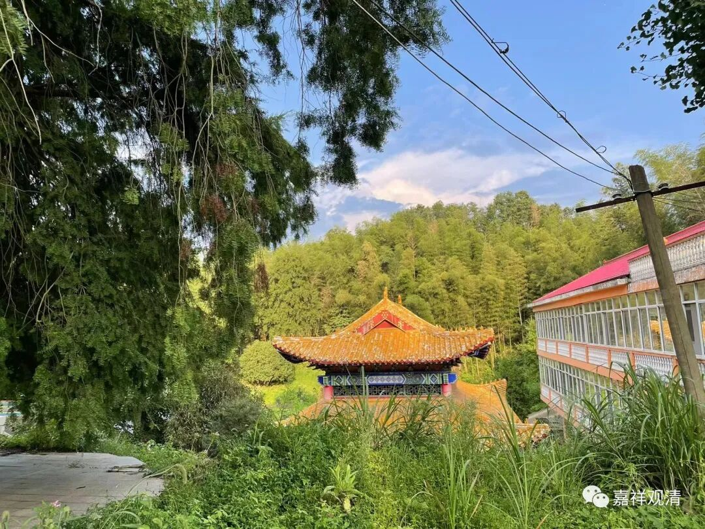
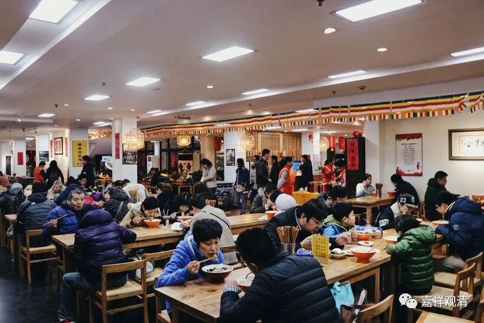

**他不可以出家的！**

** 聊聊出家（一）**

有人喜欢听这个，那我们就先聊五块钱的……

先说一个现象——

有人跟我反映他发现的一个现象，就是他发现“在出家这件事情上，在家人（居士们）好像更愿意鼓动别人出家，但出家人反而不是很鼓励的样子”，他问我这是怎么回事。

我大致回忆了一下周围发生的故事，发现确实有那么点意思。

一，先说在家人劝人出家这块——我说一个经典案例：

有一次和师父们去一家素斋馆吃饭，这家素斋馆生意太好，大堂爆满……我们就在门口等空位出来。坐在我们边上有几个老居士凑过来搭讪。

聊了几句以后，一个老阿姨表示赞叹：“你们出家真好啊，年轻人出家好啊！……”

师父这时候转过身来，大概准备趁机讲几句“苦集灭道”。我微笑着眯眯眼、点点头，示意这一回合还是我来。

“阿姨你信佛吗？”

“我是居士啊！我皈依多少多少年了……”

我【开始下套，】问：“阿姨，您孩子现在多大了呀？”

“二十几blablabla”

我继续【娓娓道来】：“出家是真的好呀，那你让你孩子也出家吧……”

老阿姨突然像触了电一样，身子往反方向一缩，急忙摇手，“不行不行，那不行那不行！我儿子不能出家的！！他是不能出家的……”

边上一直在听我们谈话的师父顿时爆笑，是非常夸张地从憋笑到大笑……

老阿姨很尴尬地不说话了。

笑停下来，师父带着笑问老阿姨：“你说出家好，那为什么不愿意自己的孩子出家呢？”

没学过因明（佛教逻辑学）的老阿姨实在没办法解决这个矛盾，只能不断地重复：“那不行的那不行的，我儿子出家不可以的，他不可以出家的。”

边说着，边从凳子上起身，躲得我们远远地……

我朝着阿姨的方向一摊手，对师父说：这，就是汉地佛教的现状……

