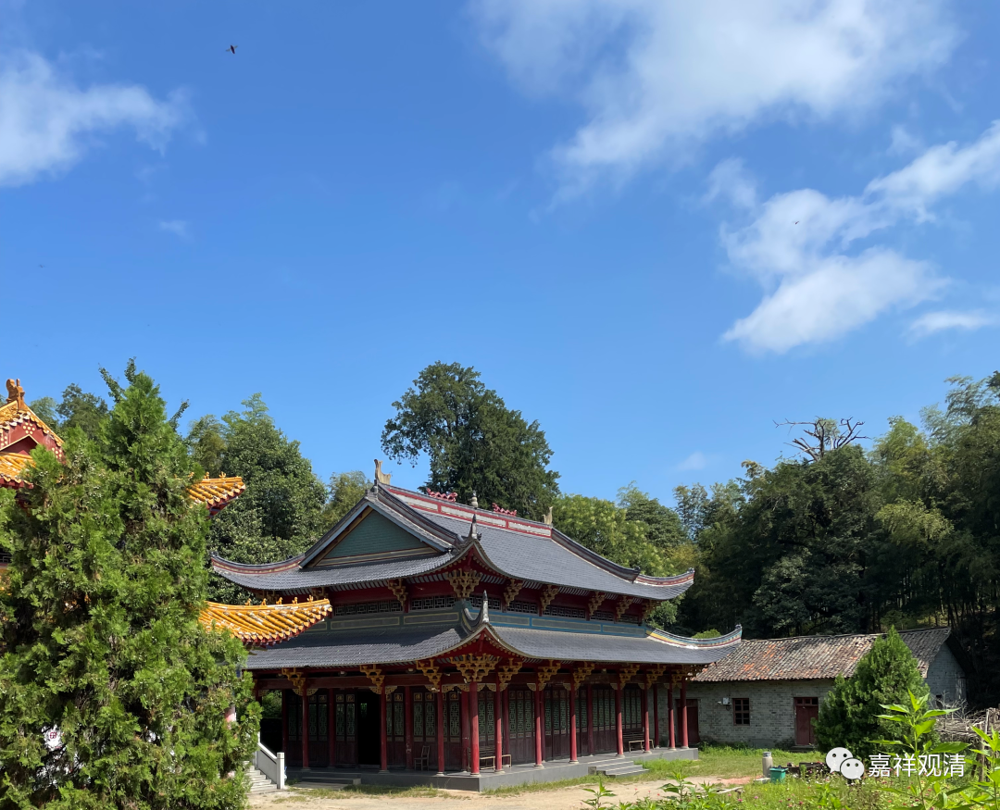

**各种来出家的奇葩（一）**

居士之劝人出家，是因为觉得那样实在“惠而不费”——自己只需要嘴上说说（不费），如果人家真的出家了，那自己就会分到好多功德（惠）。没有责任而“功德无量”，自然会出现“居士喜欢劝人出家”。

那么出家人为什么不热衷劝人出家呢？

稍微资深的大德们（撇开一般的和尚不谈）在被问到“出家与否”的问题时，通常需要考虑得更全面一些。

首先，不熟悉的首先拒绝，因为风险极大。我也举几个例子：

1、有一次我在寺院，那次正好寺院有活动，寺院人很多。忽然晚上寺院有动静，带着几个人打着手电出来巡查……后来在楼后面找到一个人，中年、男人，形象不利落，精神看起来也不像是太正常的……问下来，说是要在这里出家，因为看见人多，就躲在后面。出来很久了，肚子饿。我们给了馒头、水和咸菜……

我告诉他我不能收他，至少需要他的身份证单位证明父母签字街道办图章离婚证明或者单身证明还需要派出所图章blablabla……（这种表述是完全正确符合出家程序的，但其实就是说：不可能！）

第二天一早他下山了，但连续几天晚上还是回来，最后终于下山消失了……

2、有一次我不在寺院，龙瑜居士打电话给我说有个县城的人来要常住做义工，她就留下了……几天以后，来的那人精神病发作要跳楼……最后费了好大的劲找到她女儿把她接回去了……以后寺院再也不敢留完全不熟悉的人了。

3、又有一年寒假，我大学母校有个孩子要来出家，我看是“自己人”也没咋考察（还是托大了）。快过年的时候，也发作了（怪不得退学了），跟我大吵，大雄宝殿前面、蒙蒙细雨中，两手结了一个什么手印（反正我不认得）要“拿下”我、“干掉”我，那时候寺院里也是人多，控制住了……当天就赶下山了。

4、杭州有个寺院方丈最后被查出来身上有命案……

所以，一、寺院对于不熟悉的人，不知底细的人不会轻易接受其出家。所以现在很多寺院即使接受外来有出家意愿的人，也通常会考察一年以上。（如果是长期熟悉的弟子，很多“考察”实际都已经通过了，就轻松多了。）

待续……

