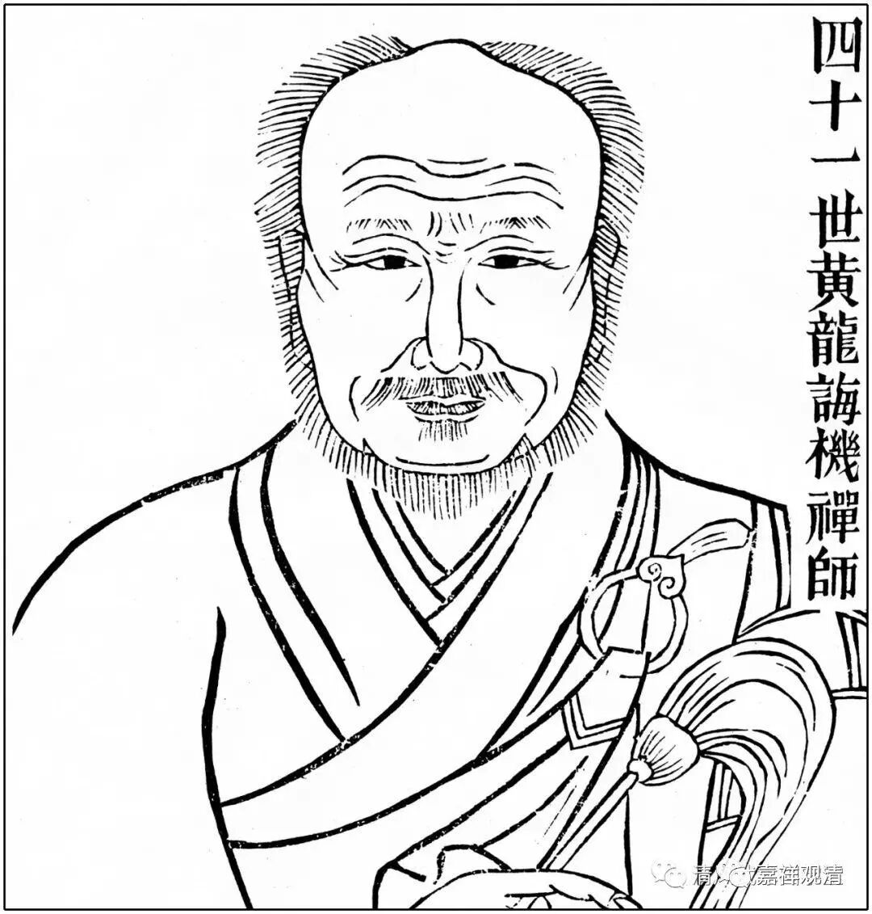
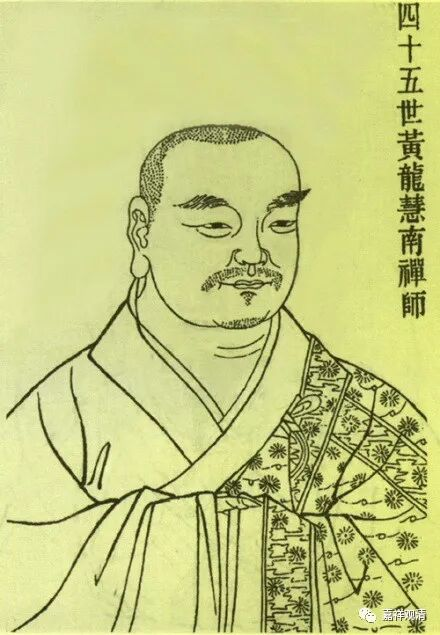

**微课佛教史392·2**

我们现在讲黄龙慧南禅师。

我本来准备今天讲一段说书“吕洞宾飞剑斩黄龙”，后来我仔细一看，这个“黄龙”（宋·黄龙慧南禅师）好像不是那个“黄龙”（唐·黄龙诲机禅师），但是这两个人的故事好像确实有重叠。这个地方在庐山归宗寺，是不是这两个人的故事在这里面有重叠的部分？只能放弃这么好的一个讲小说的机会。

冯梦龙的《三言两拍》里面也有这样一个故事——“吕洞宾飞剑斩黄龙”，大家有兴趣的话可以去看一看。其实挺想讲的，这里面有几句我还能聊一聊的，但是没办法，该舍的还是要舍掉啊。

那么我们就来讲黄龙慧南禅师。首先，黄龙慧南禅师是哪里人？江西人。江西信州（广信府的），玉山县人。家里姓章——立早章。（还有另外一位黄龙禅师，叫黄龙超慧禅师，也叫黄龙诲机禅师，也姓张，如果我没记错的话好像俗姓张——弓长张。）

黄龙慧南禅师是十一岁出家的，十一岁拜入当地怀玉寺的智銮禅师门下……十九岁，落发受具，这个才是正式出家。传记里面说他十九岁“落发受具”，但一般落发和受具不会在同一年，所以应该是有十一岁出家，十九岁受比丘戒（受具）。受具足戒，应该要二十岁。但是把在母胎里面的这一岁也算上，就可以十九岁出家。还有一种算法，就是闰年、闰月、闰日等等都算进去，说最早可以十七岁出家。这个是中国人的做法。大的方向上来说，十九岁出家没有问题，就是十九岁受具足戒，问题应该是不大的，当时也拿到国家颁发的度牒。

还有，上次我们讲到“度牒”，其实仔细说的话“度牒”和“戒牒”有点不一样，好像讲过一次。“戒牒”，就是后期佛教内部取代“度牒”的一种形式。“度牒”实际上是一种官方承认的性质，而“戒牒”则是佛教内部承认的。我们今天的“戒牒”，实际上具有“度牒”的性质，就是具有官方的性质。本来在印度的时候，出家并没有度牒制的，但是佛教传到中国以后，我们前面讲过由于一些经济方面的利益等等，不得不进行管理。

现在慢慢连居士都有戒牒了。五戒的戒牒、菩萨戒的戒牒。不过现在似乎又开始了“戒牒”“度牒”的双轨制，具体就不在这里说了。

那么，黄龙慧南禅师十九岁的时候真正剃度受戒，受比丘戒，然后就去了庐山的归宗寺。后来又去到栖贤寺的澄湜禅师那里学习，说是** “有律度”**，看样子是指戒律的法度。

