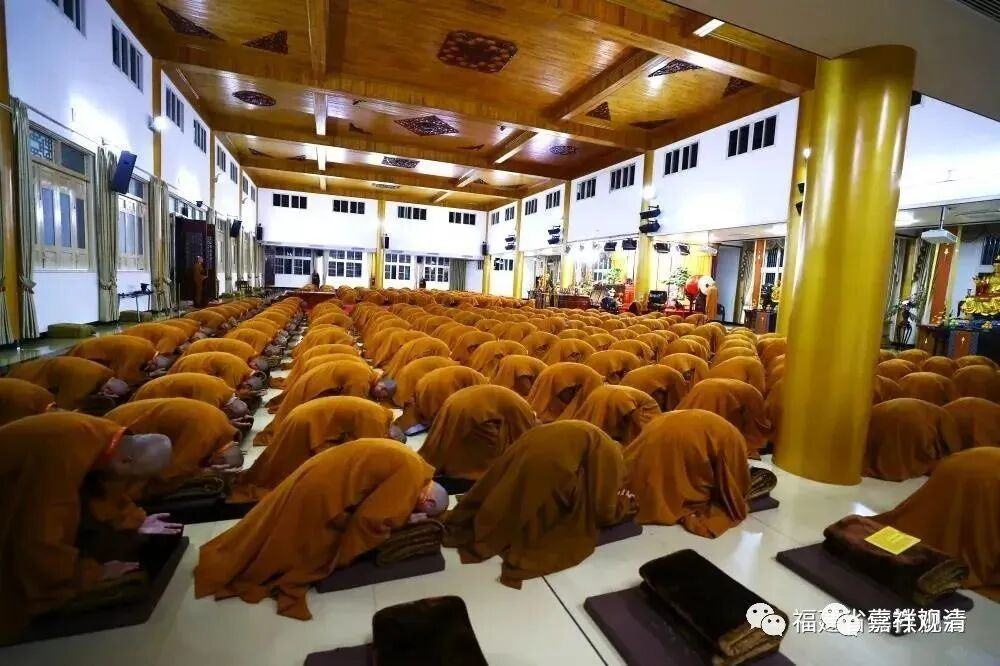
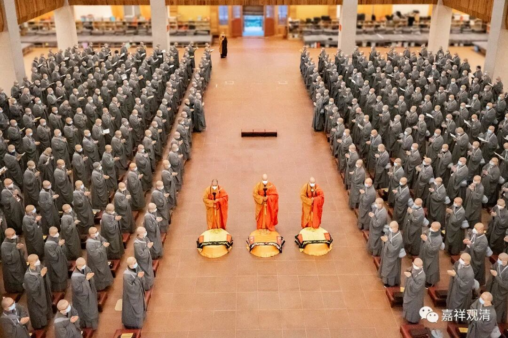
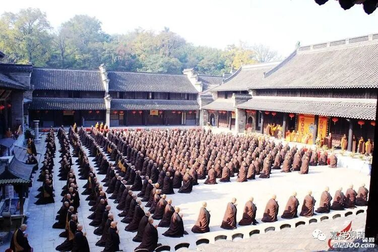

**“唯有袈裟披最难！”**

出家是要福报的！

传统里面有一种说法（夹杂了正统经论和民间说法）：由于出家意味着向往出离生死，以后（守住底线）福报很大、重报轻受，所以出家以后一般的障碍都（在修行的背景下）自趋减弱……以上为背景，那么，很多“障碍”就在出家前出现了（福报不够不能出家）。

1、某居士，向往出家，在寺院做了很久的“净人”。某时寺院要剃度一批考察合格的，他也在名单内，通知到了……结果最后一天，他在庙里和人打架了，当天就被常住（寺院）赶下山……

2、昨天说的那个“债权人”，回来以后憋了一段时间，我也通知他可以准备剃了，突然他找我忏悔，说前些日子喝酒了（！！！）。我马上开会，原来还不止一次，理由说是“助眠”。果断叫停预备剃度事项。同时我还把其他几个知情人也骂了——居然联合起来瞒着我！后来又莫名其妙踩在栏杆上打白果，摔下来造成腰椎压缩性骨折……养完伤以后自己下山了——没出家的福气。

3、我在某寺受戒的时候。整个日程已过半……一次午睡起床，就听斜对面下排有大动静（几百人的两层通铺），学医的我赶快过去，一看，癫痫大发作！手头没筷子，脑子一转，马上叫周围（有一两百和尚）“拿根牙刷来”，横过来塞嘴里避免他咬到自己舌头……后来我和寺院两位执事下午陪他去医院检查——ct检查，发现脑袋里面两个小肿瘤。当天就让他出戒场了——重大疾病的也不能出家。（其实再晚几天发作都受戒成功了）

4、另一个戒场，正考功课的时候，某尼师突然心脏病大发作……上上下下手忙脚乱……这个戒子先是被送去看病，后来也被请出戒场——因缘不具。（当时正在背功课的戒子倒是爽了，她的五堂功课基本抓瞎，但正逢“乱事”，匆匆让背了遍《心经》就算过了——这是相反的例子，福报太大了！）

