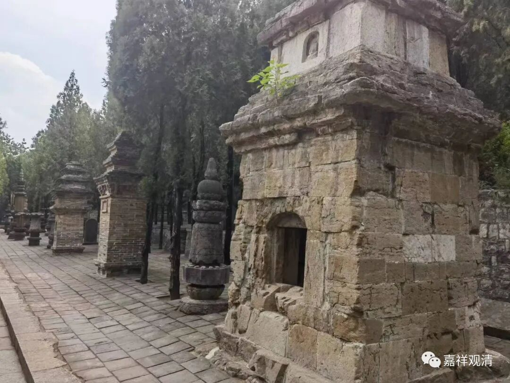

**出家的目的**

前面提到的这些怪事，事实背后就是出家的目的不纯。

我们一直说，出家的目的是解脱，是出离，乃至究竟解脱……但实际很少有人会在出家之前做到，而现实又是人人都摆出一付死士的模样，告诉你“我为利众生愿成佛”！

找我咨询或者直接找我出家的人，我一定会问这句：“你为什么出家？”而且我一般还会特地加一句“说实话，不要讲套话”。但我收到的全是套话（我不知道他们为什么认为我会相信这些假话？我发觉好像所有人都认为我傻……）——

“为了了生死！”

“为利众生愿成佛！”

“成佛度众生！”

……

（呵呵，大哥大姐，如果你们真的这么想，你们水平不会至今这么渣；如果你们真的这么想，我现在就应该把你们供起来向你们磕头。）

其实他们真实的想法（但绝不会马上告诉你，需要你展开“背调”）是——

“天天被逼婚，太烦了！”

“这个家（各种原因，比如老公是同性恋）我呆不下去了！”

“社会上（永远没有合适的工作）混不下去了！”

“我病了，听说出家的菩萨能保佑多活两年……”

“大仙叫我出家的！”

“我儿子把我赶出来了！”

“出家以后免费旅游、天下寺院免费吃住挺好的！”

“网上看到小资风的出家生活我也想……”

（甚至有）“老婆小三小四实在应付不来了我来出家吧！”

这些人连基础的佛教ABC都不知道，跟你说的“我要出家”，纯粹是因为“啥都不懂”！有些人遇到不靠谱的师父还真的能给剃了，最后，好的也就成为剃了头的“佛盲”，下焉者则给佛教抹黑，成为“佛门败类”。

所以，回到第一天说的，为什么出家的师父反而不很鼓励出家呢——因为大多数“想”出家的人根本不靠谱，所以我们才会说：“你再看看吧……”“你想清楚了再说。”“你先看点佛教基本知识吧！”

绝大部分这些人最后都不会出家，少数出家了也会还俗（几十年和尚做下来，还俗的看到太多了），另一些则是在“不想学修”和“不便还俗”中为下辈子积累一点出离的小因缘混过一生……

哪怕有百分之五的人是来认真学的，今天的佛教又何至于此！

