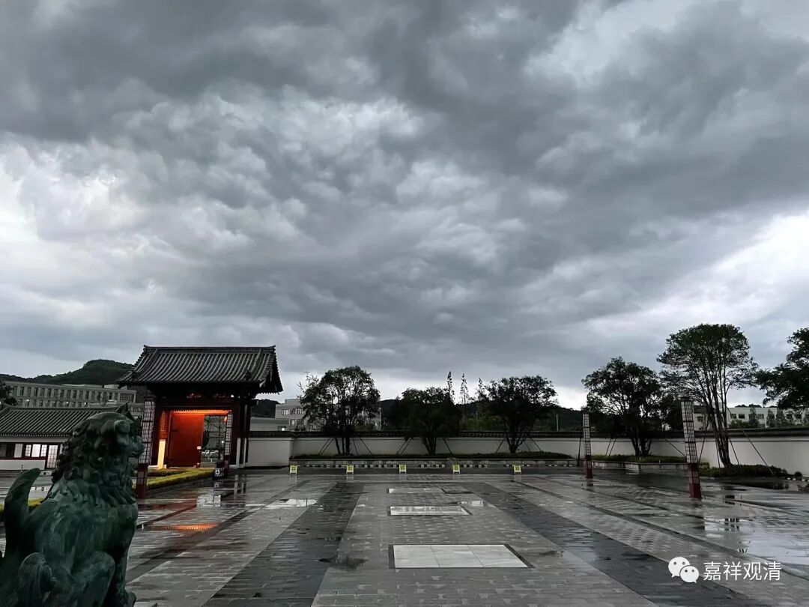

**出家人群的心理健康问题**

现在出家的年轻人中，还有一个问题，就是喜欢走极端。这可能是整体教育的问题，因为这一现象（容易走极端）也普遍地发生在社会面上。

举例：我弟子中，一类啥苦都不想吃，乃至过年有一天稍微忙了一点，中午就直接跑到我房间里说“我要还俗”！另一类觉得“吃苦才是修行”“苦才是人生”，乃至看到我带了个运动手表就觉得“师父贪图享乐”“犯戒苗头已现”，恨不得拉我出来批斗一下！（bjlqs的事情其实也有这个成分。）

我私下曾经做过一些调查——给一切年轻的僧人做了些常见的心理测试，而得到的结果（至少）是令我震惊的——除了出家人身份本身会出现的正常的一些数据偏差以外，这个群体里心理障碍的烈度和占比都普遍高于社会上正常人群的数据。而且一些“数据”在部分小团体里可能还会出现“扎堆”现象——一个具有“偏执型人格”的师父周围可能会聚集一批“偏执型人格障碍”的弟子，一个“边缘型人格障碍”的师长身边也常见边缘型人格的学生……互相越看越顺眼！（基于这些数据我是想写一篇论文的，但是……写出来也不能给人看啊！）

所以我一直呼吁、提醒，寺院和佛学院在剃度和招生的时候都可以适当考虑一下特定人群的心理健康问题，可以针对性地做一些心理测试作为参考——社会上很多公司招人的时候HR也会让做几份心理测试题，我觉得这样挺好的。比如我给某佛学院某级做了个和逻辑能力有关的心理测试，最后前三名都毕业了（以下省略）……

有些东西不能这里说了，已经说太多了，点到为止吧。

