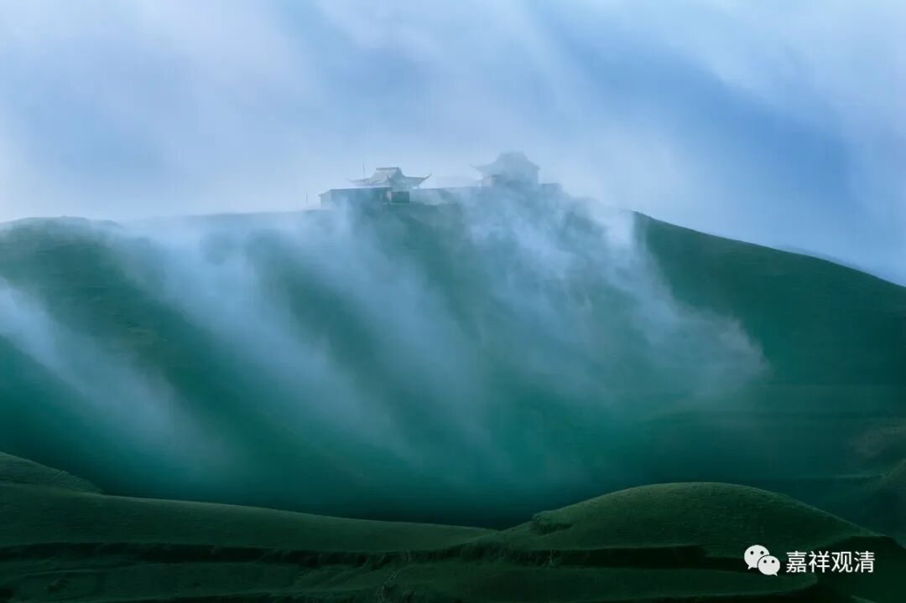
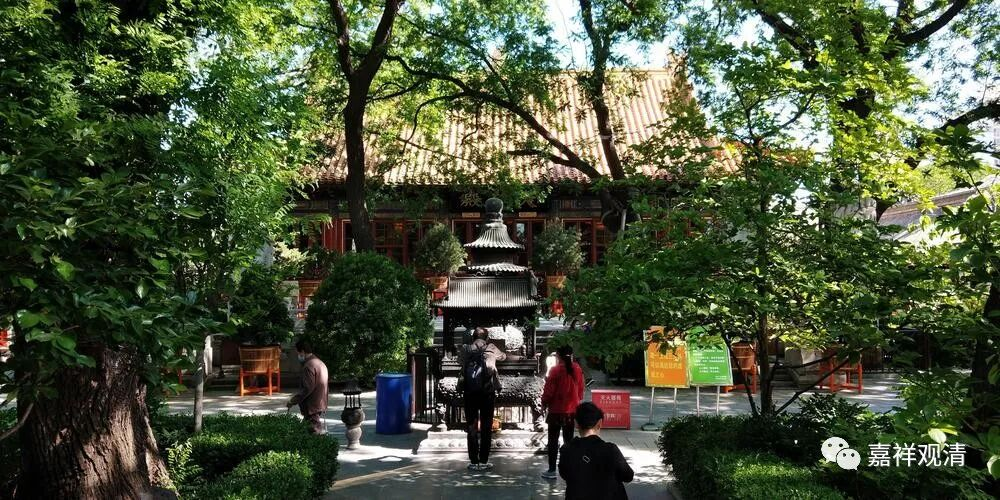
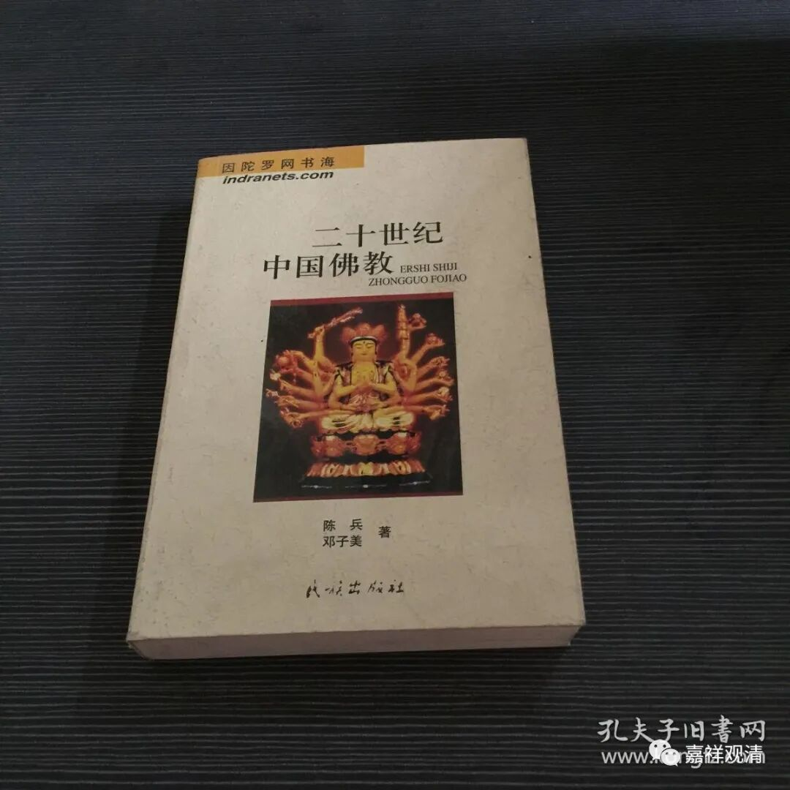
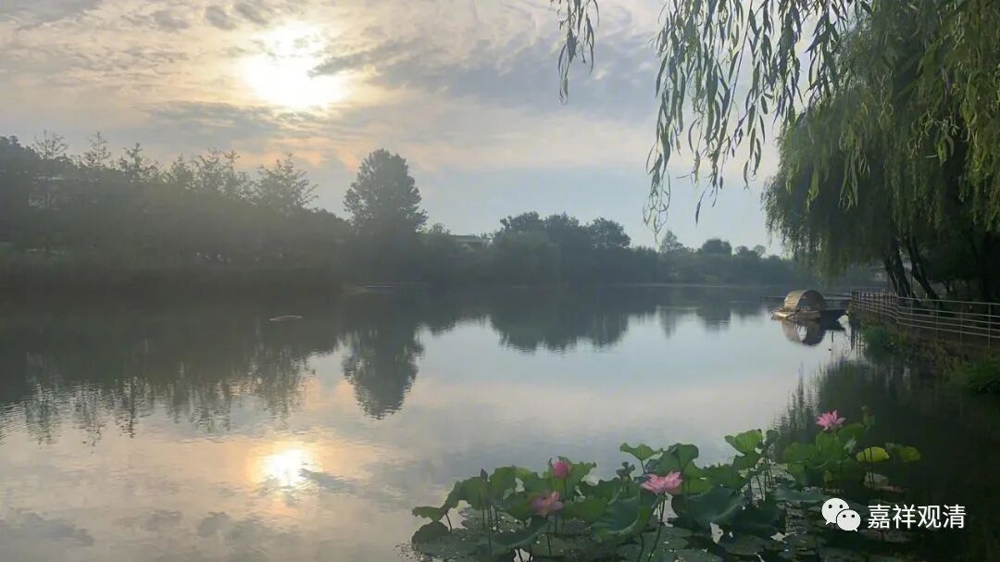
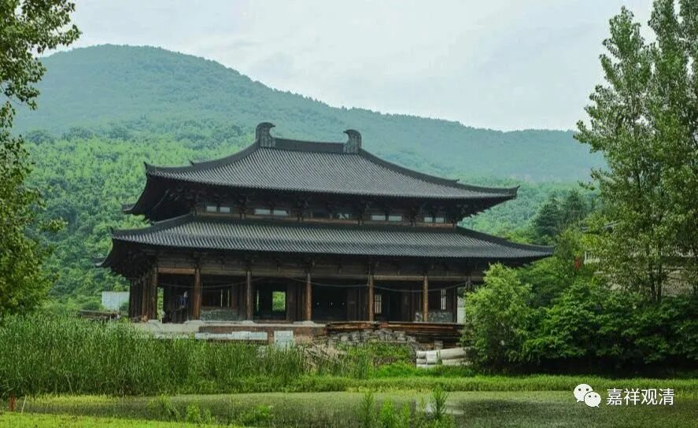

假装内行，再接着聊聊佛学院吧。

“中国佛教的问题，第一是人才！第二是人才！！第三还是人才！！！”据说这是八十年代初刚恢复佛教的时候赵朴初老先生在一次关于恢复各级佛学院的佛教会议上大声疾呼的，以后几乎每一年都要再说一次。

二十年以后的一次佛教会议上又有人提出来，一位略有声望的老居士则说：“这个问题我们不要提了。”

大家惊讶之下，老先生带着点感情的继续说下去，“二十年了，我们每年都说‘第一是人才第二是人才第三还是人才’，那么现在，人才呢？！”

……

现在，四十年了，人才呢？！

我记得《二十世纪中国佛教》中对中国遍地的佛学院有一句准确而辛辣的评语——**小而不全！**

** **

九十年代的尾巴尖尖上，我在某省市级佛学院教中观，那时候佛学院对标社会学历说是“相当中专学历”，后来社会上的学院、中专纷纷升级为大学、专科，佛学院的相关学历也开始对标地升级为“相当专科”，进而“相当本科”，现在，很多佛学院都有“相当硕士研究生”的设置，甚至最高的有相当“博士”的。与社会上的一般硕博士的价值在不断掺水一样，佛教界的这些硕博士的“水性”……可能还更强一些。

有一位zg佛学院的硕导跟我吐槽，他带的一个学生的在家学历仅仅是小学三年级，他说，辅导她的毕业论文简直是受罪。后来不到半年我也遇到了同样的事情，“小学三年级”——这个同学的学期论文也是交给我批的，那简直就没有成句的文字。我实在看不下去了，说：“这样，你用五十个字给我把你这篇文章想说的告诉我。说吧，说清楚我就给你及格。”结果是，啥都说不出来……转过年他说毕业论文想请我指导，我想了想，第二天就拒了——我实在没这个能力！我直接写一篇都比辅导一篇要轻松得多。ZZ师说我不够慈悲，于是他主动且慈悲地接下了这个活儿……三个月以后他放弃了，那个研究生也被劝退……

此后，我跟社会上招聘时问“第一学历”一样，我会问学生“你的** 在家学历**最高是什么？”……

我惊讶于很多学生“造句”里的“主谓宾定状补”全都是问题，甚至他们的简短的论文“题目”里都有一堆语病……不过后来我的气也消了一大半——因为今天社会上的普通人也是这样的。有一次我问一个居士，“你这句话里的主语是什么？”“呃，是‘因为’？”我当时就长吸了一口气……又长叹了一口气……

今天的教界的硕博士水到什么程度，举一个例子——前些年香港某大学聘了某和尚博士，该法师连续两年的论文都混淆了同一件事（而且第一次我已经** 很不给面子**地** 当面**指出过了）——把净影慧远（公元523年～592年）当作吉藏（公元549年～623年）的弟子慧远。

……

        修改于