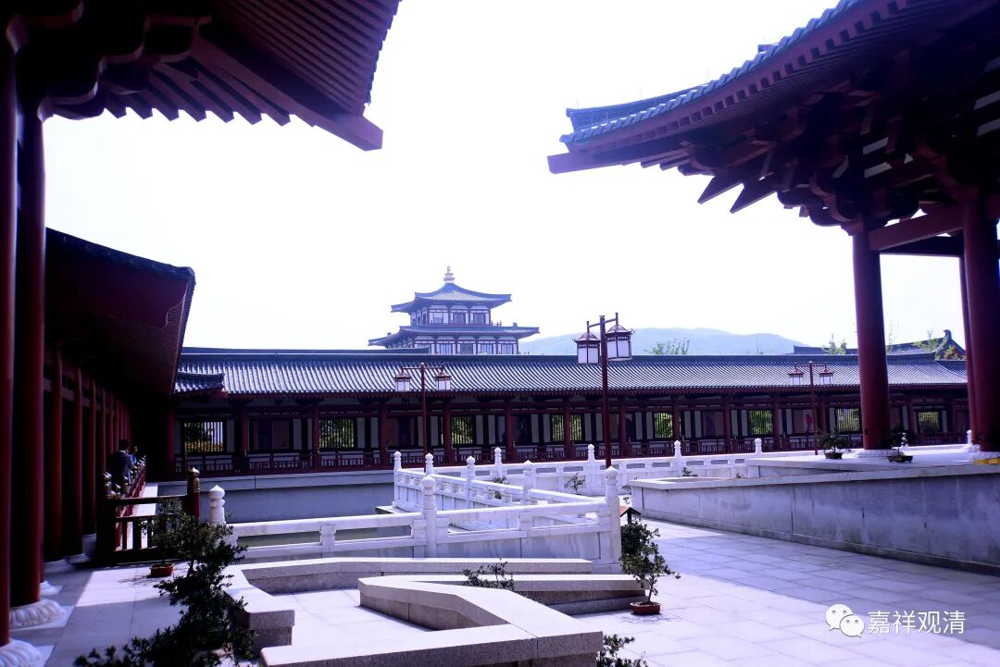
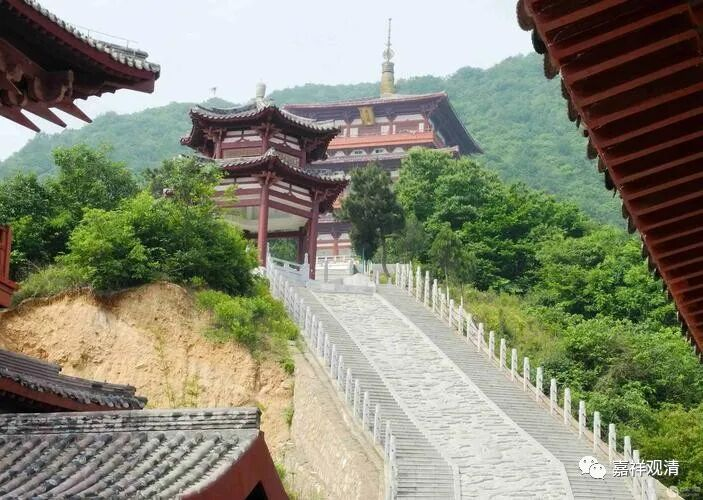
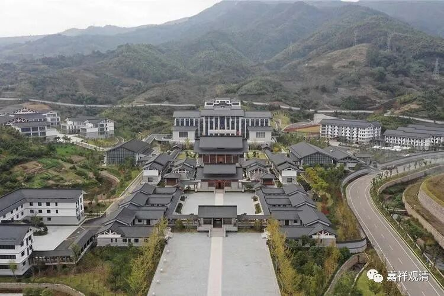
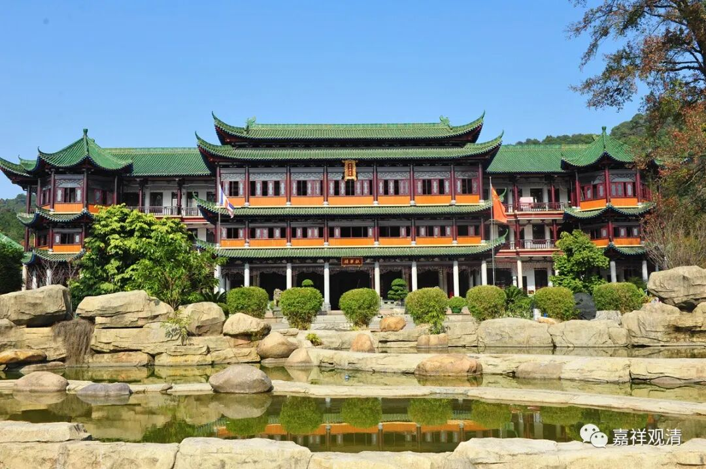

**继续谈今天佛学院的“问题”！**

继续聊佛学院。昨天的文章下面，很多跟贴都说出了不少问题和问题的缘由，很多都非常正确，但有些问题显然我不能再不知死活地扯下去了，私下聊吧。

那么，不谈细节，单从大的方面来说，今天的佛学院问题在哪里？

我再举一个例子来说明问题吧。

那年我到准备运营中的中州某佛教学院，哇！投入不小，规模很大。晚上我在豪华的图书馆看到了一张招生简章，我说：“这个招生简章写得不行啊。”LZ师说“那麻烦您给写一个吧。”我说，简单——“不交钱，上本科，还有津贴！来！”法师一咧嘴：“你这也太过分了！”

我说：“我这是大实话，也是破局的关键。今天几乎所有佛学院的问题都一样：1、稳定的资金投入和专业的调配，2、生源，3、师资。生源和（专业的）师资其实目前我们都不能保证，那怎么办？一个一个解决。本佛学院目前资金方面没问题（当然后来发现有问题），那就在保证这个的前提下，先解决生源问题。然后在游说优秀师资的时候，你就有了两个筹码了——我有资金和生源……”

稳定的资金、生源、师资！

对第一个问题，最好的解决方法，其实是建一个“母鸡”——专项基金，以基金的利息来支撑佛学院最低程度的运营开销……这个跟一般人没关系，是跟大和尚们商量的事儿，不展开了。

生源的事情，长期来看急不得，先保证“有”就行了，等做出成绩（持续输出优秀论文、持续出好书、持续输出人才），自然江湖侧目，这样，以后的招生工作就越来越轻松了。

师资的问题则很棘手。全国僧人里面，堪为佛学院优秀师资的，目前总人数应该不超过三十，如何收拢、凝聚、建设一个良好的师资团队，基本上就是佛学院能否“成功”的关键。这个程度的师资，其实跟他们“讲理想”比“讲物质”更重要了。

那么，怎么讲？讲什么？谁来讲？

终极大boss出来了——内行的管理者！真懂佛学、真有理想、真会管理的“院长”！目！前！大！陆！还！没！有！（可能连具备两条的都没有。）

四十年了，中国佛教的人才教育问题，是“任重道远”，还是“遥遥无期”？……

（某法师，你要的建议，我这篇就算是简单而糊弄地交差了。书生的文字而已……要聊细节的，我们找地方继续八卦。我** 只**负责八卦……）

