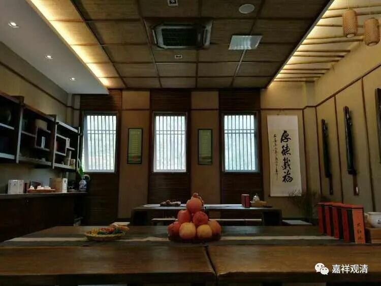
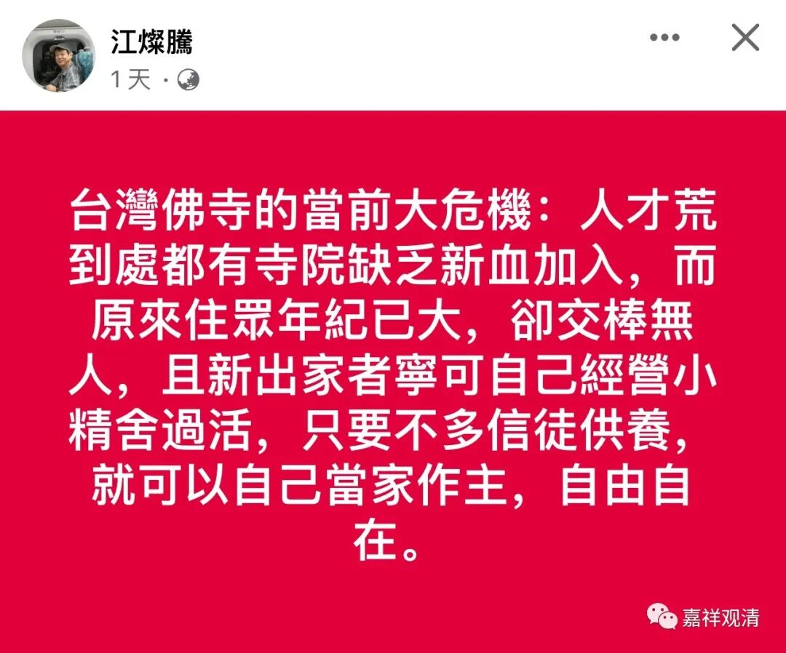

**佛教单细胞生物——精舍**

今天看到这个——

这是真话。而且我们这里也快了，只是，容易被取缔。

其实早几年我就说了，中国佛教照今天这个样子“发展”下去，精舍化会是一个趋势。宗教的内部组织问题不方便说，我举个隔壁的例子好了。

大家知道我是学中医的。中医师的成长，大致到了中年这个阶段会有一个现实的问题：升完副主任以后，是在体制内继续耕耘，还是去体制外放飞自我？体制内的好处是按部就班，衣食无忧……不过，几十年如一日，生活没有颜色。体制外的好处是，自由（心理上的），收入高，有大量可支配的时间和未来更多的可能……所以，有点能力的中医在这个时期走出体制的就很多。当然走出体制的谋生不再是无忧的，所以也主动被动地变成了半个商人……

同样的，走出寺院而精舍化的佛教也是如此。当长老恋权、团队内耗成为普遍现象以后，出走“散作满天星”遍成为一个趋势——在整个社会的基本组织已经变成个人的时候，教团的碎片化也成为合乎逻辑的必然。

假如长老们已经看到这个趋势，那么，认清自己的能力并早日向合适的人交班是一个唯一的选择！

