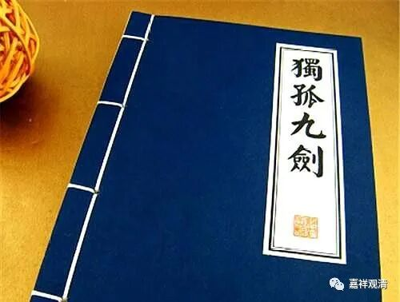

微课佛教史395·2

那么，黄龙慧南禅师自己也是心里没底，也知道自己有问题，就磕头了。石霜楚圆禅师就说（当然，要先给他面子）：“如果你真的懂得了云门宗的奥义（首先，你不能说云门有问题，而是他自己学习的问题），那你告诉我，赵州勘破婆子的公案的问题在哪里？”黄龙慧南禅师当时就吓傻了，或者不叫吓傻，至少文字上说“面热汗下”，完全懵了，回答不出来。

这是个什么事情呢？石霜楚圆禅师和文悦禅师两个人一起点到了同一个问题，但直至此时，黄龙慧南禅师还没有发现，还没有明白这个问题。是什么问题呢？就是口头禅的问题，就是“文字禅”。

“赵州勘破婆子”是怎么回事呢？这个也是禅宗里面的公案，很多人没搞清楚，其实这个公案没多复杂。说是有禅僧到赵州禅师那里去，路上遇到个老婆婆，然后禅僧就问老婆婆：“赵州在哪里啊？”

老婆婆回答：“一直去。”

和尚就走了。走了以后，老婆婆就说：“就这样走啦？”

然后大家就觉得这个老婆婆有禅。

赵州禅师说：“我帮你们去看看这个老婆婆到底有没有本事。”他去了，也同样地问。

老婆婆又说：“一直去。”又来一回。

赵州禅师回来就说：“我帮你们勘破老婆婆了。”

这是什么意思呢？就是说，老婆婆就会这一句，其他都不会。有点像后面的“一指禅”的公案，意思就是你是把别人的东西拿出来了，但背后的根本内容你是完全不知道的。

文悦禅师说黄龙慧南禅师的问题也是这样。他说的是什么呢？他说黄龙慧南禅师用的是死语，不是活句。我们前面已经讲过了，其实云门文偃禅师也好，雪峰义存禅师也好，都谈到这个问题，就是“须从己心中流出”，是吧？就说要从自己的胸襟中流出。背后的意思就是说，你不能够把别人的东西拿来唱一唱，拿来说一说，把这些当作知识去贩卖，不是这样的。

当“独孤九剑”成为一个个独立的招式被传播的时候，“独孤九剑”已死！

