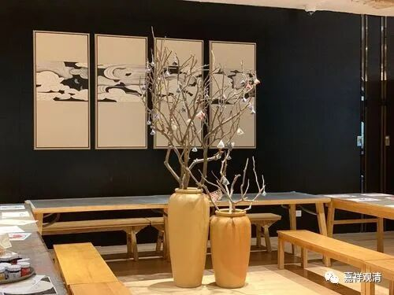

**精舍化不是出路，是堕落**

从昨天文章收到的留言中发现，很有几个人以为我是赞成、拥抱精舍化的。其实我的主张正相反。

我说中国佛教的发展有精舍化的趋势，并不是赞成、鼓励精舍化，我仅仅说，照目前这样发展，精舍化是个趋势。

佛教的去中心化、无中心化是佛教的一个“特色”。释迦牟尼佛在两千五百年前就确定了“以戒为师”的去中心化的发展模式。虽然“凝聚”是做多大做强的必要条件，但“去中心化”实际（至少在历史中）保证了佛教的生存。当兴盛一时的各大宗派（三论宗、唯识宗）在（唐武宗时期的）京城被一棒子锤死以后，禅宗却因为它的“去中心化”而顽强地生存了下来，并在佛教恢复期得到了大发展，此后近乎独占了宗教市场……一定程度的“散”对“活下来”是有好处的。

但过于碎片化对传播，特别是对教义的传播是不利的。我们看，后期的天主教固然被揭发出各种丑闻，但并不涉及更改教义，而邪教化、民间化却是新教背景下的无法遏制的硬伤。新教就是去中心化的，是绝少权威的，是开放各自解读的。一旦中国佛教的精舍化成为不可逆，那这些民俗级别的大师们的创造力足够让“万紫千红”成为一个足够克制的表述。

所以我是不主张中国佛教主动拥抱精舍化的，我说的是：今天的这种在wg后形成的“由底层僧侣恢复并建立的种种佛教制度”（引号里是作为一个单词使用的，不懂勿喷，特别是文盲勿喷。）早就到了该彻底推倒的时候了。当然，实践当中一定是改良而非革命，但改良的内容是——所有“由底层僧侣恢复并建立的种种佛教制度”。

如果不改变，那就只能看着精舍化成为必然……家长制而精舍化，是更堕落，而不是拯救。

