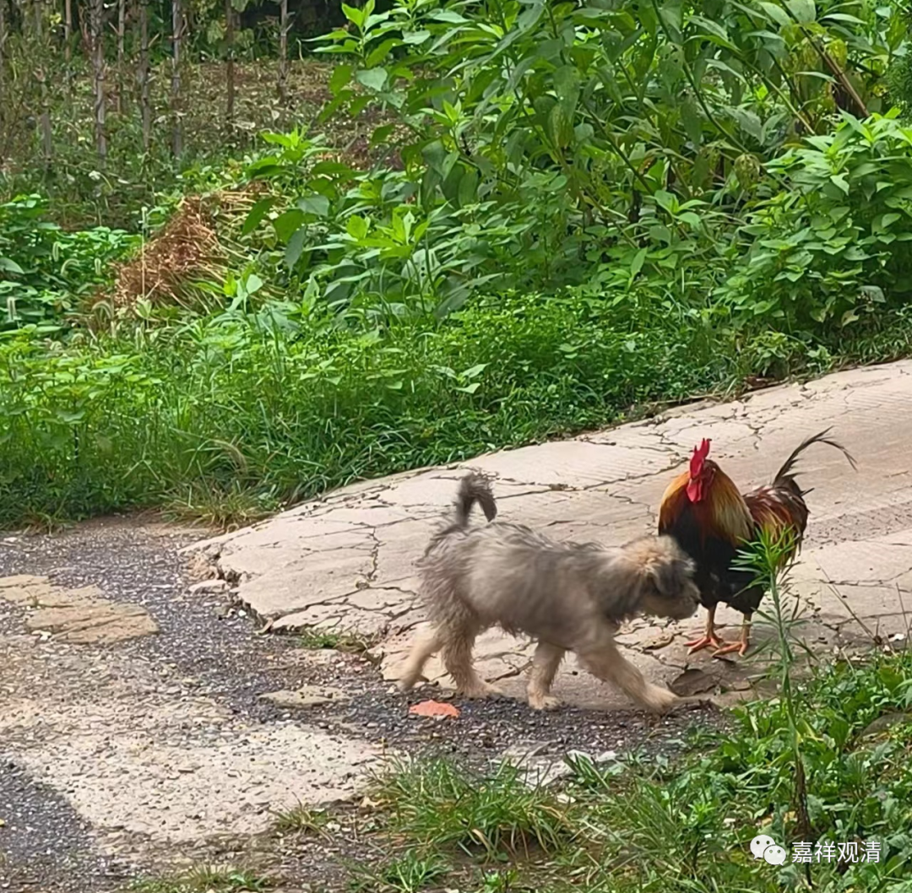

**二兽新传**

我还是聊聊寺院的小动物们吧。

连续十天叨叨佛教的事情突然把有些人聊high了，一下多出许多不知名的“大德”要督导我指点江山……我觉得自己是不配如此幸运的，“为僧之合住山谷”，小国寡民地“农禅并举”才是我的生活。

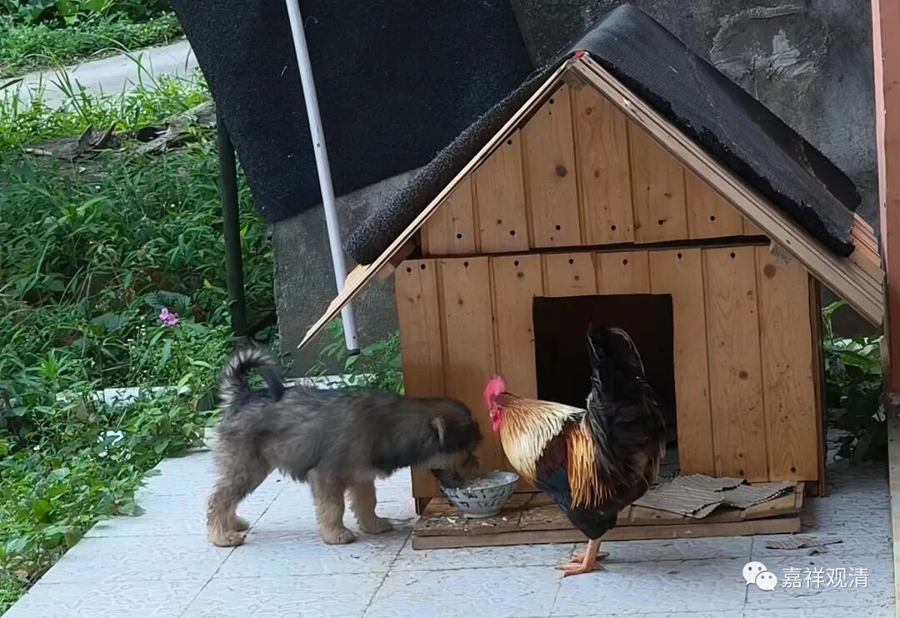

还是聊这俩吧……

直到半个月前，新来的小黑（小狗）还在被辰辰（大公鸡）欺负——啄它眼睛、抢它狗粮，追着小黑到处跑。为了小黑，我们经常得和辰辰展开追逐战，“掩护”小黑吃饭，魏老师也在那时候减了肥。有段时间，辰辰根本不吃米，可以说全靠抢吃狗食长身体了。

但是我们经历过“历史”——上一世的小黑也被上一世的大公鸡欺负过，但等它长大以后就是它追着大公鸡祸祸了。我们一般管这叫“报应”。

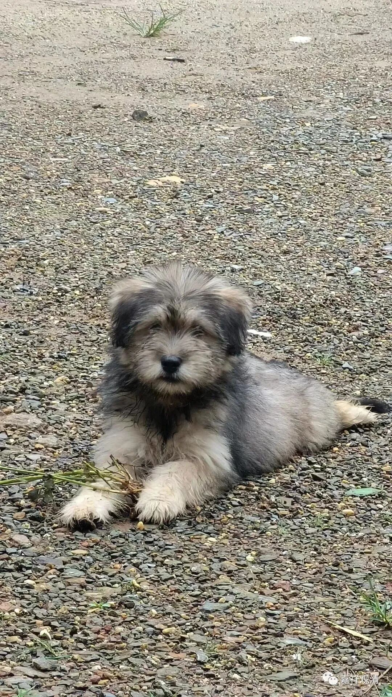

很快，我们撸狗的时候，发现小黑肥了，我们说它可以改名叫“小胖”了——狗粮还是得狗吃啊！

同时，我们发现胜负的天平在慢慢地改变着……两方的玩闹中，小黑慢慢地占据了优势。我们也不断地给大公鸡“辰辰”改外号——“姬根发”、“三毛”、“二毛”、“一毛”。

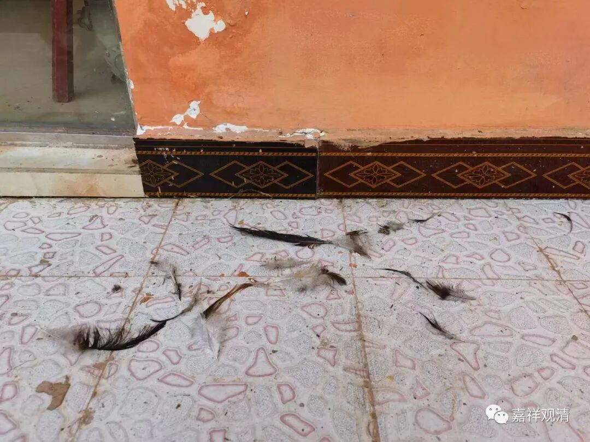

这“一地鸡毛”就是小黑的战绩

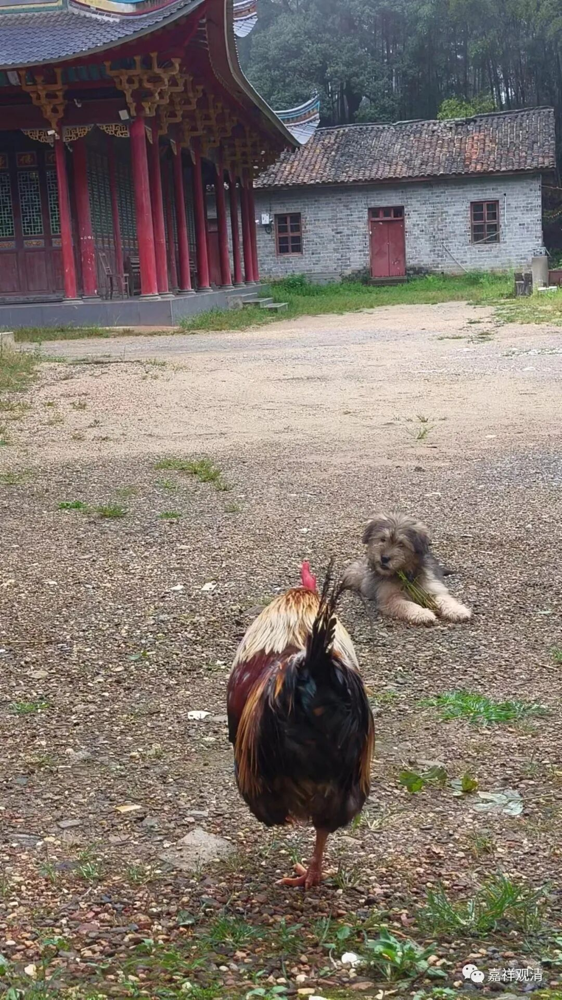

“二毛”

现在的辰辰，就剩下一根尾羽了……

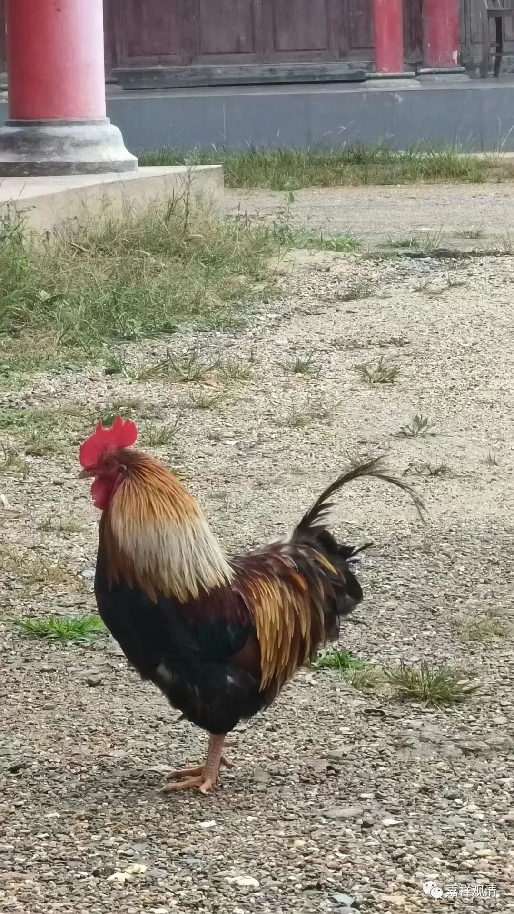

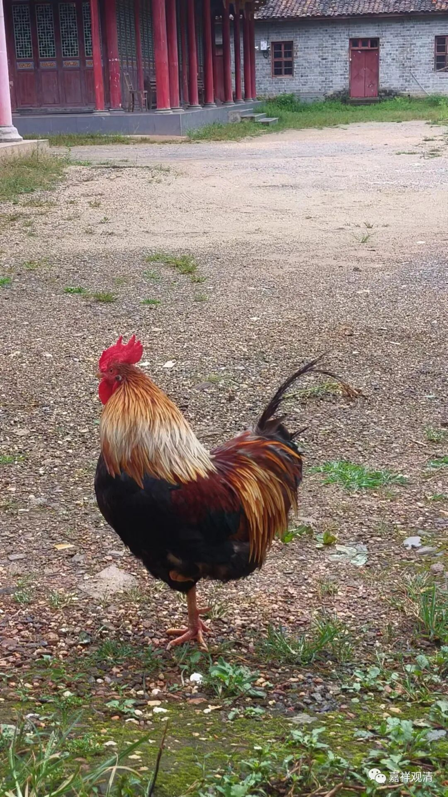

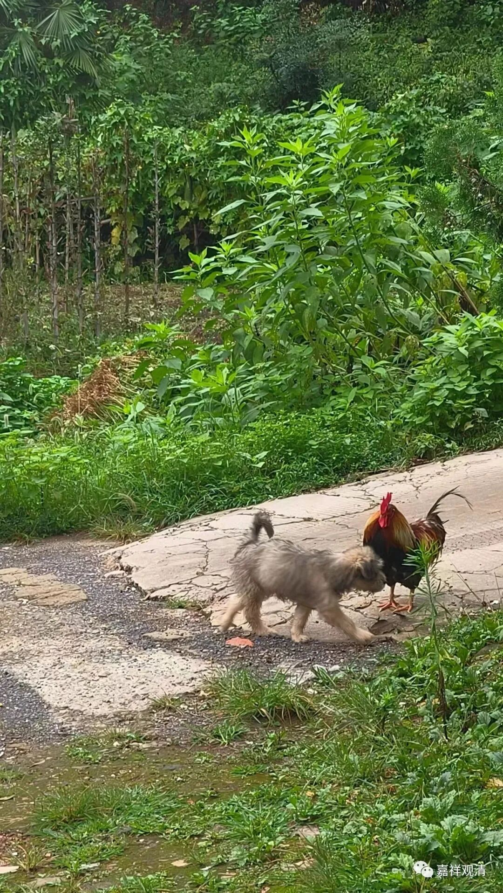

现在的独毛

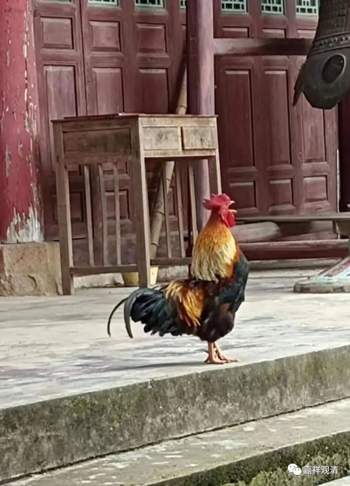

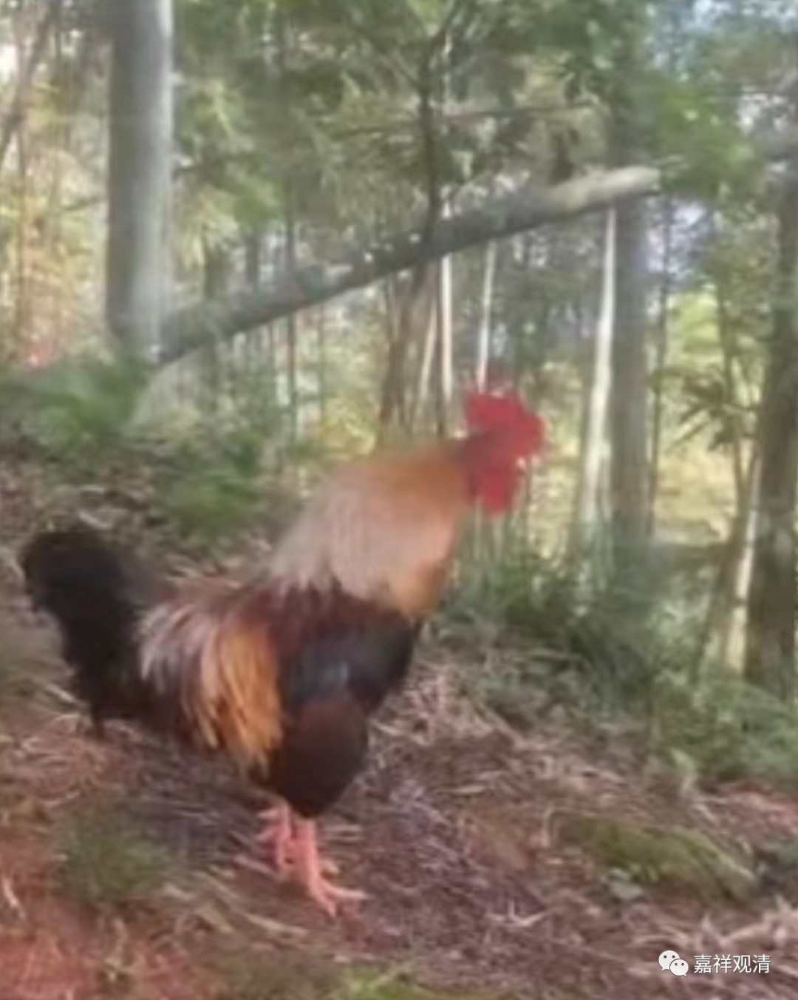

看看，以前的芦花鸡

现在，小黑反而经常去吃鸡食，连生米都吃！我们反过来只能可怜辰辰了，为了不让小黑吃到，我们把米撒到草丛里——这样辰辰可以正常进食而小黑就抢不到了——

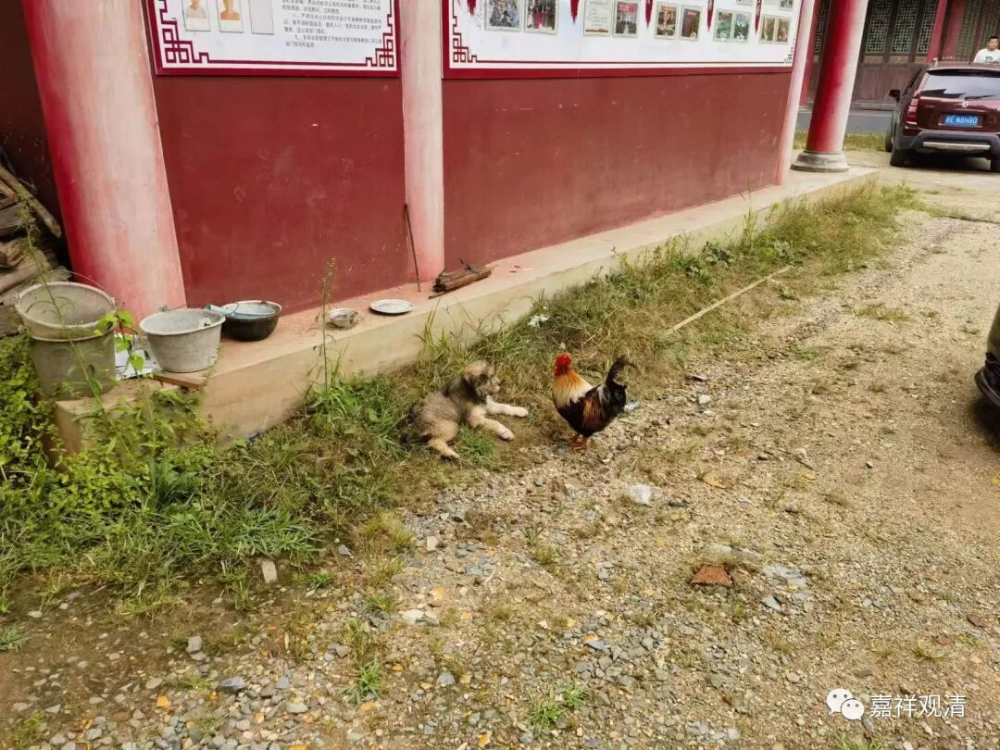

这是小黑看着辰辰啄草丛里的米

小黑的报复、辰辰的报应来的好快啊！

