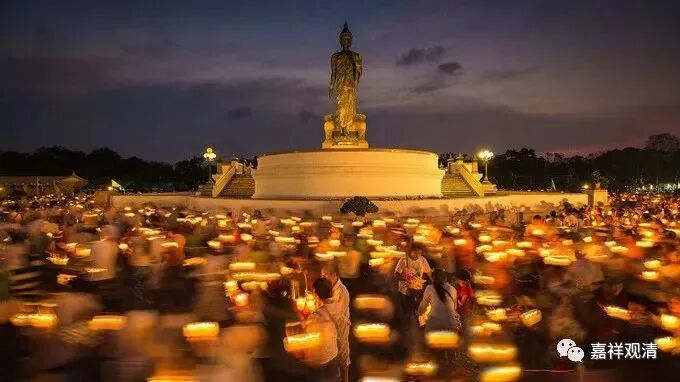
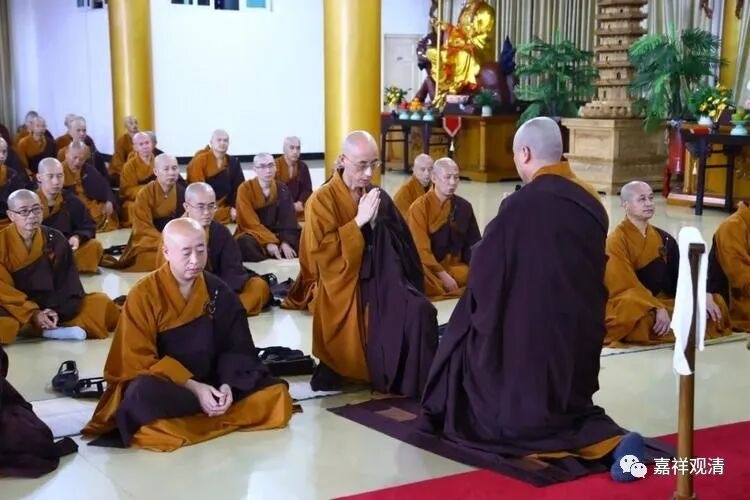
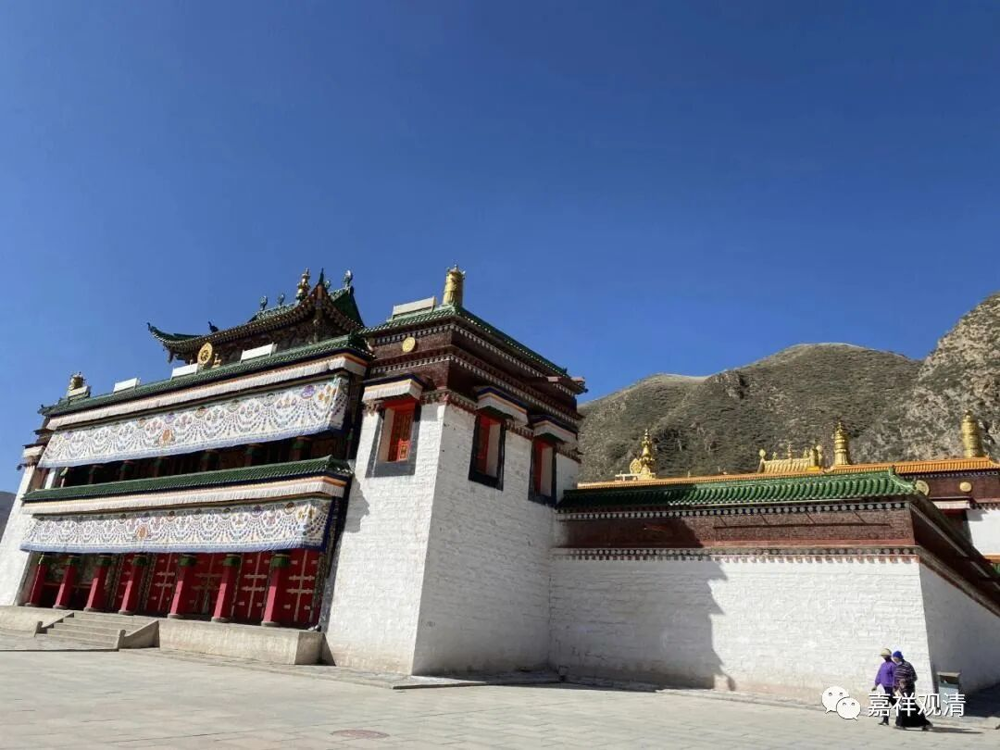

今天农历七月十五，汉传佛教僧人的夏安居今天结束，叫“解夏”。“七月十五”还有其他名字，比如佛欢喜日、僧自恣日、盂兰盆节，民间则叫中元节、鬼节。

七月十五，在佛教、在民间都是比较重要的日子……所以呢……今天庙里空空荡荡，平常初一、十五居士们都到庙里集合念经，今天连在住庙里的木生也回家去祭祖了。（所以有时候我发现外国人反而能抓住我们一些文化精髓，比如老美动画片《花木兰》里突出了祖先崇拜，很准确啊。你让我一时还不一定反应得过来。）

佛教的三个月的雨季安居（主要谈“前安居”）在现存佛教的各个系统里都有，但都略有变化而不尽相同。汉传从农历四月十五到七月十五，而且禅宗还创造性的安排了一个“冬安居”，这是从农历十月十五到来年的正月十五。“夏安居”加“冬安居”，符合了禅宗的“冬参夏讲”的模式。冬安居实际执行的时候又被操作为“打禅七”——是连续农历十月十五起的连续十四个“禅七”（有的在正月初一到初七放七天假，那前后也是91天）。冬参夏讲，日本的很多寺院还保留着个形式。

关于南传的夏安居的起始日，我刚问了一下泰国的法师，说他们的安居从相当于农历的八月初一起，也是连续三个月。中国云南的南传教区似乎是从（对应农历的）六月十五日起至九月十五日。安居的“精神内核”都一样，僧人集体闭关，全员禁止随意外出，精进修行。

臧传的安居起始日，大约也从六月十五开始（和云南傣族一样），由于藏历和农历的差别，有时日期一致（误差正负一），有时晚一个月（误差正负一）。但臧传夏安居的时间减半了，只有一个半月，七月底解夏，这可能是因为那边夏季实在太短，再继续下去，到农历八月都该下雪了，有些地方都能大雪封山了。

关于安居的日期，我十几年前还写过一篇文章，那篇类似考证，今天只是随口说一下各家现存的样式……很久不考证了。（考证是与大众为敌啊！）

