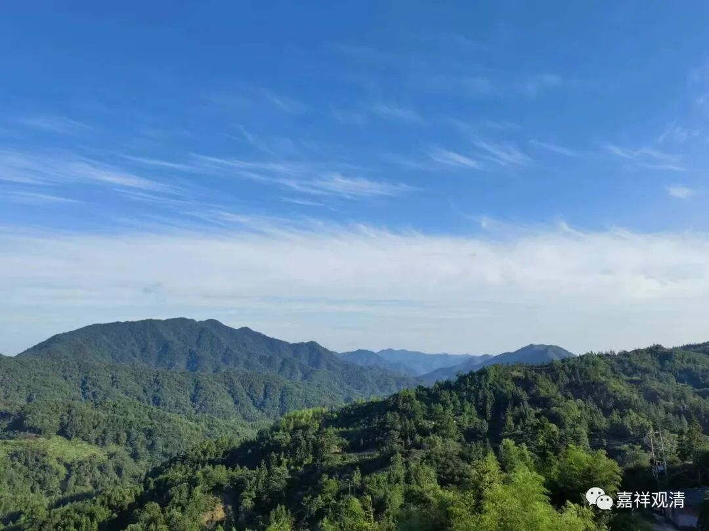
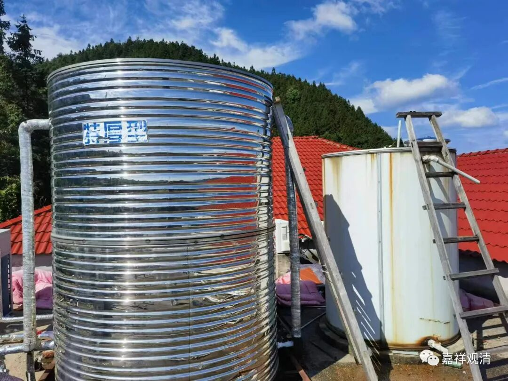
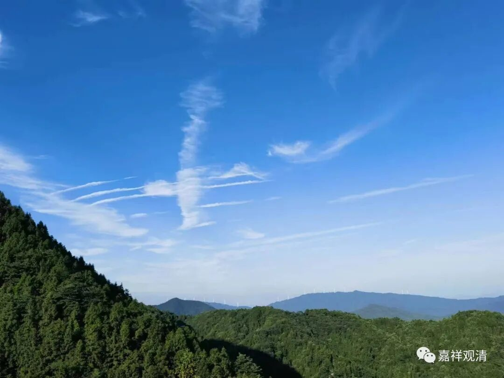

**山居也不闲**

今天乡里的水电工终于上来帮忙看综合楼的水电问题了。

有些在大城市不成为问题的小事儿，在村里、山里就是大问题，比如水电。山里的寺院、茅棚，基本都有水电的问题。前两年隔壁乡有个寺院甚至要从山下抽水接力到山上（先抽到山腰的一个水池，再从山腰抽水到山顶的寺院），可以想象其中的辛苦。（这个工程不轻松啊！但肯定是也没其他办法了。）

去年本地大旱，下半年基本就没啥降雨，连山下的水库都见底了（十几年了我第一次见），鄱阳湖也成了“赣北大草原”（这倒是常见）……山里的饮用水就更是令人发愁了。这样的情况自我接手寺院以来是第三次——有一年冬天，我们的用水浑得……那就是黄泥汤。那年冬天，全村人都在附近的几个山头找水源，可是，泉眼都干了。

好在科技还是下乡了，我们去年打了两口机井，算是彻底解决的水源问题。（有一口井我们打了一百七十米……我查了一下资料——这个深度，在沙特都能出石油了！）也是有很多善信居士支持的结果。谢谢大家了！

井是有了，水泵也放下去了，可时间久了还是会出各种问题（其实有些对专业人员来说是很小的问题）。这种水电问题，我们是搞不懂的（我只能推理：不是什么问题，可能是什么问题），在大城市也许只要给物业一个电话就搞定了，实在不行找个人帮忙弄一下子也很容易；但山里不行，山里没有“物业”，而且当地水电工奇缺，一个乡就这么一个，三请五请也不容易有空来，愁得我，都准备和兄弟一起去政府报名学习“初级水电工”了（真准备报名了。据说考出来减免六百学费）。

今天就是，半个多月以前出的毛病，终于来修了。山里上上下下沿着线路排查水管、接口、水泵、蓄水池……各处找毛病，搞了个替代方案，算是终于解决了……

下午顺带把水桶清洗了，那沉淀下的泥都老厚了。蓄水桶有点漏，水电工老王说应该能撑到明年……那就明年再换吧，现在这个能用就行。冬天上冻……老王说大家都没办法，撑过上冻那几天就好，“预备好水，事先把水泵拆掉”……我们都已经坏了无数台水泵了。

小庙的和尚，啥技能都要上手弄几下——山里都这样。

回庙里的时候，空中有几架战斗机掠过……这是去台湾的吗？

