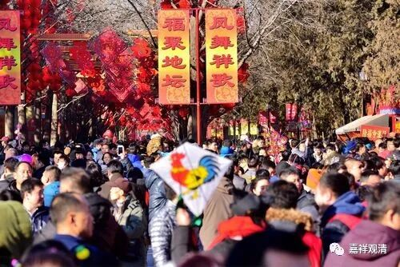
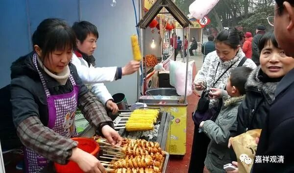
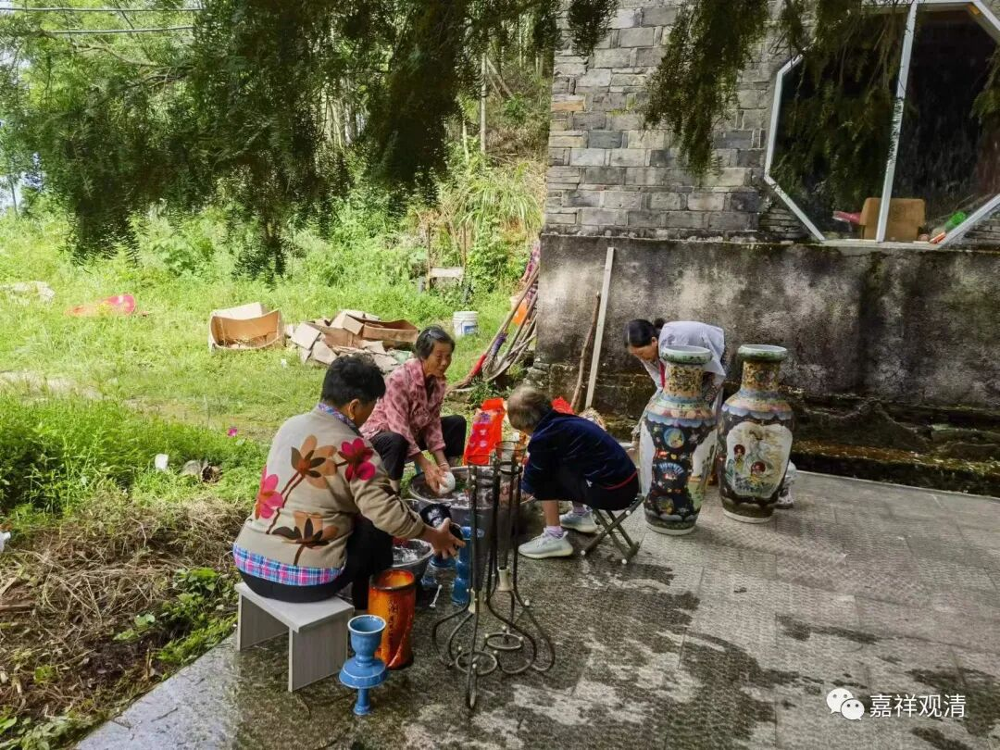

**说说咱们的“开山会”**

这边庙里一年两个节日最重要：1、过年；2、开山会。

长久以来我一直以为“开山会”是“开山”的“会”（偏正结构），就是纪念寺院创建（“开山”，比如“开山祖师”）的；或者是寺院解夏安居以后开放大家来参观，所以叫开山会（解夏是七月十五，我们“开山会”在七月二十六，正在解夏之后）。后来下到民间接触民间宗教了，才顿悟这个“开山会”其实是“开”“山会”（动宾结构），“山会”，就是庙会、山会、香会，“开山会”，就是办香会、办庙会。

开山会的时候，周围十里八乡的人都会上山来拜佛。当然我们说起来叫“拜佛”，其实在当地人思维里更类似过年那时候的“走亲戚”（当地很多人都认观音做干妈的），所以他们在村里临时招“义工”的时候说是“庙里办事”“要人”，而“拜佛”以后的“供养”他们实际称作“随礼”（就是吃酒席的“随礼”）。因此，庙里在这天最主要的操作也类似于一般人家“做寿”“嫁娶”“搬新房”的那种套路，要办流水席——摆开十几、二十张八仙桌，找十几、二十个人帮忙，甚至要去他们祠堂借很多桌椅板凳，还有专人登记收红包。

除了吃一顿和看看亲戚（菩萨），这里开山会并没有其他内容了。最近我提出我们可以按其他地方“庙会”的套路来，搞点炸土豆、套圈、银耳羹、土特产……搞点临时的竹棚弄个小庙会办个三五天。乡里说：“搭棚子的钱挣不回来。”哈哈，也有道理啊。

不过我还是考虑，义工多一点的话，我们可以试着做一下，搞点我可以吃的素食摊位，至少我们可以自产自销啊。

“来来来，我的烤素肠你来两根……”

“你的红豆羹给我来一碗……”

“炸土豆片给我留着！”

“包浆豆腐多加孜然！”

“油条炸老一点！”

“豆浆，咸的！”

……

因为要办“开山会”，所以提前几天庙里该清扫准备，今天居士们就上来大扫除，搞点清洁准备工作了。

下周日开山会咯！

