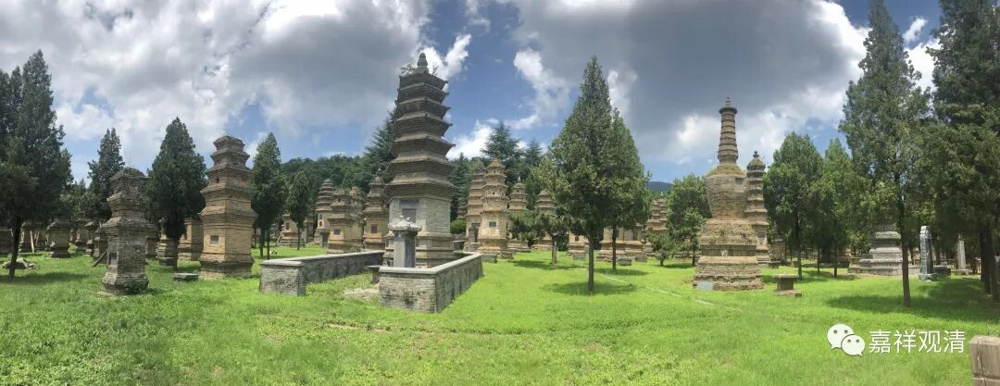

在南北朝大致同一时期，出现有敦煌昙庆、琅琊昙度和江陵昙度，此三位似乎都与三论师承有关，我们之前略略提了一下，现在继续讨论一二。

一、先说敦煌昙庆。

安澄《中论疏记》说高丽道朗：

**“高丽国辽东城大朗法师，远去炖煌郡昙庆师所，受学三论”

大朗，即道朗，为区别于僧诠弟子兴皇法朗，故称“大朗”。

朗公于梁天监十一年（公元512年）摄受僧诠、僧怀等人，则敦煌昙庆大致活跃于公元450～500年前后。

敦煌昙庆可以明确为三论师。

二、琅琊昙度。

刘宋元徽（公元472～477年）中继僧瑾为僧正，亦曲事明帝之子后废帝刘昱（《高僧传》做“少帝”，应即后废帝刘昱），则亦大致活跃于公元450～500年前后。

刘宋时期，智斌、僧瑾、昙度相继为僧正，其中，智斌善三论，僧瑾师从龙光道生亦属三论一脉，琅琊昙度善三藏、三玄，（亦此时三论师学风，）或亦善三论。

三、江陵昙度。

长期住彭城，一般认为是成实师，但亦传三论。如《高僧传》记载僧印曾从其学三论。据《高僧传》记载，江陵昙度卒于北魏太和十三年，即公元489年，则其生卒年与敦煌昙庆、琅琊昙度相近。

一般认为江陵昙度算成实师，但成实师善《三论》、三论师善《成实》亦为当时所常见。（且僧印曾从其学《三论》……或者我们可以因此再考虑一下三论师和成实师的关系——既对立，又融合，或者说早期相容，后期相斥。）

高丽朗公之三论学一直没有令人信服的明确师承，有谓“昙度”即“昙庆”，指向江陵昙度，但江陵昙度虽亦传三论，但足迹未踏入敦煌，应非一人。若谓即琅琊昙度，年代上虽亦相近，且琅琊昙度或亦擅三论，但亦似未见涉足敦煌，不能确定即敦煌昙庆。

所以，还是昙庆归昙庆，昙度归昙度，让历史留点未知吧。

