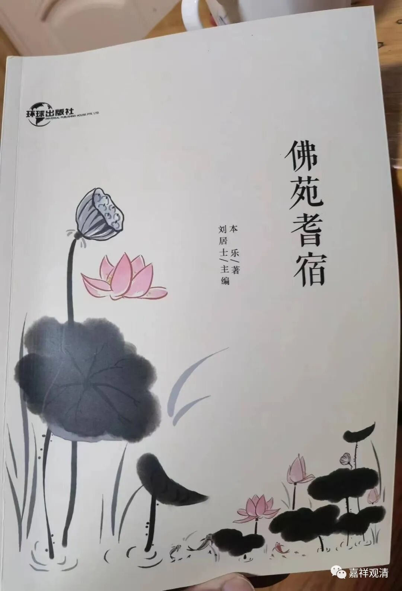
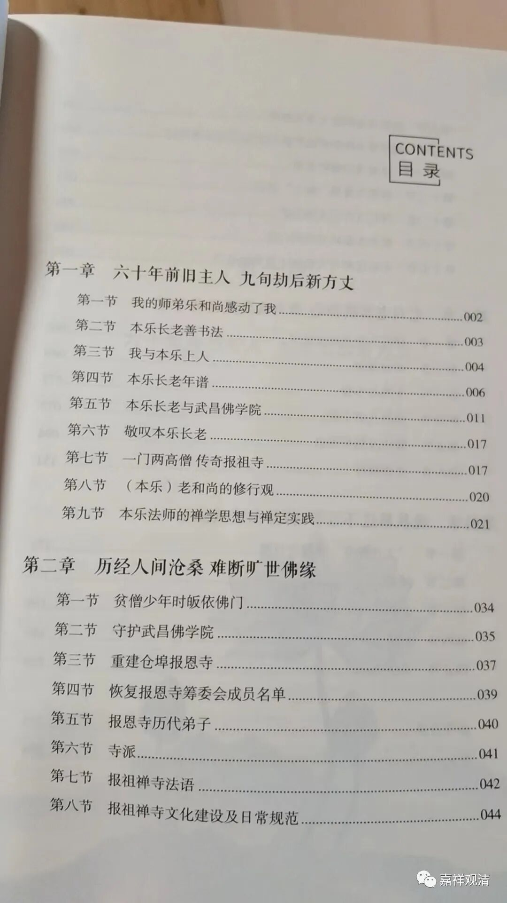
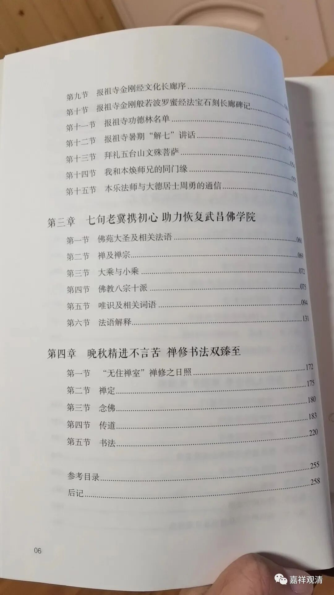
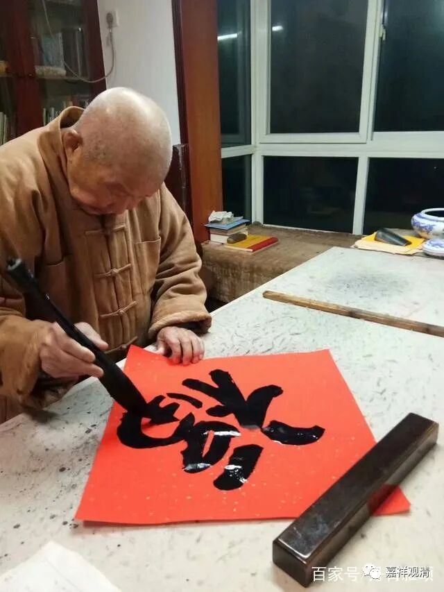
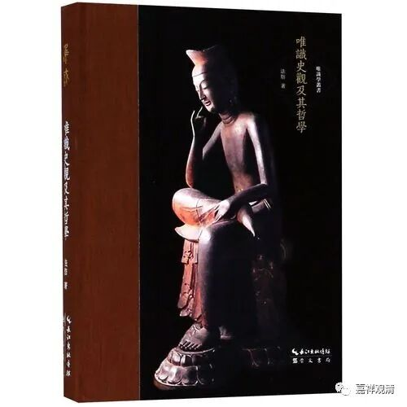
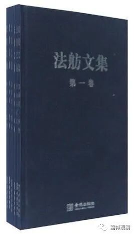
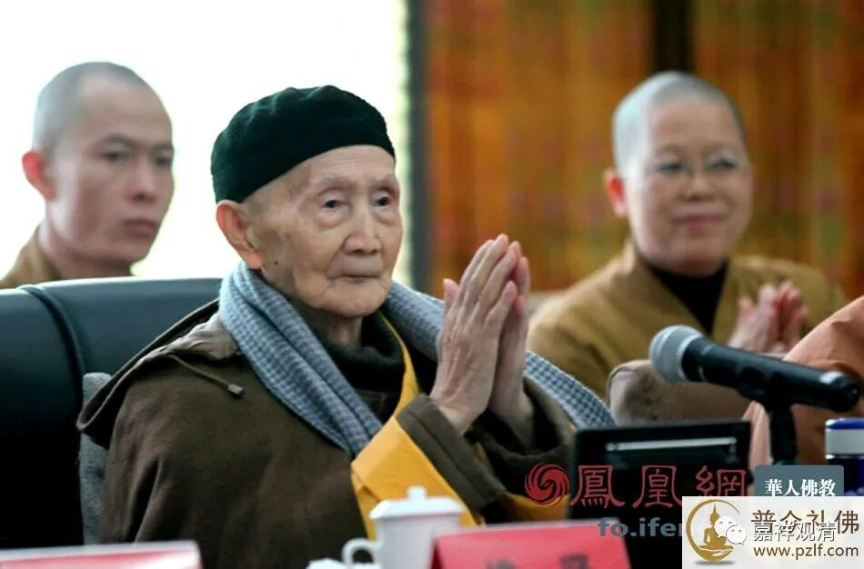

**署名老和尚的《佛苑耆宿》**

从报祖寺带回来一本和老和尚有关的书——

说得这么拗口，是因为这本书的编撰体例颇有些杂乱，虽说是老和尚“著”，但从内容来看老和尚亲自动笔的比例很小，大概类似老和尚周围人士结集的文字。

听说曾经专门收集过一些老和尚回忆生平的录音资料，现在看来，由于整理人员对这段历史比较生疏，所以似乎相当地“意犹未尽”。

老和尚曾在汉藏教理院先后进修三年，按理说法尊法师、观空法师都曾经给予过教授，但好像老和尚最服的是法舫法师，从这个角度来说，老和尚佛教思想还是继承自中国明清以来传统而略支持现代性诠释的那种。

法舫法师是太虚大师门人，是在当年被公认为会是太虚法师接班人的，当时在汉传佛教界的名声地位恐怕尚在他的同学法尊法师、印顺法师之上，代表作为《唯识史观及其哲学》。曾在东南亚某佛学院教《俱舍》，过世得比较早。前几年市面上有《法舫法师文集》的出版。

老和尚说，当年在佛学院毕业以后，学习笔记一直都留着，直到被拿走检查，以后就再也没见过了。老和尚说，他的佛教知识也随着笔记都飘走了～～所以我一直说我们一定要注意多背点东西，别只会背个《心经》……我现在的佛教水平，少一台电脑大概段位要掉好几段

这本书里面说到老和尚就读武昌佛学院的时候，教师里有惟贤长老，书里介绍说惟贤老和尚是“曾为重庆基云寺方丈”，这一段明显是整理录音的人弄错了，“重庆基云寺”应该是“重庆缙云寺”。但惟贤老和尚其实是“重庆慈云寺方丈”，重庆慈云寺在重庆市南岸区玄坛庙狮子山麓，重庆缙云寺则在重庆市北碚缙云山中。

有机会我把那些录音拿来整理一下的话，可能会有很多新发现。我去要要看……

