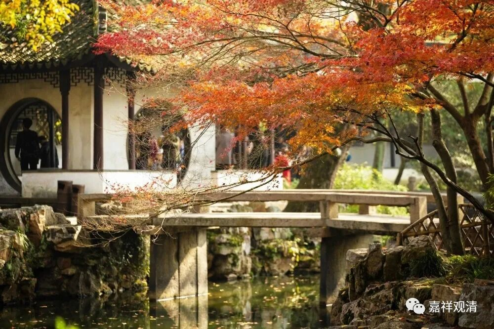

**微课佛教史388·2**

黄龙慧南禅师说，牢里面这些牢头或者审案子的人，习惯性地以为犯人要是不上刑的话，是不会说实话的，所以他们一定会用刑的，他们就是纯粹不相信你的。禅师的意思就是说，你也怪不得人家，这是人家套路。但是，如果你被打以后，你的话如果前后不一样，那就更加坐实你讲的是假话了……等到他们发现所有的事情都查清楚了，那也就把你放了。

假如你在被打的时候说了一些新的东西，人家不知道具体内容是什么，反而还得继续审下去……黄龙慧南禅师就说他之所以不说话的原因就在于此。所以打就打呗，扛着。打了以后，事实该怎么样就怎么样。最后查清楚了，该怎么处理怎么处理，该放也就放了。

这说明黄龙慧南禅师当时的思路还是很清楚的，不知道是不是有人教他，应对思路还是很清楚的（但说明当地地方小吏不怎么信佛）。

这种事情在后来的禅寺管理当中真的是很常见的，是什么情况呢？或者是被诬告，或者是因为其它什么原因被抓，被抓了以后怎么样呢？前面我们讲过，就去动用一些关系。不过，一般不会马上放出来的，通常是过一段时间，甚至过一两年的情况可能都有，然后再被放出来。

脾气大的住持就不再回这个寺院了……这个说法也不太好，应该说有些禅师就不回原先的寺院了，得罪人了，等于得罪原先的利益阶层了，回去还是被穿小鞋。（前面我们说过，那时候，一般“方丈”是流动的，寺院本身有自身独立延续的管理团队，方丈相当于学术带头人，名义上的老大。当然能力强的就能够强势参与管理。）或者也有能力强的祖师是再回原先的寺院进行整肃，这个情况也有。

我还是这么说，中国在封建社会还有这样的情况，就是千万不要做被告，中国以前的说法就是不要做被告，做被告就要倒霉，先输一半。这个案子既然找到你了，那你不被打一顿肯定是不可能的——这是说古代啊，现在是没问题的。

然后，就说黄龙慧南禅师两个月后被放了，** “须发不剪，皮骨仅存”**，就是瘦得一塌糊涂，他不是绝食嘛。（说实话，这类事件，两个月绝对算很短的时间。）另外，他的“绝食”和今天意义上的绝食不一样，相对要单纯一些。

