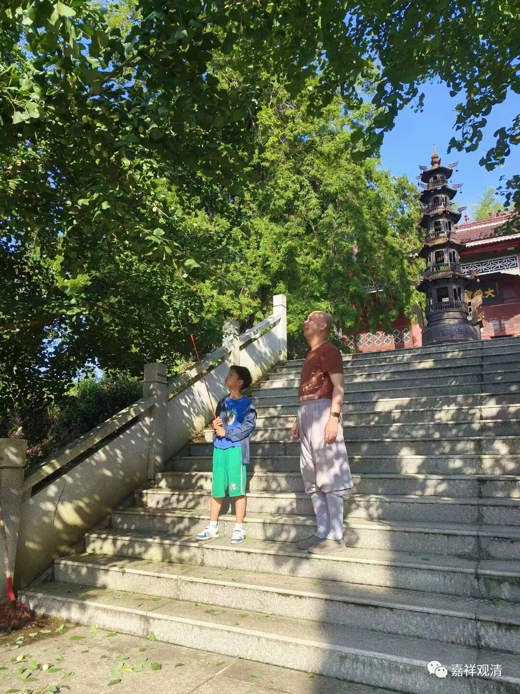
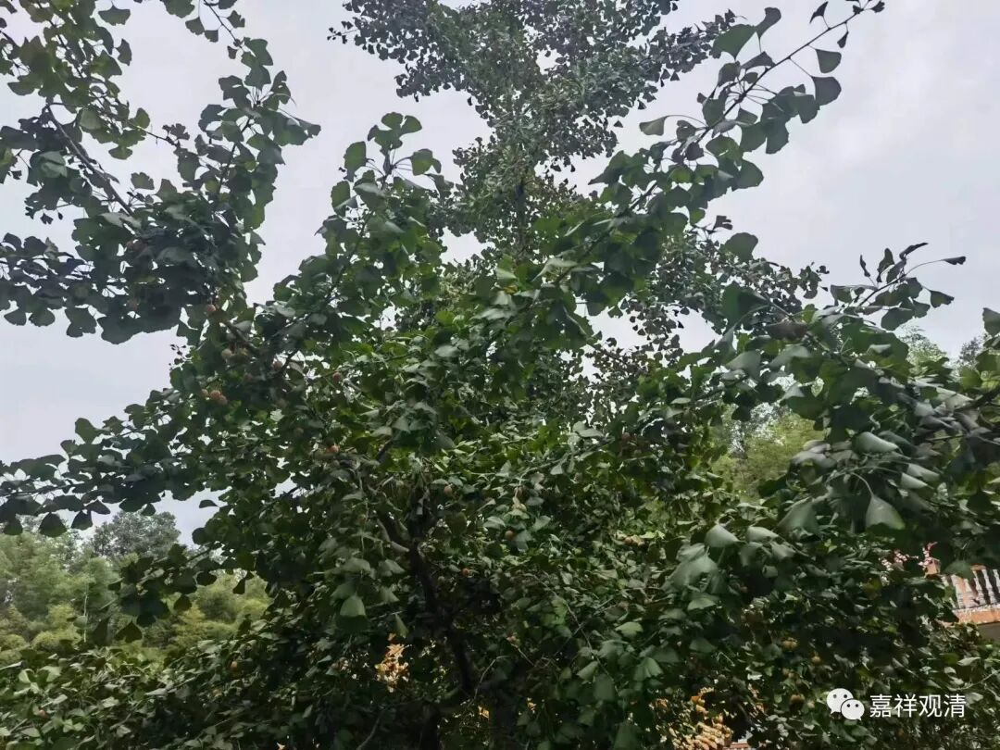
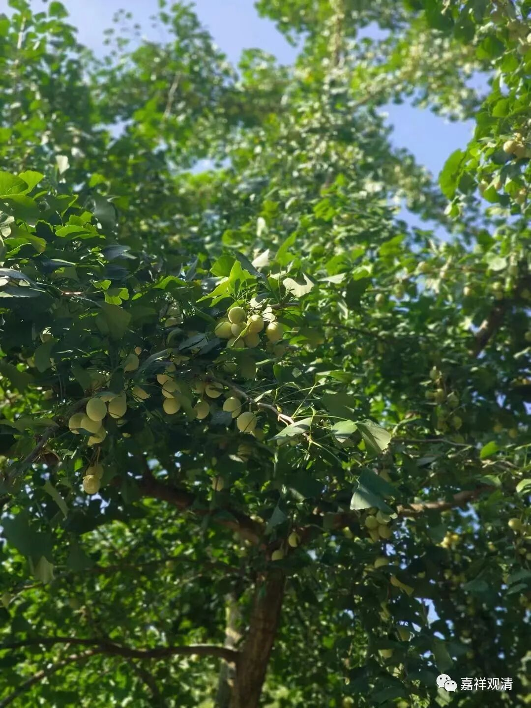
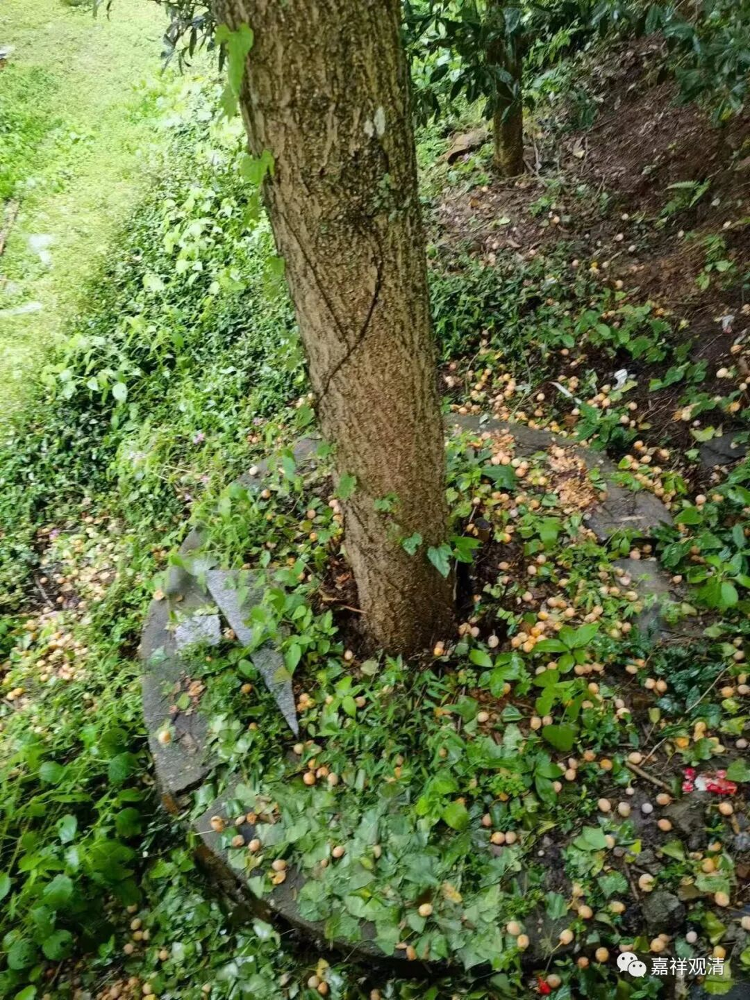
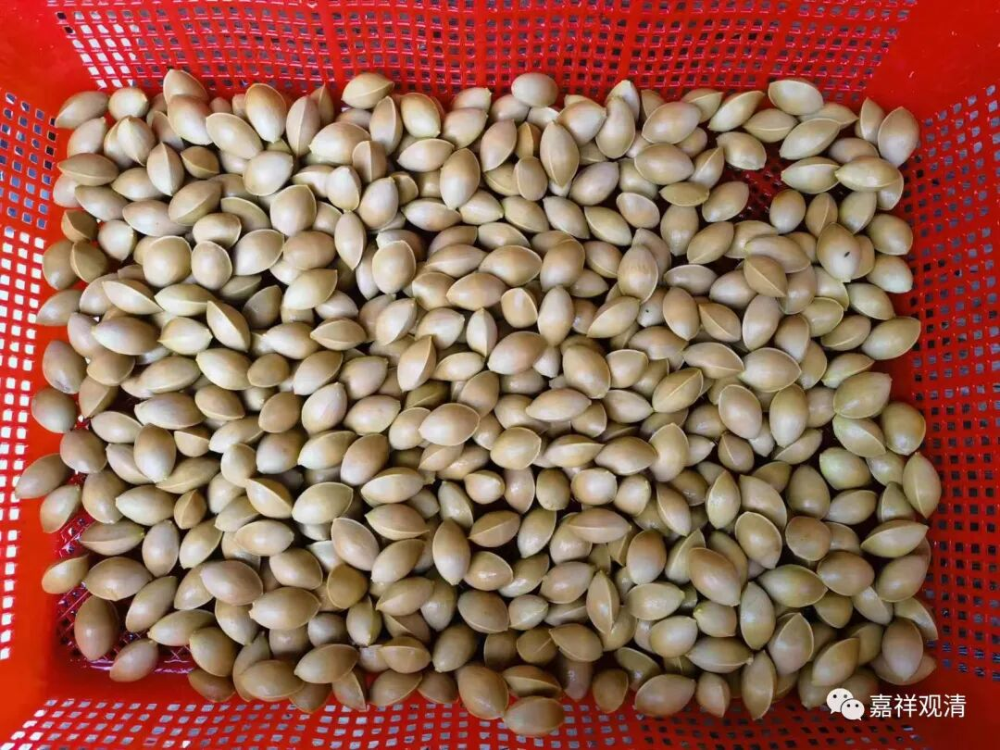
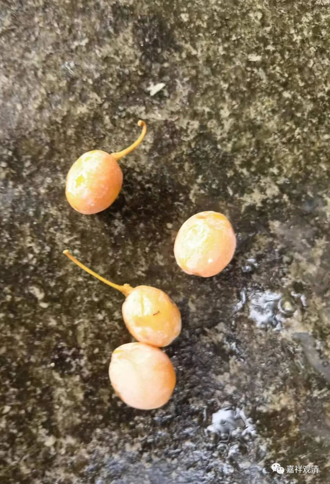
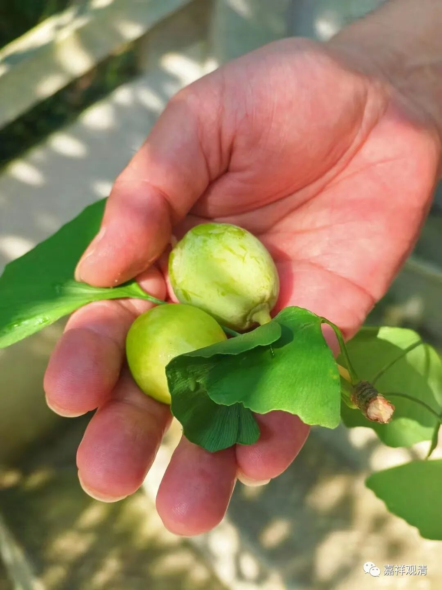
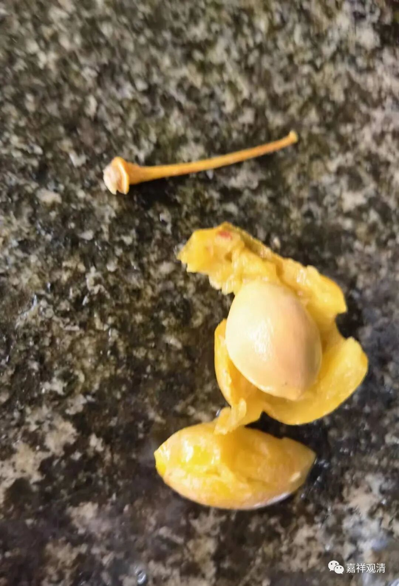
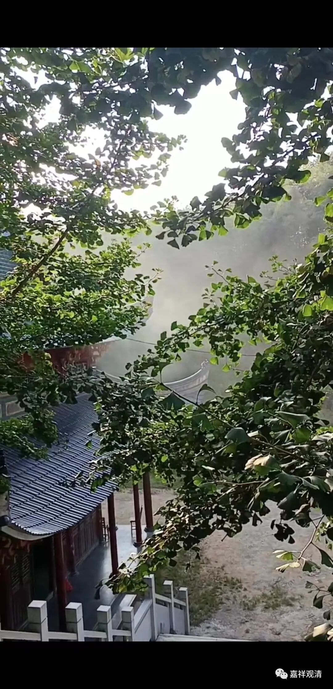
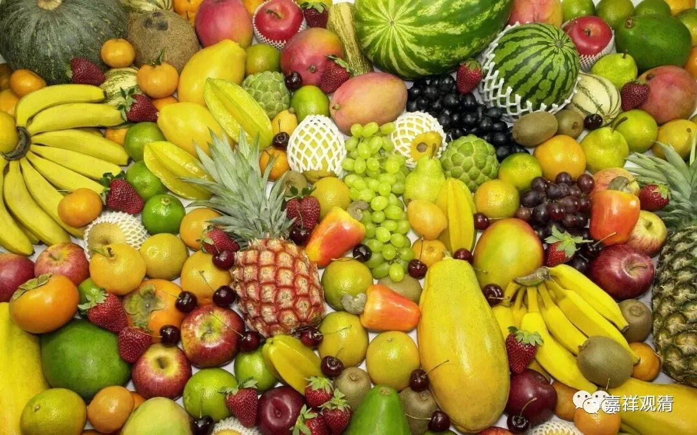

**庙里的银杏树**

庙里的银杏果子都熟透了。

树上挂的都是银杏果

前些年庙里先后种了十棵银杏，都长成了。大殿阶梯两边的银杏树种得最早，有一棵已经结果子了。其余八棵都还没张开，看样子还得十年左右才能结果。银杏树分公母，山下面清溪村的祠堂门口也有一棵老银杏树，以前我们去他们村子，会顺手买一点白果（还会买一点蜂蜜，他们村口有一家养蜂），现在我们自己有了（银杏树和蜜蜂我们都有了）。

白果长成熟了，自己掉下来，我们会捡起来，外面烂了，就剩下这个了——白果。

这是熟的银杏果——

下面这还没熟——

等它果子烂了，取中间的核，晒干。

等银杏果烂了以后，就取核。

银杏果子烂了很臭，原先不懂，收集一堆用手捏……那个味道实在太臭，手上味道很久都散不了。而且这东西腐蚀性强，手到后来会脱皮。现在我们收集来放几天等它烂，然后穿上胶鞋踩，最后把核儿捡出来，晒……山下他们在搞烂以后直接放在溪水里冲洗，那样简单。

银杏有毒，也有药用价值，其实它的药性就是它的毒性。药店里有卖银杏叶片、银杏叶胶囊的，出家以前，老朱医生开给我吃过。

银杏的核叫白果，也有微毒，一般我们说一天不超过七粒（有说十粒），小孩儿减半，有报道小孩吃白果中毒的案例。

我们的银杏就在路边，所以很多人采，一般我们也不管，因为根本管不了（他愿意采，就没觉得自己错），管了他还自找没趣。昨天就有一个爬了栏杆还爬树上去采，咣咣咣咣对着树一顿踢一顿摇……我提醒他小心，因为真有人摔骨折过……人家不听，非要跟我犟，说摔了他自己负责，呵呵……

其实疫情第一年我们开了一片山，种了很多果树（果树），脑子里勾画了好多美好的愿景……可最终基本都死了，就剩几棵枇杷树活着——山里本来就有枇杷树，所以可能这里的土质只适合种它。（说到这里，我好像还真没吃过庙里的枇杷。）

