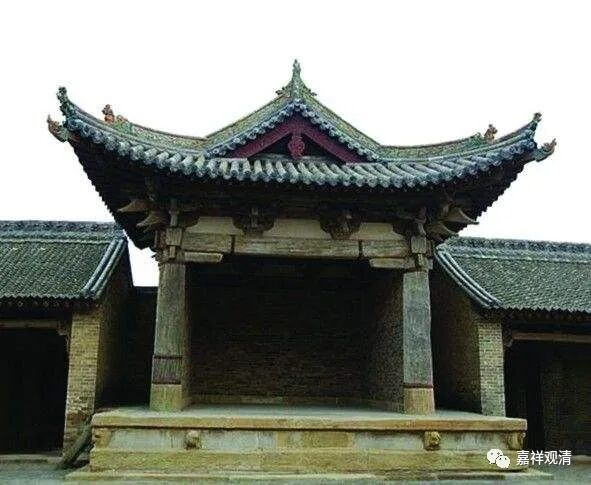
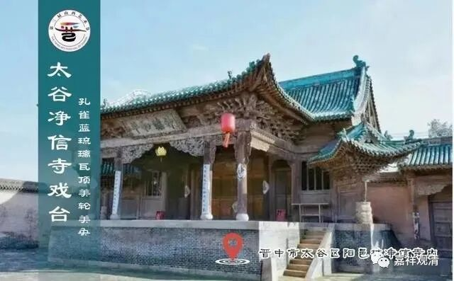
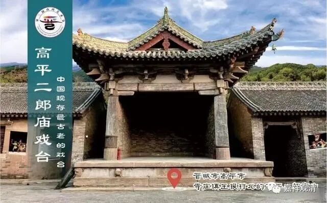
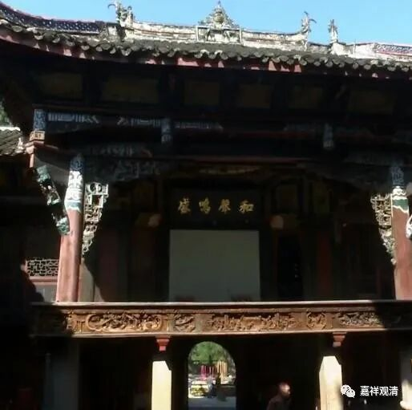
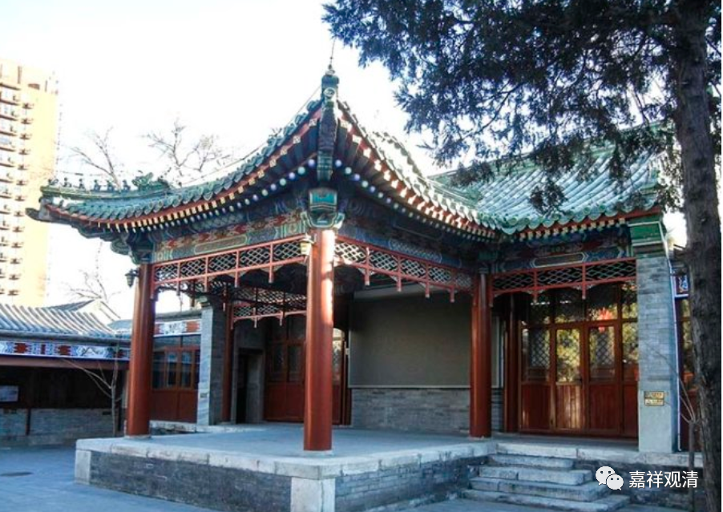
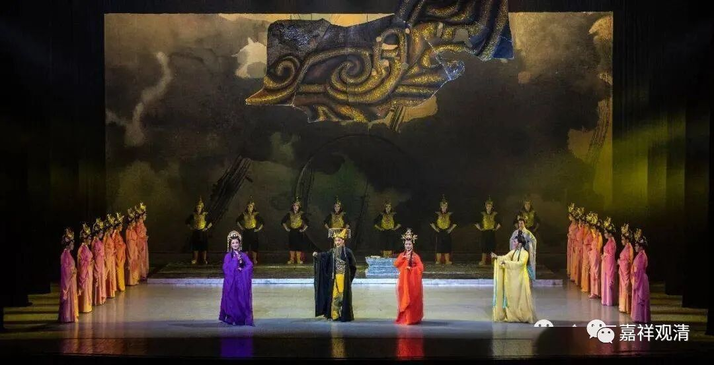

**寺院的戏台**

今天，有个黄梅戏班主给我打电话，问我寺院里面要不要“唱戏”。

一般城市里的人可能不太了解，很多村里小寺院都是有戏台的。

净信寺戏台

很多地方性的寺院跟祠堂的性质有交集，福建那里，有些寺院和祠堂就在前后或隔壁院子，而祠堂门口，经常会有个戏台，有时候是面对祠堂的主建筑，有时候是在主建筑的左右手，两个戏台，这就叫“对台戏”。到某个节日，会分别请两个戏班子来唱戏，哪个戏台看的人多就打赏，看的人少就不给钱……所以“唱对台戏”相当于踢场子。

我在很多地方的寺院里也看到有戏台，记得有山西晋中、浙江舟山、福建漳浦，都见到有这个形式，说明地方性的寺院里会请戏班子来唱戏。有的戏台是永久建筑，有的则是半永久的性质——平时把戏台上的板子抽去，到了演戏的时候再把舞台铺上。

真佛山戏台

庙里过两天就是开山会，我问过老居士们，他们说到——以前，有时候，贵溪的居士团会“带一台戏”上山“请菩萨看戏”……我问是什么剧种，她们说是赣剧。我没有直接见过居士团带戏班子上山，但见过他们（贵溪进香团）自己带着胡琴板子上山，晚上就在斋堂自己敲打自己唱，没有戏服……一般在开山会以后的七月二十八，但这些年这个套路被简化了。

北京隆安寺古戏台

前几年，山下有老人百岁生日请了个黄梅戏班子，摆了几天的流水席就唱了几天。戏班子老板上来问我们庙里要不要也点一出戏，我一看正好在开山会的日子，很应景，就请他们唱了两出，在山下潘村的大礼堂（毕竟在我们庙里唱戏不太合适），我记得有一出是《妙善出家》——民间说观音出家前叫妙善，是楚王的公主。点一出戏也不贵，就两千多。

这次升级后的戏班班主（他现在有流动的汽车戏台了）又来找我，不过开山会的时间他们没空，那就再说吧，毕竟这不是我们的必选项。

戏班说我们自己写的戏也行，也能现排，他们说排练大概十天左右，我们有剧作家不？整一出？

