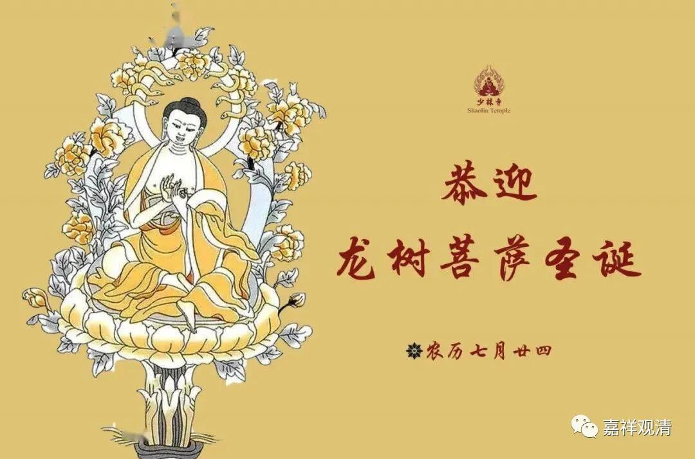
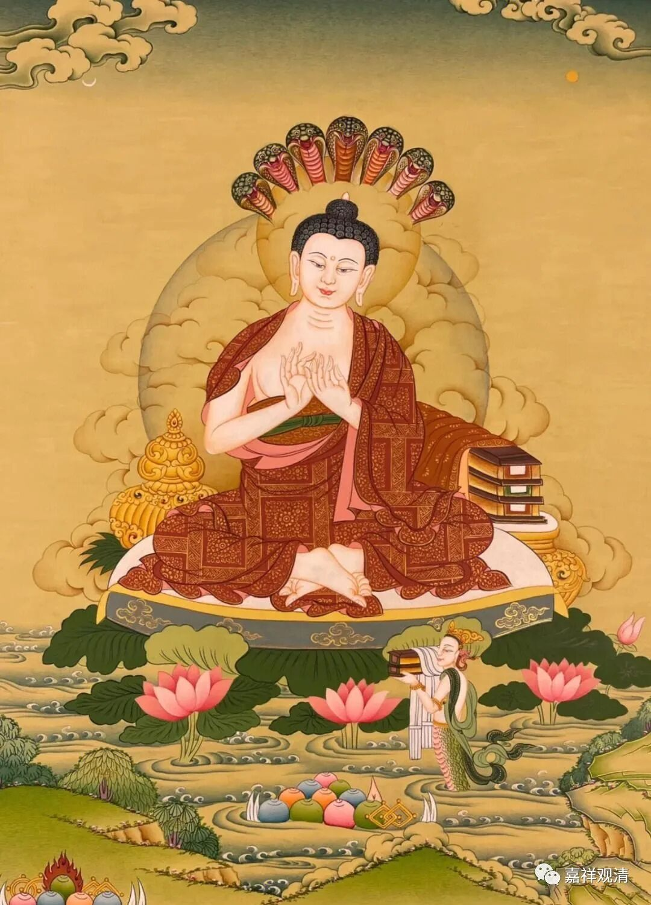

**纪念龙树大师**

今天是七月二十四，汉地佛教圈说这是“龙树菩萨圣诞”……我的朋友圈相对比较保守，很少看到有专门拿出来说的。有人问我为什么我们好像没什么动静，我回答——

“信龙树的不信这个日子，信这个日子的不信龙树。”

我大概是信龙树的那批。我是他的粉丝，他是我的偶像！

龙树菩萨的传记虽然也是版本众多，但大致有个基本的框架：年少轻狂，折服于大乘佛教，出世成为大乘佛教（中观派）的开创者……目前相对可靠的龙树传记，以罗什大师的《龙树传》和玄奘法师带回的相关传说为主，但从没见过有具体“生日”的可靠记载……别说生日了，连生卒年代目前都还只是个大概的推测，模糊到得以“正负百年”来估算，呵呵，这个“农历七月二十四”的生日、诞辰，如果不是来自扶乩，也就只能来源于梦感了

汉地现在流行的“佛菩萨圣诞”，除了释迦佛的那几个日子可以明确来自早期汉译阿含的记载，其余都不知明确出处，甚至这些“佛菩萨的诞辰”还是“同时”且“突然”间出现的——不是在不同的记载中出现不同的菩萨“诞辰”的日子然后经由“好事者”收集起来逐渐形成，而是大约在明末突然地“扎堆”出现了，呵呵，“佛菩萨诞辰全集”一起莫名其妙地暴露了，而且一出现就定型了!两千多年来，“教界”对一件事情的认知可能还从来没有如此地统一过（龙树大师到底是哪个世纪的人都还“各说各的”，哪一天出生的倒先统一口径了，哈哈，有趣）。

当然咯，每年找个特定的时间纪念各位大师，这样的“纪念日”我是很愿意接受的，所以我在这些“日子”经常是类似这么说的——

纪念龙树大师！

