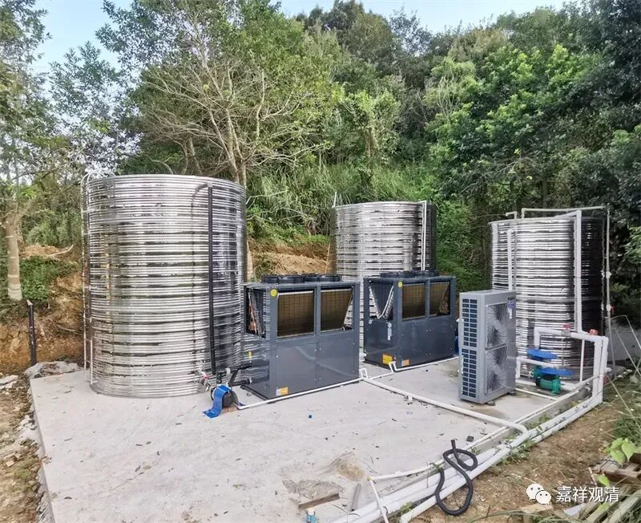
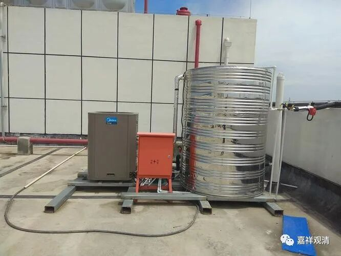

**当山里人要修电器**

综合楼的空气能热水器坏了。

昨天报修……今天服务商终于从四十公里外的镇上开车过来修了——山里的电器维修这类就是这样地不方便，在大城市也就一个电话几十块钱的事，我这里就是大麻烦。

庙里买了几个洗衣机，最近有几个出了状况，就去这个四十公里外的镇上的电器商店找他们修了（正好也要买点电器）。

因为我们经常在他这里买东西，老板和我们都很熟了，跟我说：那就别修了，我派个车子上下山两次也要一两百，修个洗衣机几十块，这样你这洗衣机修一次要两百多，你这个洗衣机现在卖掉也值个几十块，再买个新的现在也就三百多——买个新的和修一下都不差几块钱了，不值得修了！

嗯，也是。于是就买了个新的洗衣机……

同样，城市里的水电基本都不算啥问题，我这里都得自费修通，而且永远是问题。所以前几天T总给出了个主意：“不要接外面电线了，自己买个发电机发电不就行了！”呵呵，这个主意够馊。我说：“那柴油每次运进来不麻烦吗？而且发电机的噪声还那么大……”

不过我们庙里确实备了两三台发电机，那是救急用的——雷电季节，山里经常会停电（乡里拉闸保护设备。有一次雷雨，把乡里电箱的总闸都给劈了），附近的车祸也经常造成临时停电（把电线杆子给撞了），那像我这种参加过地震救援的，一定会备点发电机。听说现在华为魅60有卫星电话功能了，那我们也应该备一台……

空气能热水器修好了，原来是电闸的设置和以前不一样，而表盘上没做更改——这事儿我们不知道（以前经手的龙瑜过世了）……现在连猜带调试弄清楚个大概，至少可以使用了……一会儿我把示意图画下来留好，以后就自己照单抓药了

