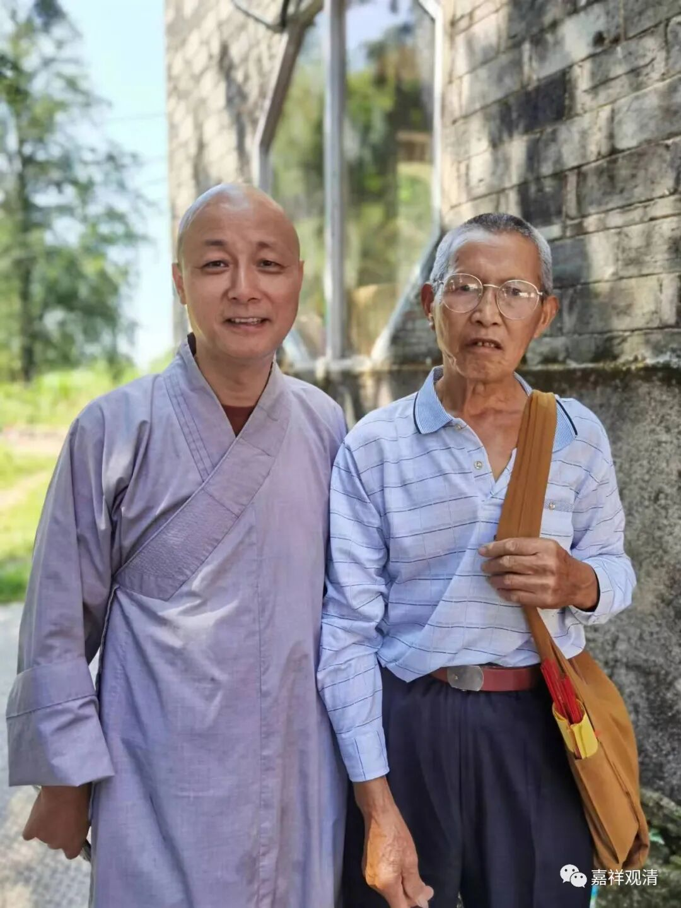

这是我们的“老团长”郑居士。

“老团长”是老郑（龙善师）的叔叔，在我们庙做过两三年义工，那时候管做饭。脾气实在大，谁都看不惯（整个庙也就我在的时候还给我点面子）……但有一个好处，他在，小虾米们不敢造次。有一次隔壁镇的镇长来摆谱——往那儿一坐，让他“上茶”。他提来一壶开水作势就要往镇长头上浇！镇长和左右都吓到了……他吼到：“你这小东西，要我给你倒水？！你什么级别？！我县团级！我给你倒水？我给你倒（身上）！”

其实他并不是团长，是县团级转业、退休，是我们管他叫“老团长”而已。对越自卫反击战那会儿，他是轻机枪手，九死一生（九死一生都不止），荣立一等功一次、二等功一次、三等功一次。一等功，是他用肩扛式打掉对方一辆坦克；二等功，是干掉对方一个机枪阵地突破了对方防御；三等功……他说三等功他们都有……

他说战友们很多都牺牲了，他自己，右脸腮帮子被打穿，右颈被打中机枪子弹，右下腹被刺刀挑中——他说，敌人刺刀戳进去以后还转了一下……他的“县团级”，是命换来的。

数次经历战场厮杀（他不是一次受的伤、不是一次立的功）而活下来，算是捡了条命回来，他认为是咱庙里的菩萨保佑他，所以一定要到咱们庙里做事。他说，记得小时候是拜在白云寺观音菩萨的脚下（民俗，怕小孩难养活，就认观音菩萨做干妈），他说他的命就是咱庙里观音菩萨救的。他说他杀了很多人（因为他是轻机枪手，他的阵地敌我双方争夺要点），所以他要好好念佛、好好帮庙里做事……每年庙里大事他都带人来，这不，开山会又上来了。

