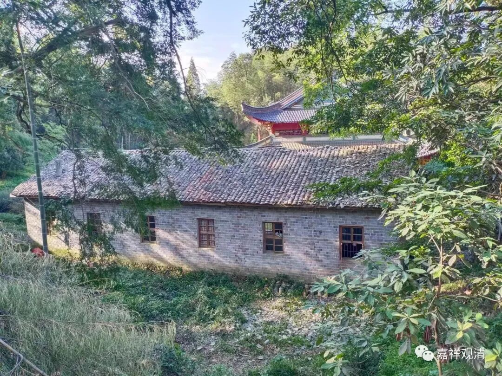

**斋堂，让我再看你一眼**

这是老的斋堂。曾经是寺院的核心建筑——

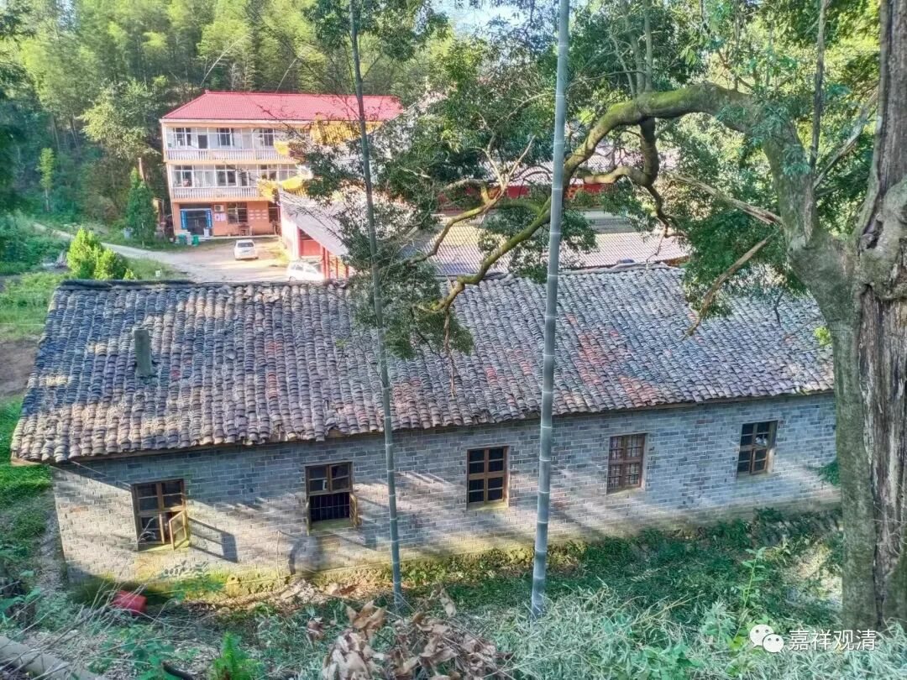

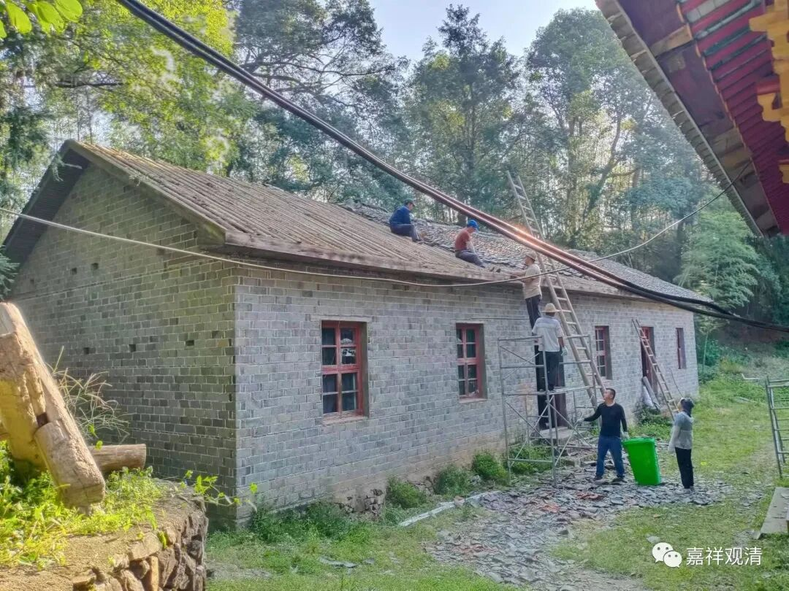

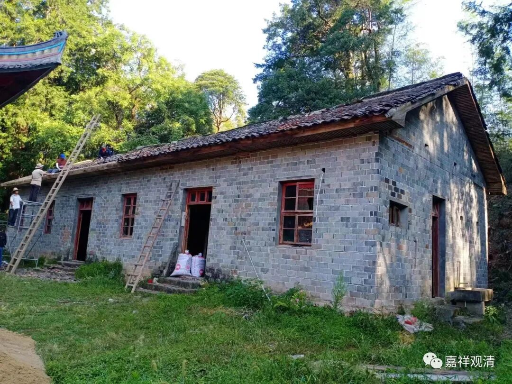

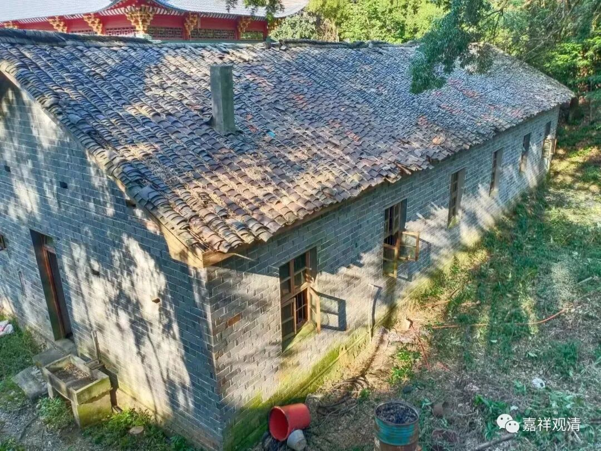

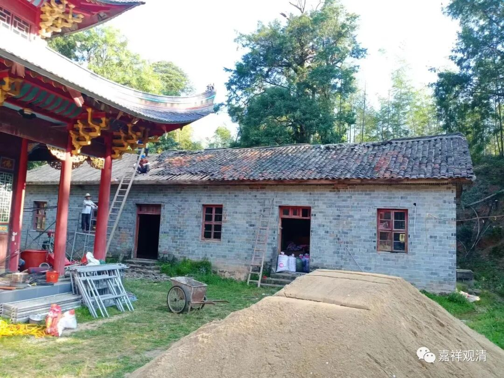

我刚来的时候，住在这里，吃饭在这里，来人也在这里，接待也在这里，炒茶叶烘茶叶都在这里……

刚来的时候，我住这个房间——

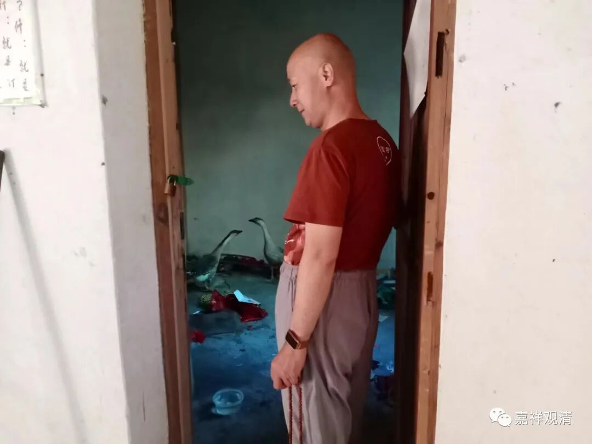

前两天给鹅住了。

当时整个寺院里就我一个人，村里人问我：“害怕吗？需要人陪不？”我当然不要。晚上落了锁，再拿根木头抵住门闩就去睡了……

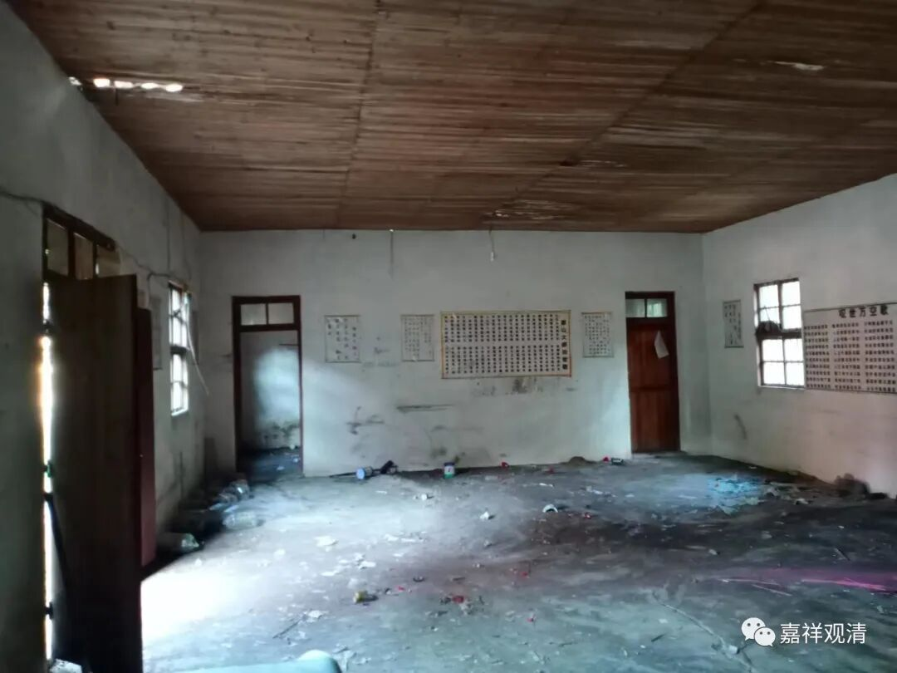

** “大厅”，以前龙岸师在这里看《今日说法》……**

我就住在右边这个屋子。有一年夏天我从外面回来，晚上睡觉发现没铺凉席，找来赶紧铺上……晚上睡觉冻得我全身缩起来，把被子一半垫着一半盖着，自己则做了饺子馅儿……第二天起来第一件事就是把凉席抽掉——山上的夏天，晚上还是挺凉的。

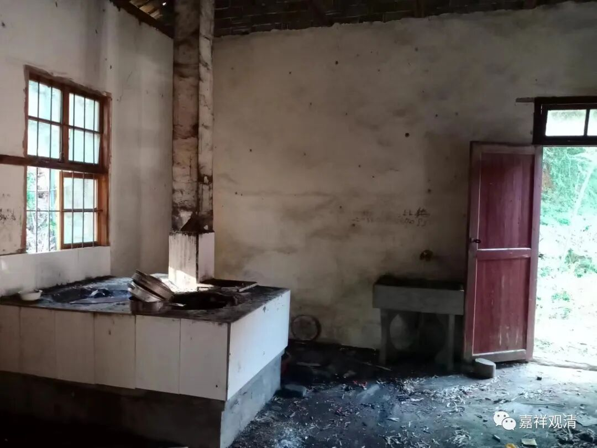

** 这是土灶头**

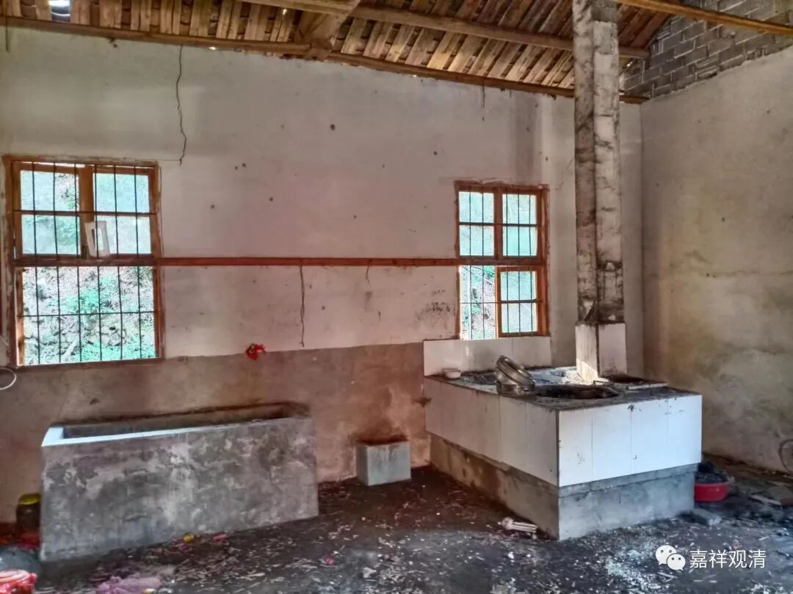

灶头和水池

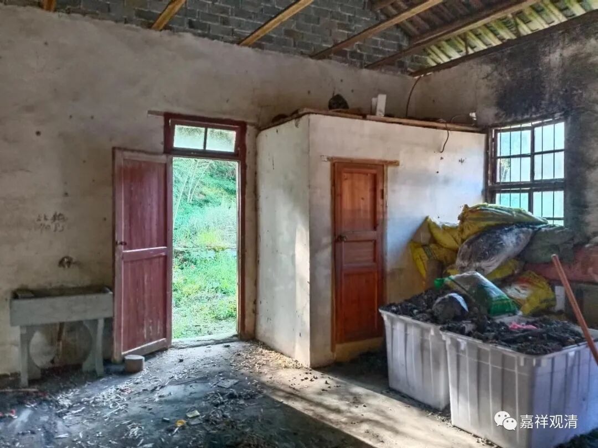

这是淋浴房。我一来就在这里装了个热水器。

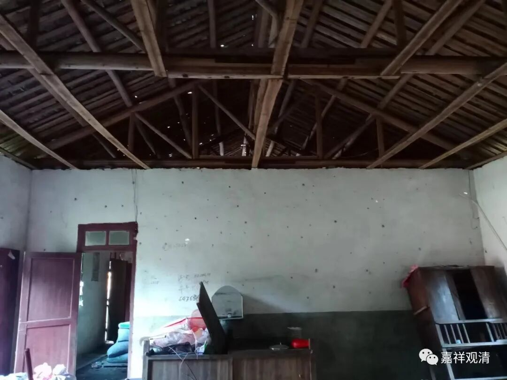

房子是大约三十年前建的，那时候的住持是觉超师父——他原来是hb乡村的小干部，被人诬告，愤而出家，后来查出来没问题找到他让他回去，他说已经出家，习惯了出家的生活，就不再回世俗了……他来白云寺，修了大雄宝殿和这个斋堂。

那时候山上还没有通水泥路，有的只是徽饶古道的台阶石板路，所以觉超师父造庙就比我要辛苦（我是先修路再造庙的）——木头是他下山到左右村里、乡里化缘来的，让捐献的人自己送来；砖头（青砖）都是让人挑上山的，一块五分钱，居士运砖头就少收一半的钱，算义工。当时连村里的小孩子都在帮忙运砖头，一天搬个几块，几毛钱的零花钱就有了……

所以别看这房子没什么结构、装饰，其实也花了不少钱。

觉超师父后来又去了莲湖建庙，做了县里的佛协会长，那些年我去他们庙里给他拜年，还遇到过他家人……觉超师父前几年过世了。

这个老斋堂年代久了，屋顶没做好，老是漏雨，已经翻修很多次，那几年每一两年就要清理一次屋顶，补瓦——今天上面的瓦至少有五种规格，五种。

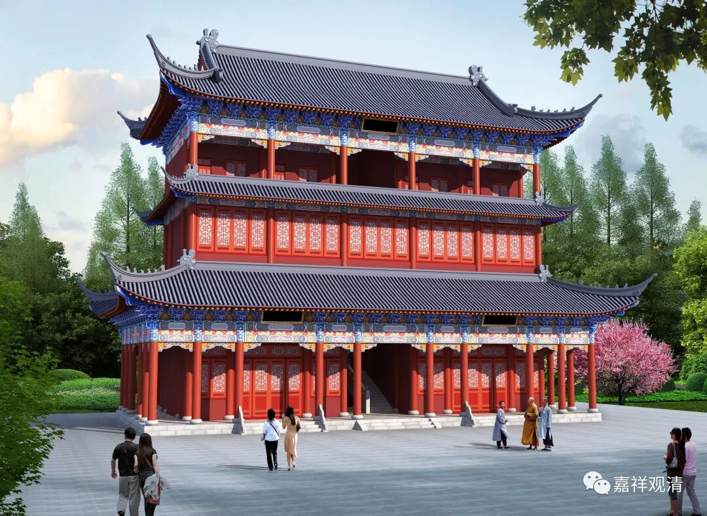

它的历史任务已经完成，该以新面貌示人了！

