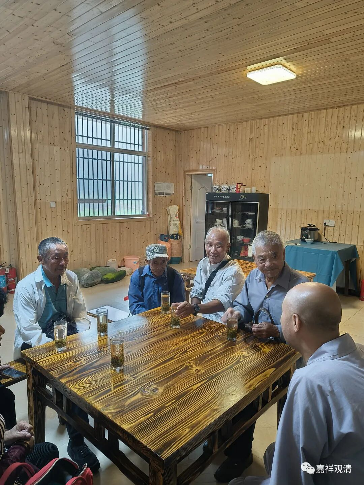
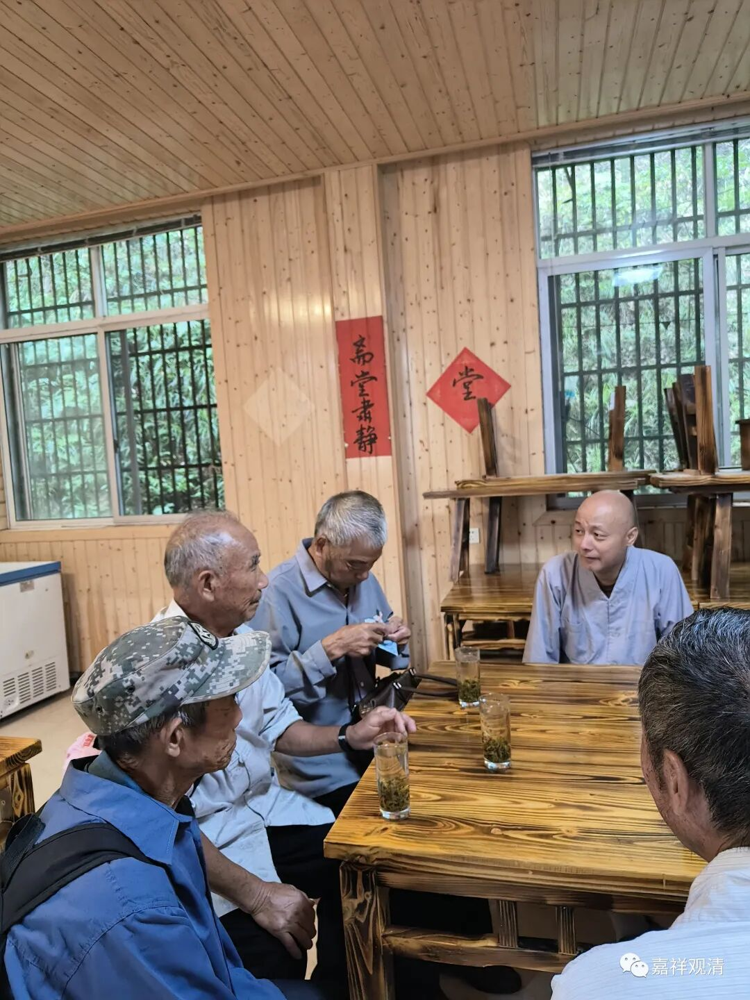
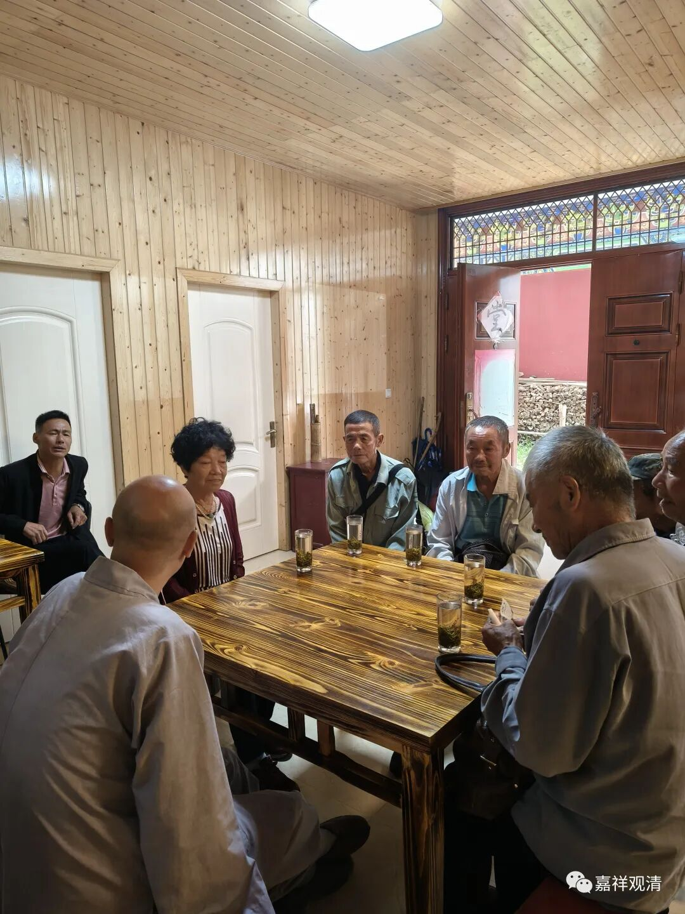
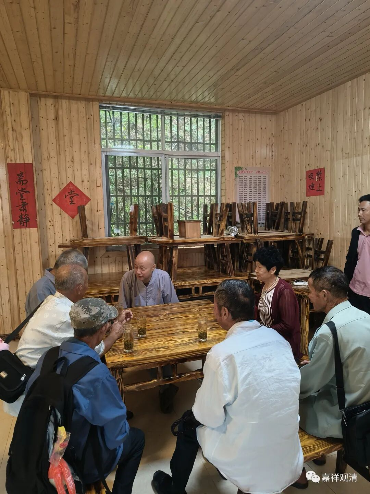
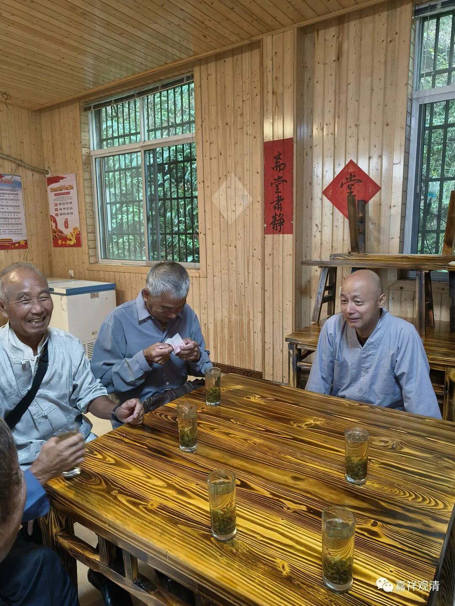

**自有历史的“贵溪进香团”**

贵溪的进香团今天到了。

每年七月二十六是我们庙里的“开山会”，开山会后面两天，七月二十八就会有来自江西鹰潭市贵溪的朝山团来，今年的农历七月闰了一天，有七月三十，所以今年这个日子换到了七月二十九。

其实从昨天开始我就在等他们，今天上午到了。都是熟人了。

这个来贵溪来的进香团很有趣，历史也已经很久了（至少有一两百年）。民国年间他们过来庙里进香，来回走要半个月——先坐船到鄱阳，再从鄱阳县城走过来。坐船的时候，有风就扯棚挂帆，没风的时候得拉纤……后来改坐长途到鄱阳，再坐班车到下面乡里走上来……前些年开始先坐火车到景德镇，再转浮梁从那个方向的山脚上山……最近几年更简单了，今天干脆直接从贵溪花一千多包了个车直接开上山了。

说起来贵溪虽然也在赣北，但那里离我们庙已经很远了（200多公里），也许在古代曾经发生过什么灵异事件，导致他们非要每年专门定一个日子大老远赶过来进香（没有大供养，每人六十，管吃住一天），而且一心一意，沿途并不拖泥带水，直奔咱们寺院，来了住一两天就走。

疫情三年，贵溪进香团都没有来。有一年好像要来，提前一天给我打了电话，我说疫情管控，不方便接待，他们也就没再坚持。

以前，多的时候有四五十人一起走着上来，还有专门人打着贵溪进香团的红旗……晚上在地藏殿、观音殿打地铺，让住综合楼宿舍也不住。有一次我晚上还给他们讲了皈依和道次第，都说是第一次听到。

他们最整齐的拍场，应该是：红旗、锣鼓队（敲锣打鼓）、四五十个老人……说以前有带戏班子上来（给菩萨唱戏）的，我没见到，只见过晚上他们自己拉琴打鼓唱戏，热闹得很……

今年上来的人数少，带司机也就七个，有好几个老面孔。

他们说的话我基本听不懂，得现场找翻译。说今年人少，明年人多，以后就都这样包车上来了。（我估计今年人少是因为包车每人花了两百。）因为是包车来的，他们今天就不住在庙里了，拜完菩萨吃了午饭就回了。（他们早上三、四点出来的，车子去了几个地方接人。）

他们一来就找“住持”，就找“客堂”，都给他们登记了，每人捐六十，算上“代缴”的，一共660。其中有个居士说他以前是老师，字写得好，都让他登记。

十年前我都被他们叫“老师父”了，我想这个“老”大概是官最大的意思吧，哈哈。

