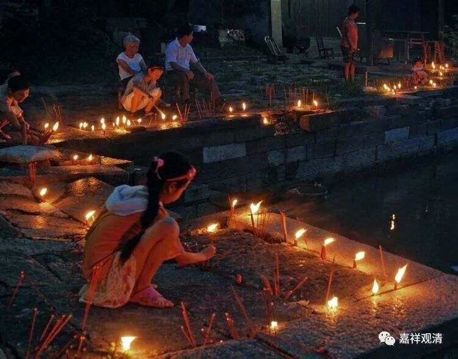
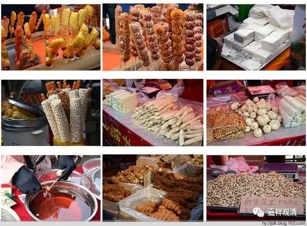
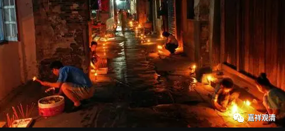
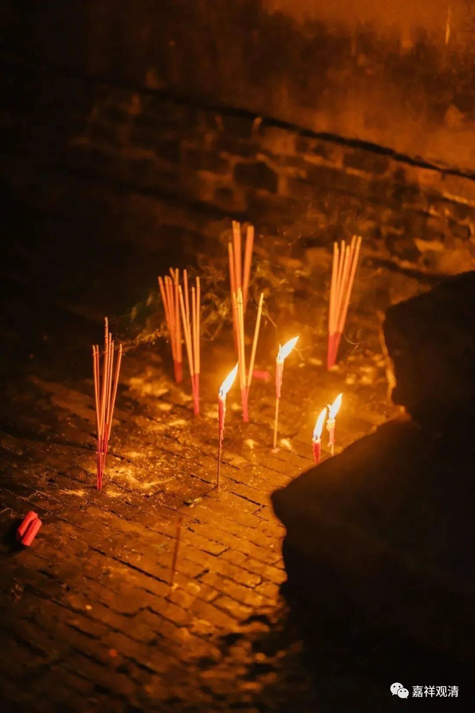
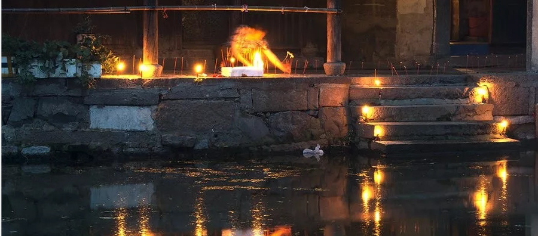
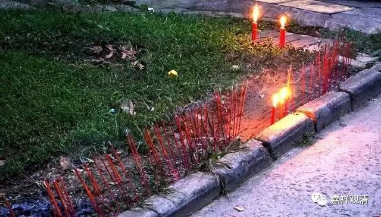

**“地藏圣诞”与“插地（藏）香”

今天七月三十，民间传统说是地藏诞辰日，居士们都上来拜地藏菩萨、“上课”，他们的“上课”就是诵念《佛教念诵集》。今天下雨，一早，我们车子来来回回地接了四五车……

看到寺院开始建设，居士们都很兴奋。她们自发地捐款，追着我们要登记……现实当中大家都是眼见为实，看到我们庙里正式动（工）了，居士们也开始（激）动了。

前几天的“开山会”，其实规模比以前是小了，但是居士们反映说很满意！我说：以后我们可以再加点项目——烤玉米、赤豆汤、绿豆羹、烤红薯、炸土豆、油墩子、卖饮料（杨枝甘露、酸梅汤……）、烤素肠、银耳羹、套圈、卖参须……我们以后就按庙会的意思来，增加多点项目。

居士们说：以前道士在这里的时候（文革以后，有一段时间这里没和尚，当地会在附近请外面的和尚、道士来主持“开山会”），逢“开山会”，从晚上开始，还要守夜，晚上到处佛殿去烧香，忙忙碌碌得很是热闹……我估计那就是“插地香”或者叫“插地藏香”。

什么是“插地香”？

“在地的佛教”以每年农历七月三十为地藏菩萨生日（由于农历的七月三十很少见，所以一般就放在七月二十九这一天“替菩萨过生日”，但如果那一年有七月三十就会特别热闹——类似某人生日是2月29）。

民间传说：地藏菩萨每年就在这一天开眼，观察民情，如果这天看到人家烧香、点蜡烛、拜佛，就会认为这人一年都在拜佛做善事（和灶神的套路差不多啊），就会善加护佑……所以民间这天晚上就会“插地藏香”，意思是，在“地藏”菩萨生日这天“插”“香”；或者叫“插地香”，就是把“香”“插”在“地”上（不是野地里乱插，是插在砖缝里，而不是平时的香炉里）拜地藏。

民俗里会尽量让小孩子插香（竹签香），第二天一早还要让小孩子去拔香棒，谁拔得多谁就聪明……

《儒林外史》里也有南京七月三十“地藏会”插地藏香的记载，有介绍说：

“这一夜南京人各家门户，都搭起两张桌子来，两枝通宵风烛，一座香斗，从大中桥到清凉山，一条街有七八里路，点得像一条银龙。一夜的亮，香烟不绝，大风也吹不熄。倾城士女都出来烧香看会……”

我看，这种“传统民俗”很值得恢复嘛！明年我们试试看恢复一下？有报名的不？

