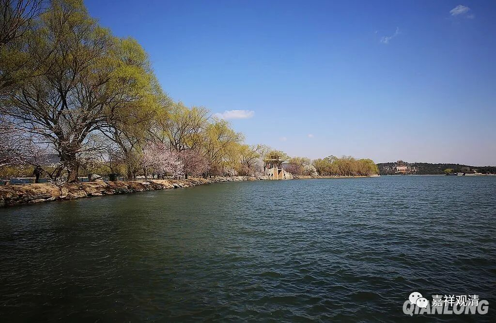

**微课佛教史402·2**

但是到了宋代，整个佛教界的气氛又不一样了……禅宗一下子就跳出来了。禅宗又强调“教外别传”，突然之间顶层佛教的门槛就变低了，大家（儒家道家）都要和禅宗或者和佛教争争地位了。

这和唐代的佛儒道三家争地位是不一样的，就大的方向来讲，儒家仅仅等同于我们今天讲的素质教育，实际上在哲学（逻辑学、知识论、特别是形而上学方面）方面并没有什么特别的建树，道教则并无可观，没什么可看的，仅仅是把民间巫术和先秦学术大致整合了一下。

总的来说，中国思想史里面，佛教肯定是站在最顶尖的那个。而且在唐代的时候，佛教的译场也好，大的寺院也好，都相当于是教育机构，它们都是具有教育职能的，特别是在盛唐时期。

同时，唐代开始出现了书院制度，包括官方的和私立的。到了宋代，书院制度就发展得更加兴盛，而佛教的教育背景就开始往后退了。儒家自己的（或者是官方，或者是私学、民间的）书院制度，可以说帮助儒家培养了不少人才。而且佛教在这个时期是人才输出的。

我们举个例子，像范仲淹小时候就是在庙里面读书的，他等于是以佛教的教学背景向士大夫阶层输出的人才。他是在寺院里面读书的，穷人嘛，就在九华山的后山。

我以前看《读史方舆纪要》，在九华山后山北面的那个地方叫刘公寨，前面有一座山，说当年范仲淹就在那个寺院里面读书。据说晚上就煮个稀饭，早上就喝粥，还不是稀粥，是那种厚的粥，把那个粥切成四块，就这样吃。

那么，这是当时的历史背景之下的情况。

其实，单纯在佛教内部也会发生这种人才外流的情况，比如我们一直在讲的牛头宗，就是牛头禅系或者三论禅系，三论——牛头系禅师一直表现为人才外流的现象。他们的人才外流到哪里呢？流到了江西马祖道一禅师这一系。而马祖道一禅师这一系的人才，也是有人才外流（主要是在早期），集中流向石头希迁禅师这一系。我们现在讲到宋代的云门禅这一系，在宋初的时候云门宗也在人才外流，主要流向临济宗这一系。

