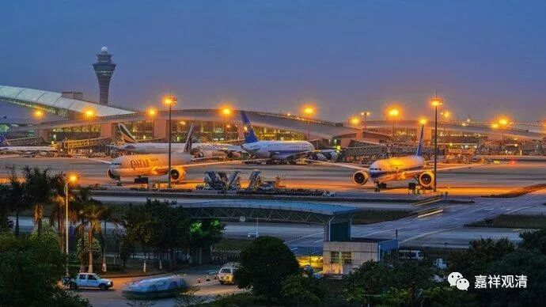
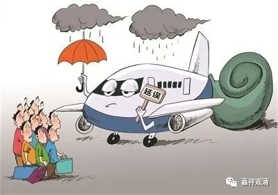

**老衲流水帐

** 之

**一路晚点

今天初一，“出门没看黄历”，结果，航班延误，连带耽误了联程的第二个航班……延误得实在有点久了，四个小时！（可能是我坐飞机延误得最长的一次了。）

原计划这几天去鹤庆演悟法师那边去有点事儿，遇上果华法师圆寂……行程安排推迟了。初六果华法师入塔，我也想赶去送一程，看当地的安排了。（最近我这边也有两位师父过世了……我们总是到这个时候才会叹会儿“无常”。）

今天一早就赶去机场，十一点的飞机，我九点半就坐这候机了。候机厅一直被告知我的航班“延误”了。“延误”，我倒是不急，淡定自若，因为我的联程航班要下午四点才起飞——等在哪儿不是等呢。（之前看这个航班准点率不到百分之三十，早就有心理准备了。现在想想，当时就应该买一个航班延误险。）

从预计改到十二点起飞……再改到两点十分……我终于觉得——要赶不上了！我不可能二十分钟里面换乘另一个航班。

赶紧找机场工作人员问……出候机楼找了航空公司……把联程行李取出来——既然赶不上了，联程行李自然随身比较好了。

最终，14：50起飞，又因为深圳当地暴雨，在天上绕了半个小时等雷雨过去……最终晚点四个多小时。

在深航柜台办理改签的有一摞人……排到我，被告知今天没有航班了（有航班我估计也不见得飞得起来），说可以给改签每天一早的航班，今晚则给我安排“机场附近”住宿。好吧，不给人多添麻烦，准了！

呃，“机场附近”，开车四十分钟才到——深圳晚上常规堵车。我这一天尽跟晚点、迟到、延误有缘了

深航、酒店给安排的是两人间，要和别人合住（另一个已经入住了）。我想要个单间，前台说需要补差价。“不是我的错为什么还要我出钱呢”，我这么笑着跟前台叨叨，“对了，我还是会员呢”……会员也没用……

最后还是老老实实补了差价，上来打开电脑记下今天的流水账……

