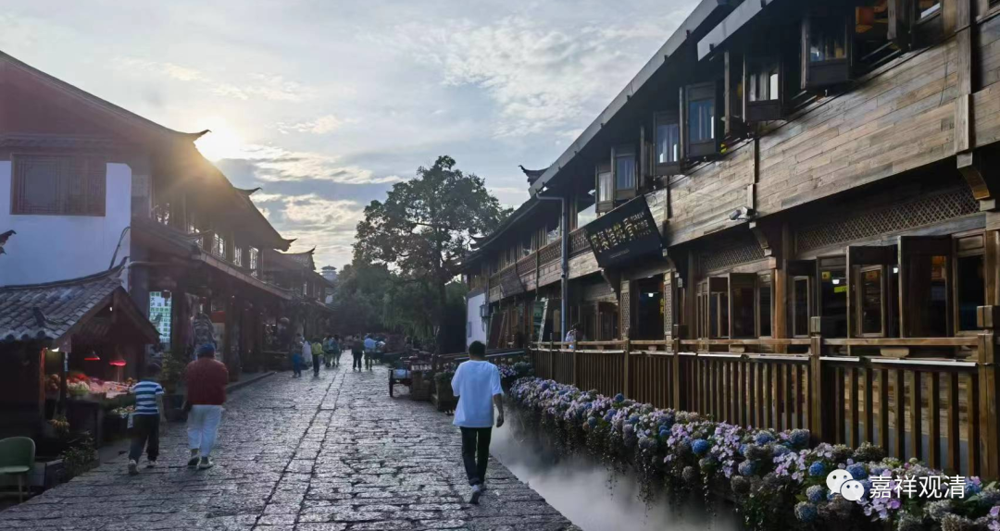

**丽江·迎面遇上姚广孝**

悟大师先忙老和尚圆寂的事情，我们就先来丽江走走。

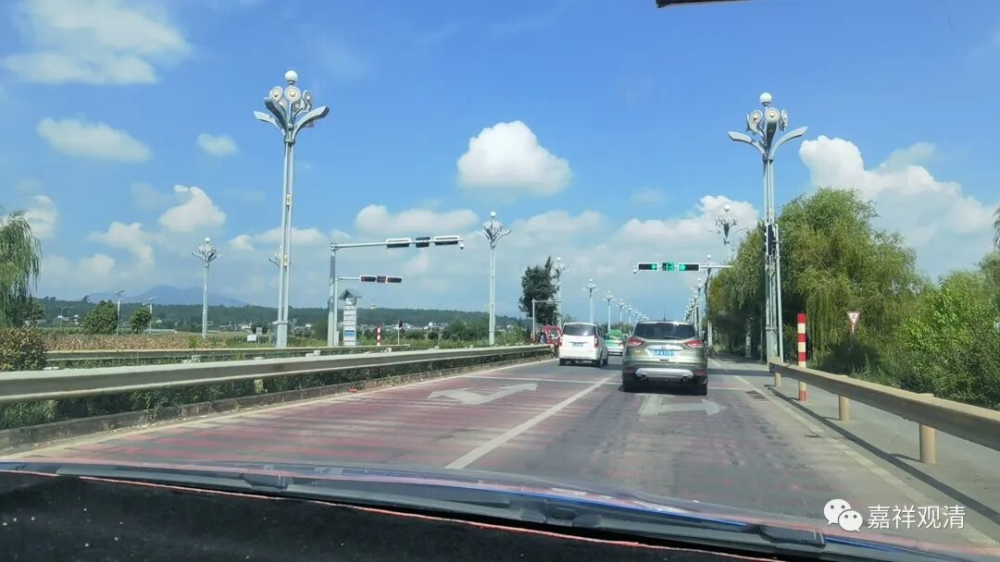

鹤庆离丽江很近，打车四十分钟就到了。其实丽江的机场都在鹤庆呢，可见两城相隔有多近。

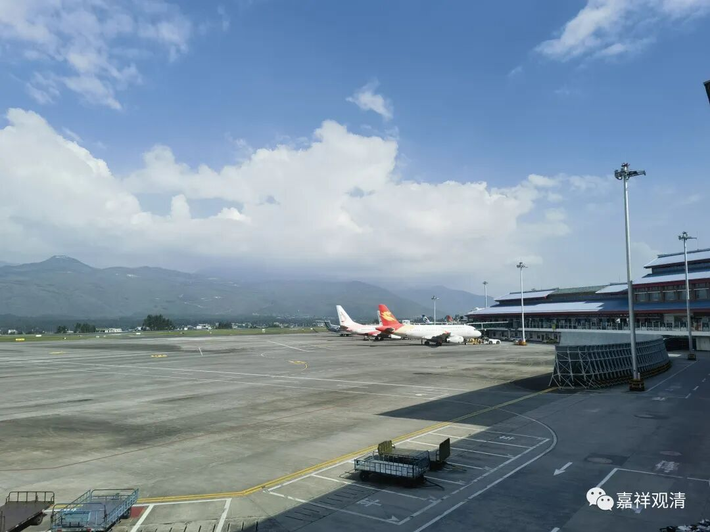

上回演悟法师陪我们逛云南，来过丽江，那回去的是束河古镇，没来丽江古城，这次补上了。（演悟法师太热情了，上回实在不好意思继续辛苦他。）

丽江古城果然够大，感觉仍旧在不断扩张中，中心区开发足够密集，现在边上也都在挖了、刨了建客栈。虽然各地古镇渐渐趋同，但这里仍旧是文青、小资的“圣地”。这段日子还不是旅游旺季，旅游的人不算多，特别是上午，古城显得冷清……

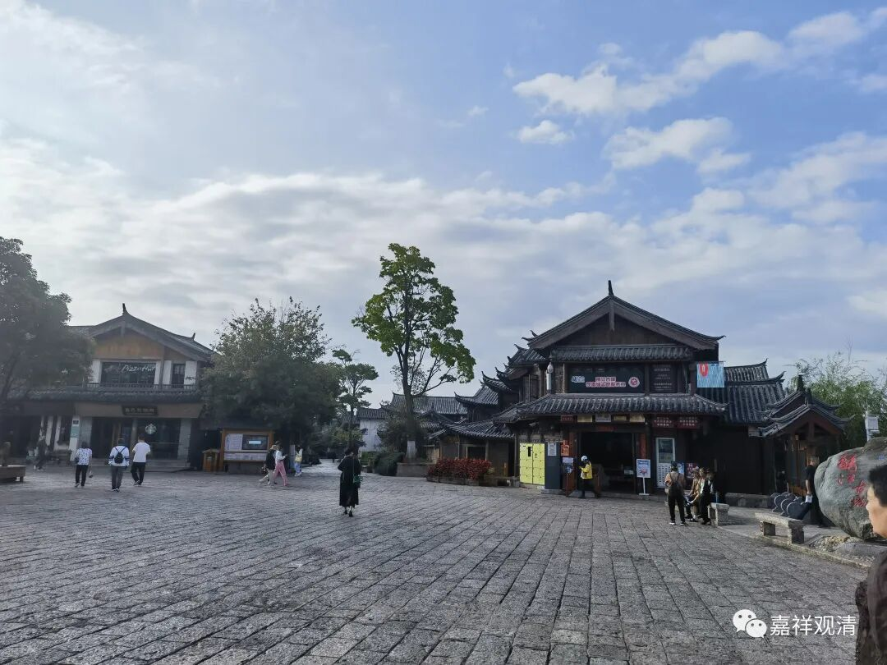

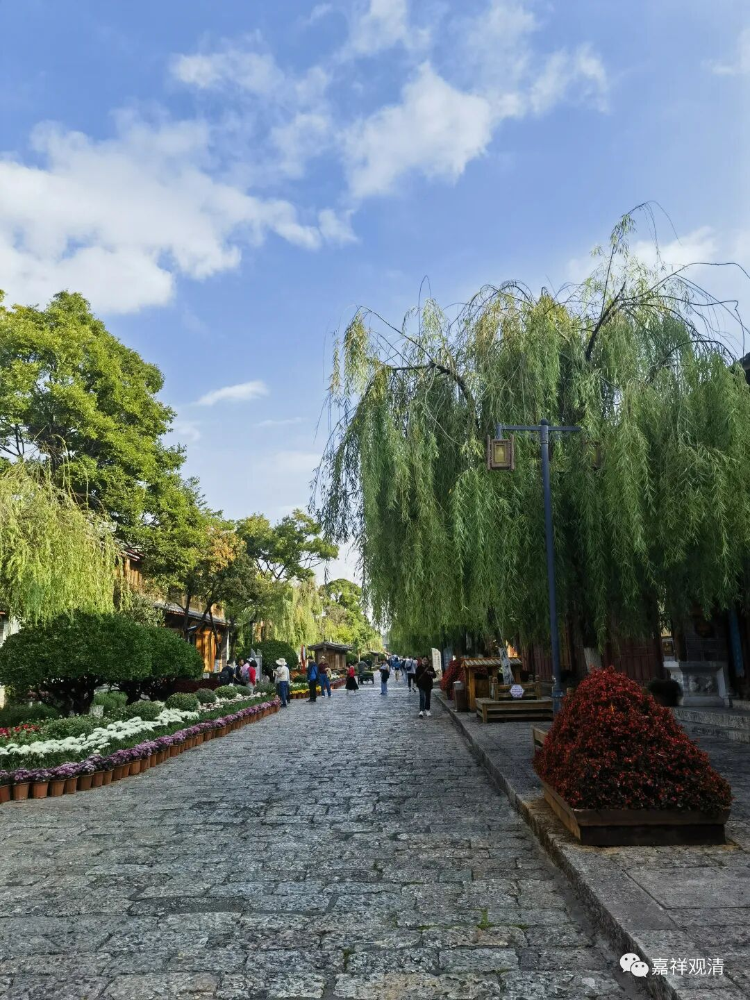

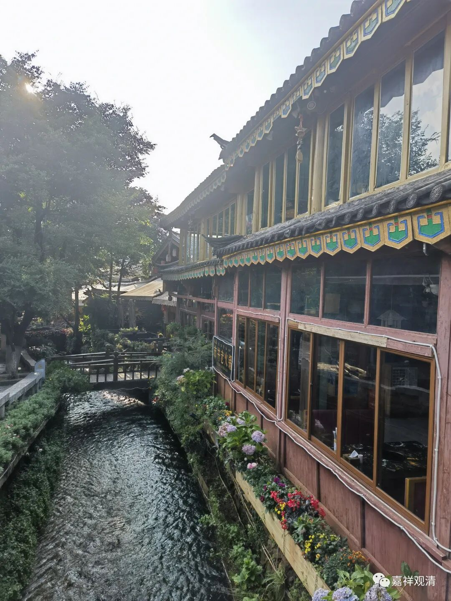

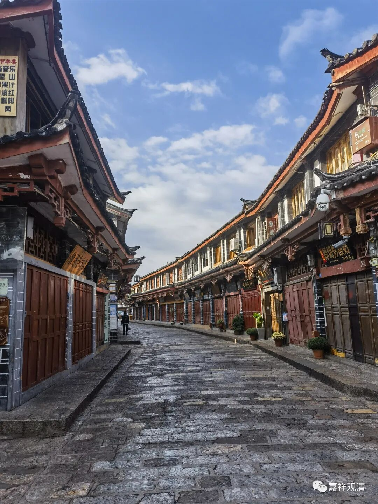

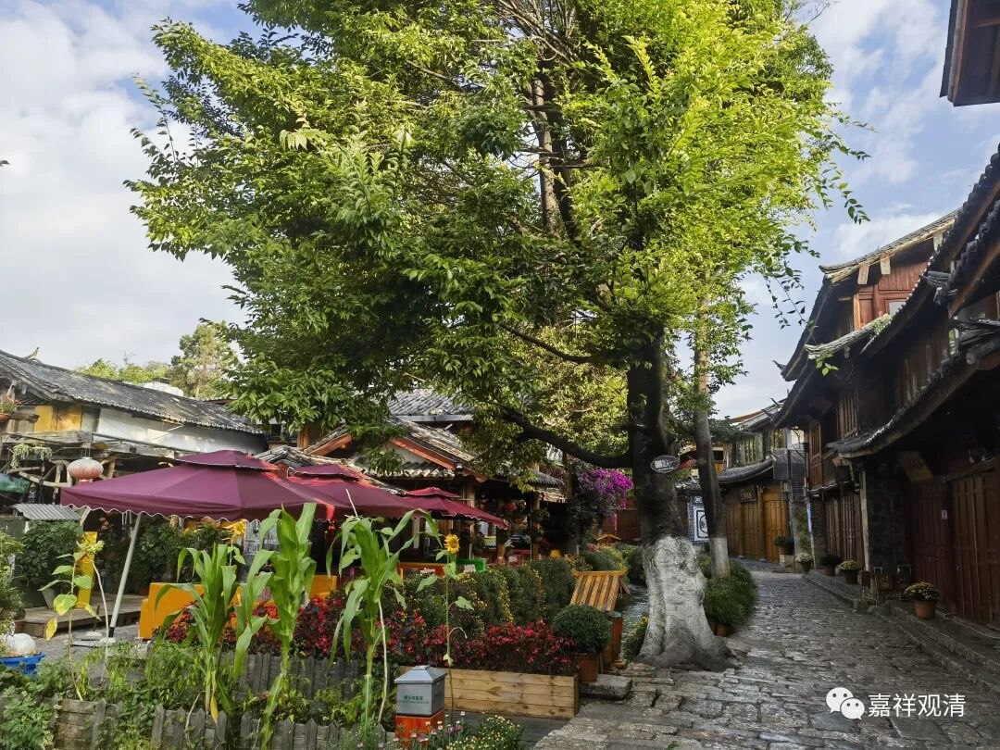

古城、古镇对我来说都得先打个对折，然后再给个折上折——穿的、用的都跟我无关，吃的也只能吃素的豆腐、饮料之类，还只能正午之前进食（这里的正午现在大约在中午一点十分左右），再加上最近牙疼……逛古城对我来说只是“健身运动”。

所以遇到一个书店就比较兴奋——总算有花钱的地方了！

这是丽江的三联韬奋书店——

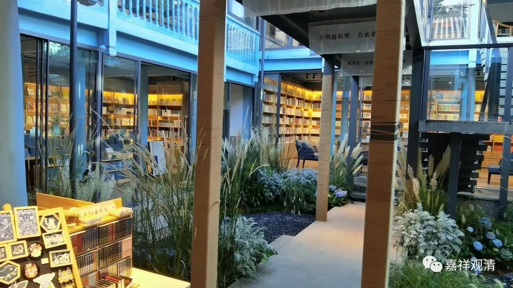

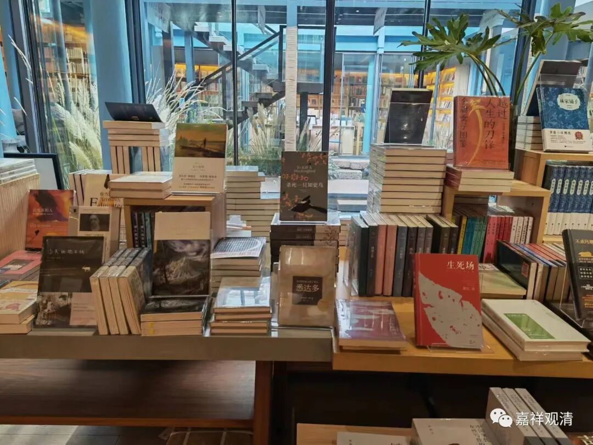

书的质量不错，我买了一本应景的《被遗忘的王国——丽江1941～1949》.

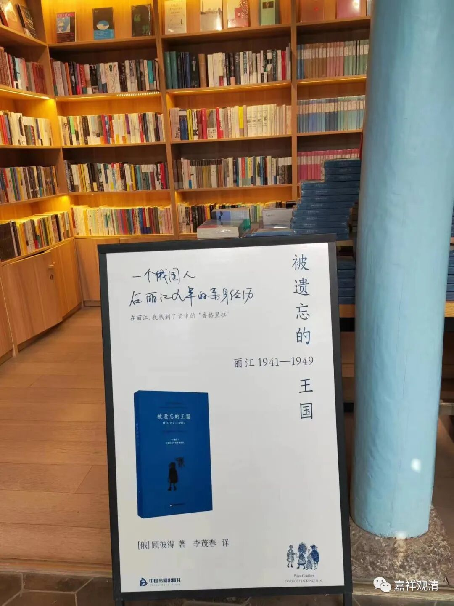

礼品堆里面，居然有一张这样的明信片——

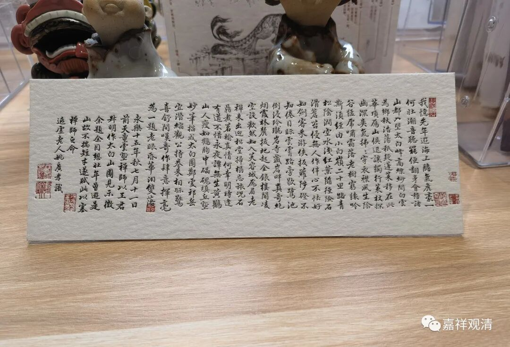

一般的说法，说这是“明·姚广孝行书《跋王蒙太白山图卷》”，此件原件在辽宁博物院。《续书史会要》评姚广孝“书法古雅，全以筋胜，晚年书法愈秀”，虽不无所见，但略有考证不清之嫌。

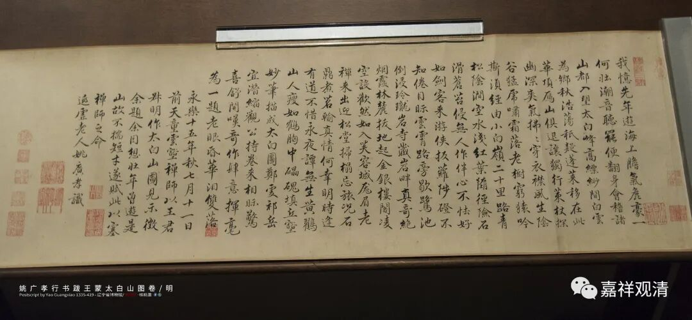

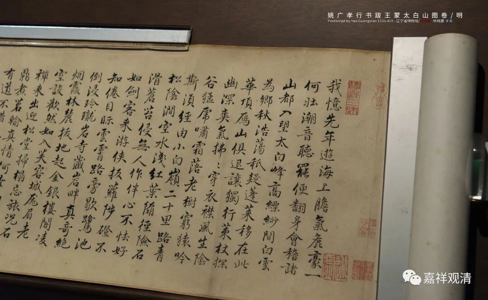

辽宁博物院原件

此件作品实为姚广孝之晚年由其子（养子）姚继代笔之作。姚广孝当年回苏州赈灾，见一少年书法颇佳，问知此儿丧父，遂收为养子，后朱棣赐名姚继。此件作品即姚继代笔之作。

能在这里看到这件和姚广孝有关的文创作品，真是有点意外之喜了，又值得消费一笔。（标价十六，卖我二十——她是不是瞧着我高兴，刮了我一小刀？）

