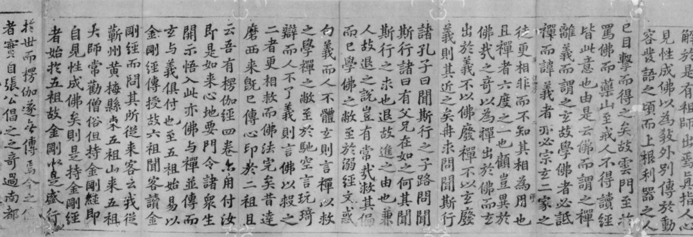

**微课佛教史403·3**

在朝廷里面，佛印了元禅师和士大夫之间的关系不错。这方面看起来主要是因为他世俗的功底比较好，跟大家有得聊。大家比较知道的苏东坡、黄山谷，都和佛印禅师聊得比较好。还有王安石、周敦颐……那个时候苏东坡被贬到黄州，是吧？黄州应该就是湖北黄冈了，对面就是九江，佛印在九江做住持嘛，所以有了“一屁过江来”的故事，哈哈哈，这个故事大家都知道，我就不说了。

这里又讲到一个故事，就是太子太保张方平的故事，太子太保这个官也大得很。张方平读到《楞伽经》的时候，觉得非常好，** “忽感悟前身事……”**前生是不是个和尚？** “夙障冰解。”**然后呢，张方平晚年就把这部《楞伽经》交给苏轼，给了他** “钱三十万”**（好多钱啊！），让他刻经。

宋代的刻经业已经是非常的兴盛了，宋初就有开宝藏的刊行。那么，刻经就需要写，我们现在江湖上看到有苏轼写刻的《楞伽经》，现在有影印版的。“写刻”就是写完以后再刻经嘛。

后来佛印了元禅师不是在镇江金山寺做住持嘛，这部经就是在金山寺刻的，然后就印了。现在我们江湖上应该买得到这个刻本的影印版。

日·东福寺藏宋刊苏轼写本《入楞伽经》局部

佛印了元禅师还有一件事——

说佛印禅师在南京定林寺遇上王安石，（这个定林寺和中国佛教史上著名的“弥勒化身”傅大士有关，）王安石就拿出一幅傅大士的画像求赞。佛印禅师很快就提了《像赞》：

“道冠儒履释袈裟，

和会三家作一家。

忘却率陀天上路，

双林痴坐待龙华。”

这首诗的作者现在江湖上有三个版本：1、傅大士；2、佛印了元禅师；3、净慈道济禅师（济公）。假如我们对早先的文字记录抱着一种相对尊敬的理解的话……那么，很明显著作权归佛印了元禅师比较合适。（其他两个一看就是弄错了。）

不过这里又引出另一个问题：凭这首《傅大士像赞》能不能就推断佛印了元禅师有三教合会的思想呢？我个人觉得不宜过分追究类似《像赞》这种交际性文字，这首《傅大士像赞》里的“三教和会”的“符号”，其实要挂在（当时市场上以为的）“傅大士”身上。（是当时出现的《灯录》里赋予了“傅大士”这个“禅宗”+“三教和会”的形象。）

好吧，今天就先讲到这里。

佛印了元禅师，这里的“佛印”是宋神宗给他的赐号，同时还赐了衣（袈裟）钵。

好，今天先讲到这里，谢谢大家！

