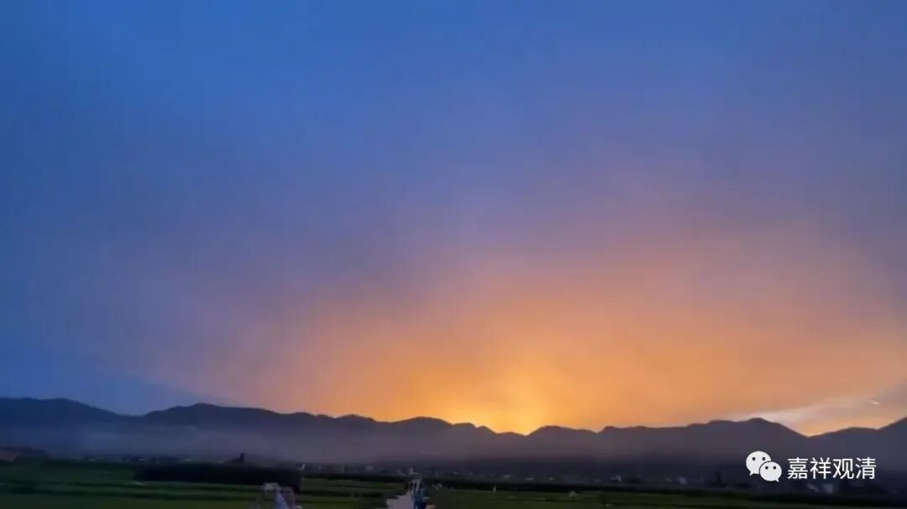
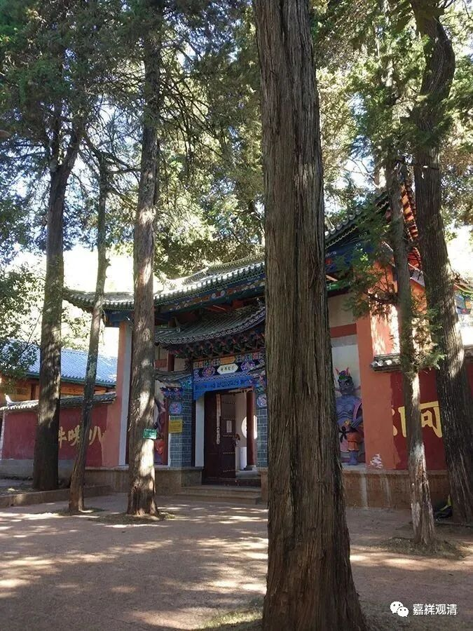
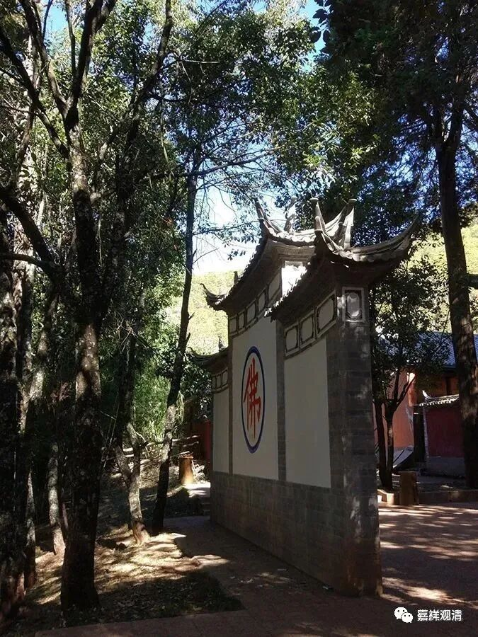
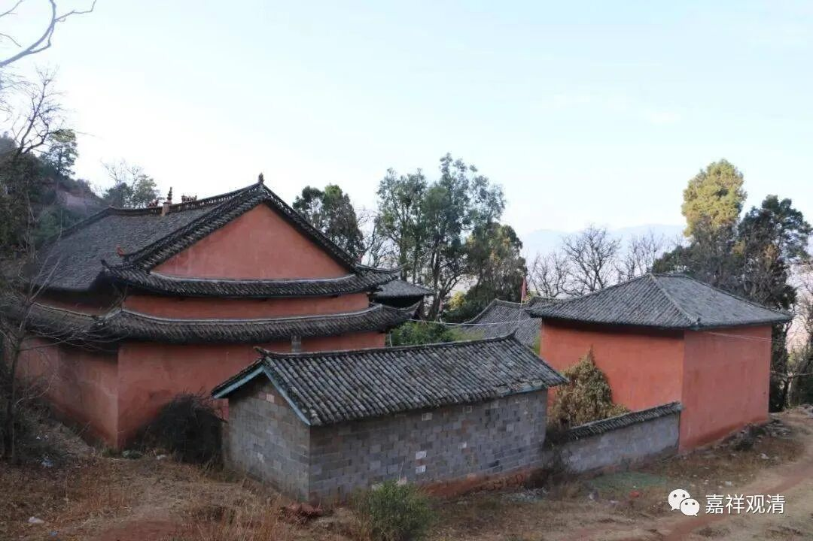
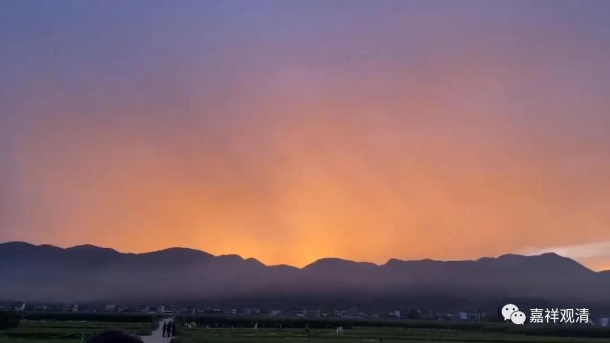

**他不是圣人**

今天回到鹤庆，下午去鹤阳寺，到方丈室听演悟法师讲古……

还是先说果华法师吧。

上次我来鹤庆见过龙华山顶上的果华法师，还帮他寺院建设化缘了……没想到这次已经是来送他……

龙华十八寺原先是鹤庆著名寺院群，文革中全毁。文革刚结束，尚未出家的果华法师就致力于恢复龙华十八寺，在民间四处化缘，渐渐聚集点滴之功……导致鹤庆市里认识老和尚的人非常之多……期间备尝艰辛、辛苦异常，传说曾“十八次”被逮，其中有一次，某吏搬来个大冰块，说“你坐化了就放你出去”，他硬是不屈地“坐化”了冰，也落下了病……

后来有人劝他，说：“你这样不出家而化缘造庙，名不正而言不顺”，他觉得有理，遂正式剃度出家。

演悟法师说：果华法师这一生就做了两件事：一、恢复寺院；二、用自己的能力（民间的医、巫）帮助别人，出发点也是为了造庙。那我看来，果华法师他就是龙华寺的“护法”了，其实一生就只做一件事——恢复旧有的寺院！他是寺院的护法再来吧？

我并不以为果华法师是一个高僧（哪怕他去世的日子彩虹显现、霞光满天，哪怕他若干年前便预知寿命，哪怕鹤庆的居士们都把他当作圣人），但我觉得他是一个纯粹的出家人。一辈子纯粹地做一件事情，不容易！

