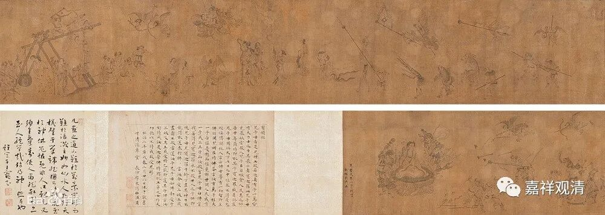
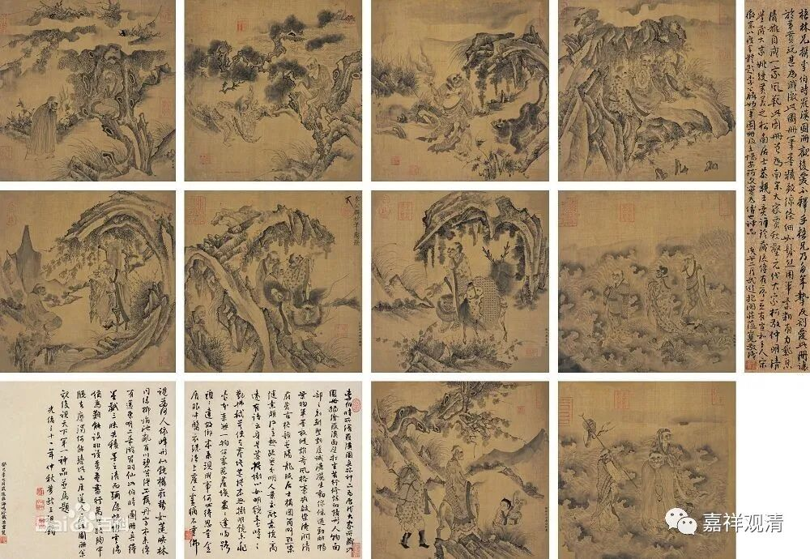
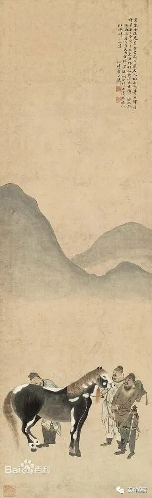
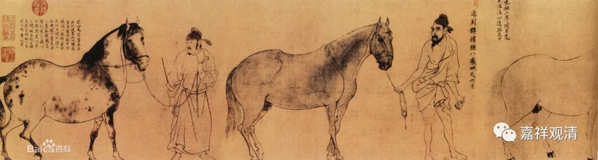
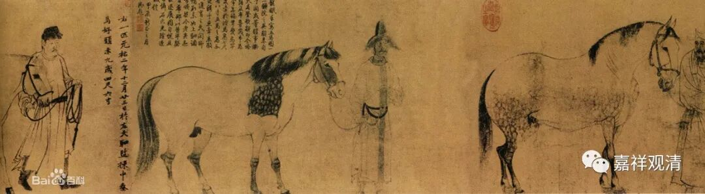
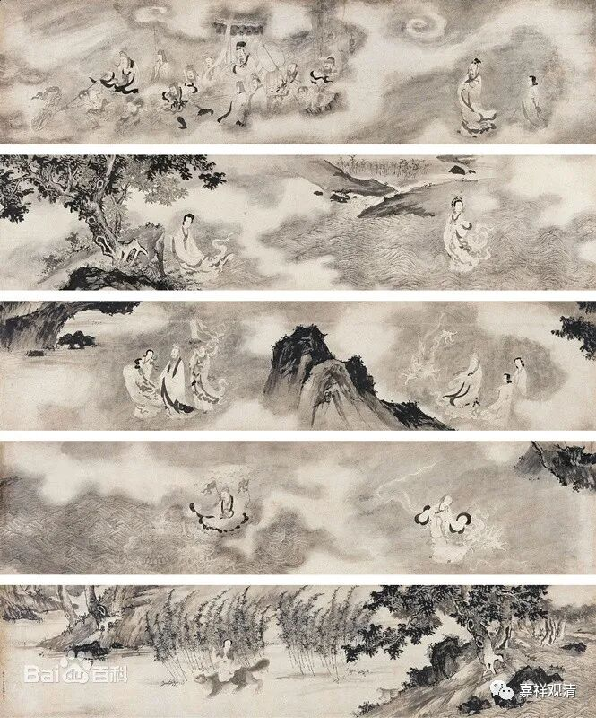

**微课堂佛教史 404·1

好，我们继续佛教史，现在讲到宋代的禅宗，讲到了佛印了元禅师。

大家都知道佛印禅师，主要是因为苏东坡的缘故。前面讲到了佛印禅师出世是在九江的承天寺，他家离九江也不远，在浮梁县，今天属于景德镇了，以前是属于上饶，当时饶州府的府治是在鄱阳。他家离我们庙不远，很近，估计一天不到的路程，走路就可以走到了。

佛印禅师和苏东坡的关系很好，这个大家都知道，是吧？有几方面的原因。我不知道是因为巧合还是怎么样，苏东坡被贬官以后到了黄州，距离九江也很近，那时候佛印禅师正好在九江。后来苏东坡又被贬到了江浙一带，那个时候佛印禅师也在江浙一带，在镇江的金山寺、焦山寺。

佛印禅师和当时的这批文人之间的关系很好。我们现在能够记得的其实也就是这些文人，实际上有一种切合事实的说法，就是他们都是离开核心圈子的官员。因此，这些人的“上进心”就不那么强，相对而言就比较喜欢和僧人、道士打交道。其实主要是和僧人打交道，因为道士在那个时候水平比较差，除了很特别的情况之外，很少有人专门和道士打交道。这个情况（道士在上层社会的交流圈子地位不高）一直要到明代的时候才发生改变，大家很喜欢和道士打交道，也是因为明代的前面两三代做了榜样。哦，这之前还有一位元代的刘秉忠，和这些人都有点关系，到后面再讲……

佛印了元禅师和这些文人关系都挺不错的，除了苏东坡，还有黄庭坚（其实说苏东坡的话，就应该对应地说黄山谷）、周敦颐、苏辙、秦观、李公麟……

李公麟的画作

李公麟也是进士出身，今天我们知道他主要是他作为一个画家很有名。李公麟也信佛。接下去我们会讲到投子义青禅师，投子义青禅师和他同乡，是堂兄堂，关系也不错。

佛印了元禅师和这帮文人的关系都不错。那么，跟文人交往也是要注意的，你也不能一味地拍马屁，否则人家也看不上你。你讲的东西要是他们都懂，他们会觉得你没本事；你讲的东西要是他们都不懂，他们也会觉得你没本事。真是很难伺候的。

由于佛印了元禅师自小就专通儒家的，所以他和这些文人交往起来的时候，在世间法方面基本上没有什么问题，在出世间法方面他也有他自己的所得，同时他还是很有自己原则的一个人，并不一味奉承巴结。

