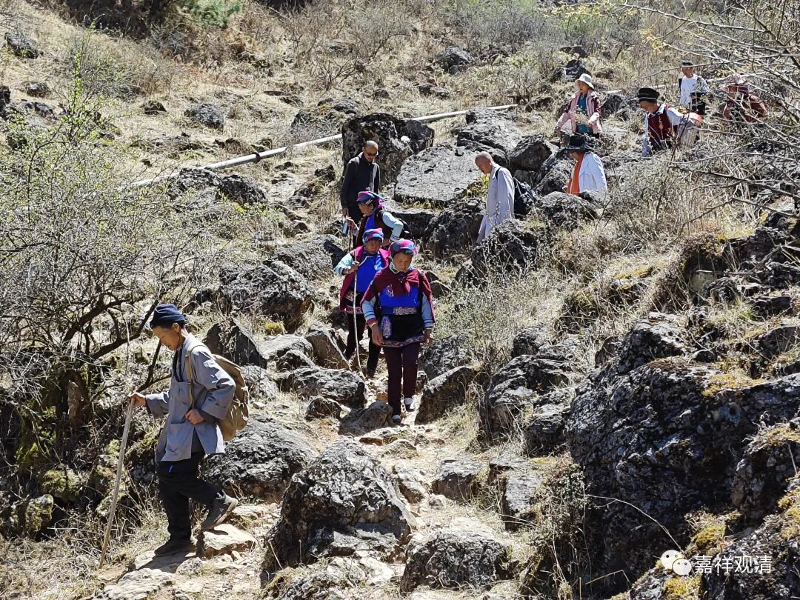
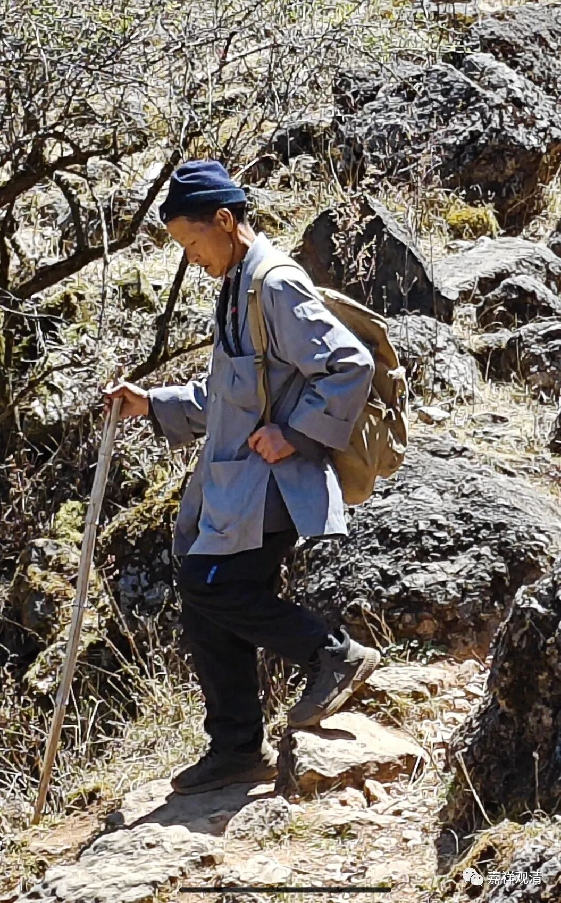
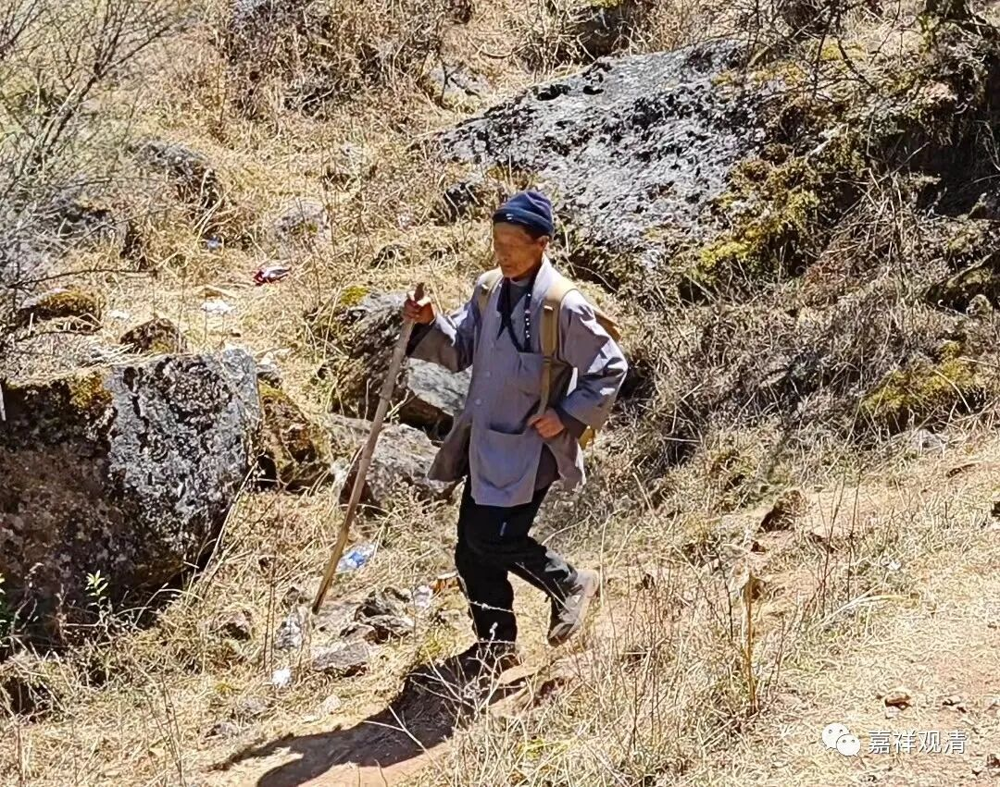
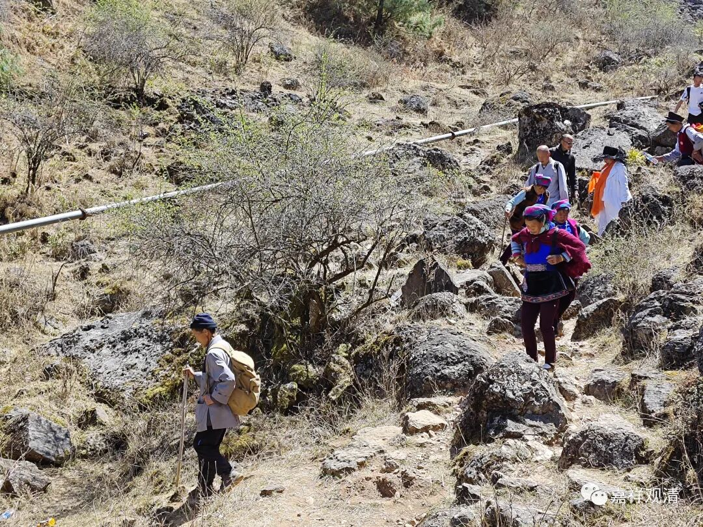
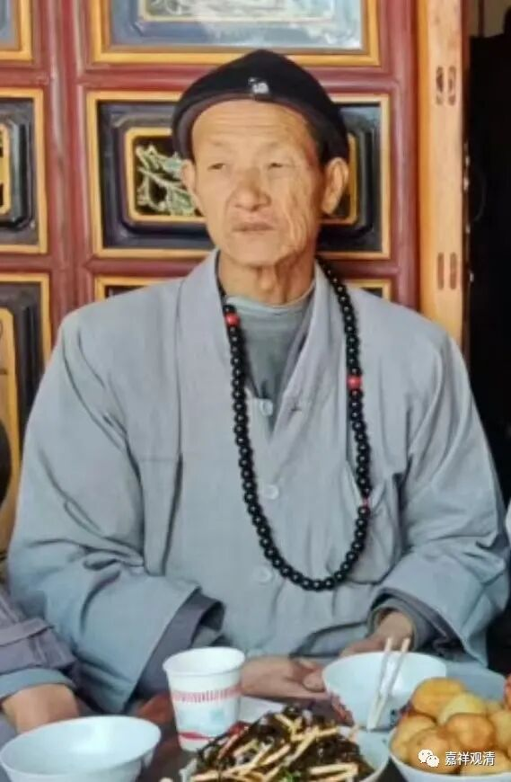
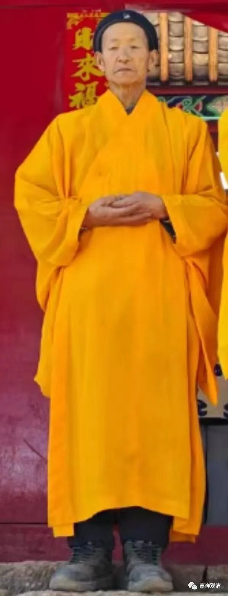

**果华法师的来历**

“鹤庆僧伽考察团”的法师们（我们真带着佛协的介绍信哦）都出去素斋馆爽了，我一个人留在宾馆，就继续给大家继续聊聊果华法师吧。

果华法师

果华法师今年76岁圆寂的，那就是1948年生的。他出家前（五六十年代）不识字，家里生活很苦，出家是为了谋一碗饭吃。有一次他师父生病，他背着师父下山，结果师徒两人都累得不行了……他先把师父安排在路边休息……

这时候耳朵里突然听到说：“你这样（背师父下山看病）师徒二人都有危险！你去前面林子里采啥啥果子，给你师父吃，病就会好，不用背他下山了。”

于是他听从“教诲”采了果子给师父吃，果然病就好了。

此后他就以医术和“看事”在当地闻名了，实际他的身份接近于村里的巫医（这里是云南，这类情况很多，几乎每个自然村都可以被“平均”到一个类似的人物），而当地人管他叫“仙人”。云南、巫医、仙人……我觉得大家应该懂了。

果华法师给人看病，用的药品类并不多，后来也不知道跟谁学了一点民间的中医，他自己用自己看得懂的“画法”记录了一些药的药效和功用（有人看到过他的本子），其实比较重要的看病能力就来自于“他力”，我觉得应该是龙族，龙族对看病很有一套的，而丽江、大理这里也比较相信龙王（到处都是“龙潭”“龙王庙”）。所以，他圆寂这天和骨灰回寺院安奉那天都出现彩虹这事儿大家就容易理解了吧，还记得吗，我一直说的是——“法师和龙族关系不错啊。”

后来，果华法师用他的技能还看好过某些大官家属的怪病，再加上原先的群众基础就比较好，后期他建寺院就稍微顺利点了。但看他建起的“妙明居”就很有点“特色”——我们跟着演悟法师走了一圈，寺院的某些通道很绕～～据说果华法师以前说的：“‘他们’从这边来嘛，我就朝那边走起咯……”还记得吗，他因为造庙被逮了18次……这边找他的人来了，他就从那边上山咯……

造个庙，不容易啊！

（上面几张，都是今年五月份的照片。

果华法师说过：他活不过76岁。）

