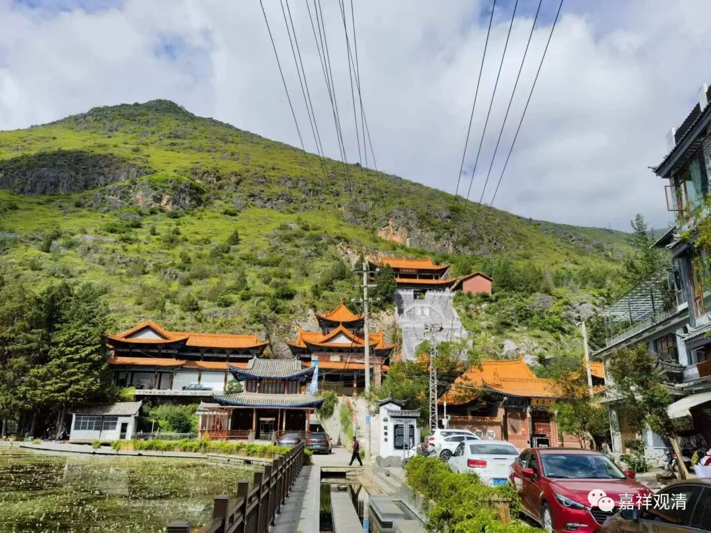

**黑龙潭的本主庙

那天在鹤庆，去附近延寿寺溜溜腿。

奈何“寻隐者不遇”，延寿寺大门紧闭。给延寿寺寂照法师留言、去电，都没有回应（晚上回了，原来他去了鹤阳寺，也和我们上山送果华老和尚）。

延寿寺在鹤庆北面新华村黑龙潭边上。

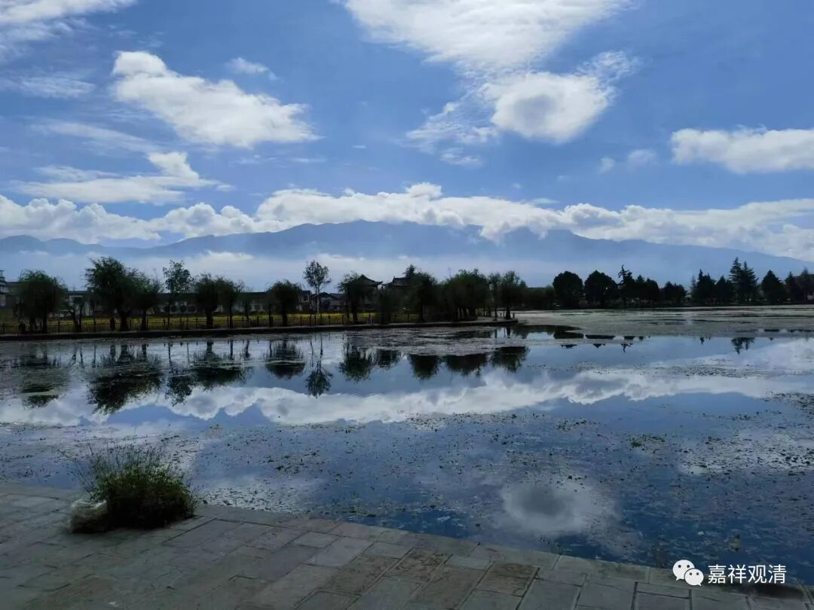

黑龙潭

鹤庆的东西两面都是连山，山脚下有很多泉，有了泉水流出，就积了很多“龙潭”，我记得有黑龙潭、白龙潭、黄龙潭、西龙潭……西龙潭在鹤阳寺边上，是鹤庆市的饮水水源；黄龙潭被开发成公园，黑龙潭边上是著名的鹤庆银器一条街，还有这个延寿寺——供奉的是“消灾延寿药师佛”（所以叫“延寿寺”）。

这里原先是个本主庙，现在本主庙还在。“本主”是云南地方信仰，“本主”大约相当于地方神，他可以是山神、龙神，也可以是释迦、观音、大黑天。黑龙潭这里本主庙供奉的是山神。

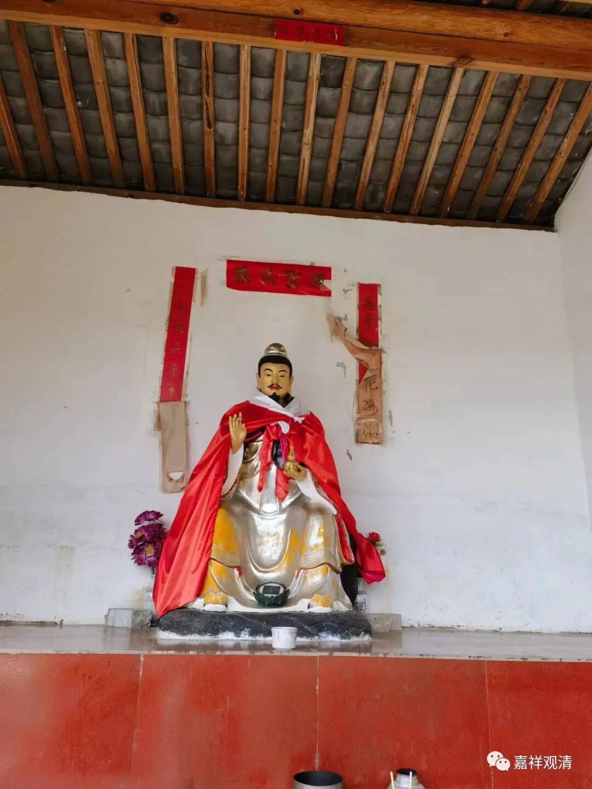

黑龙潭本主庙供奉的山神

本主庙今天好像有活动，几个白族信众在做饭，荤素都有（我有点吃惊）。和她们聊天，她们告诉我今天中午有二三十个人要来吃饭，那些人先去南边另一个本主庙烧香去了，一会儿就回来。我说你们也做鱼肉（我有点迷糊，黑龙潭边上供着龙神，怎么还杀鱼吃）？她们告诉我，她们逢初一、十五也是吃素的，平时不拘荤素，比如今天初六，就可以吃荤。她们还请我一起吃鱼、吃肉，吓得我连忙摆手，hoho，不敢不敢……

也可以看出来，当地的民间信仰一般并不知道汉传出家人有吃纯素的习惯，有些此里民间的僧人则在午饭以前茹素，晚餐则不拘，当地人也并不觉得这样的僧人不正常。这也许跟云南属于“滇密”的教区有关，正统的汉传佛教并不非常下沉，或者说下沉得尚未彻底。

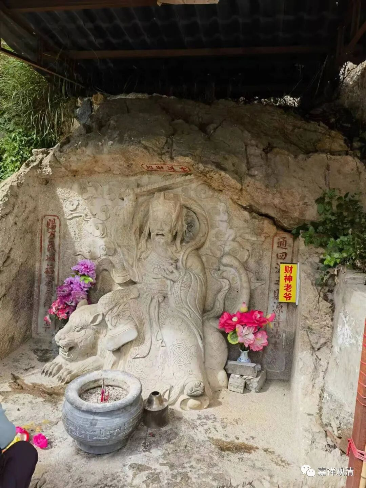

黑龙潭泉眼边上供奉的财神

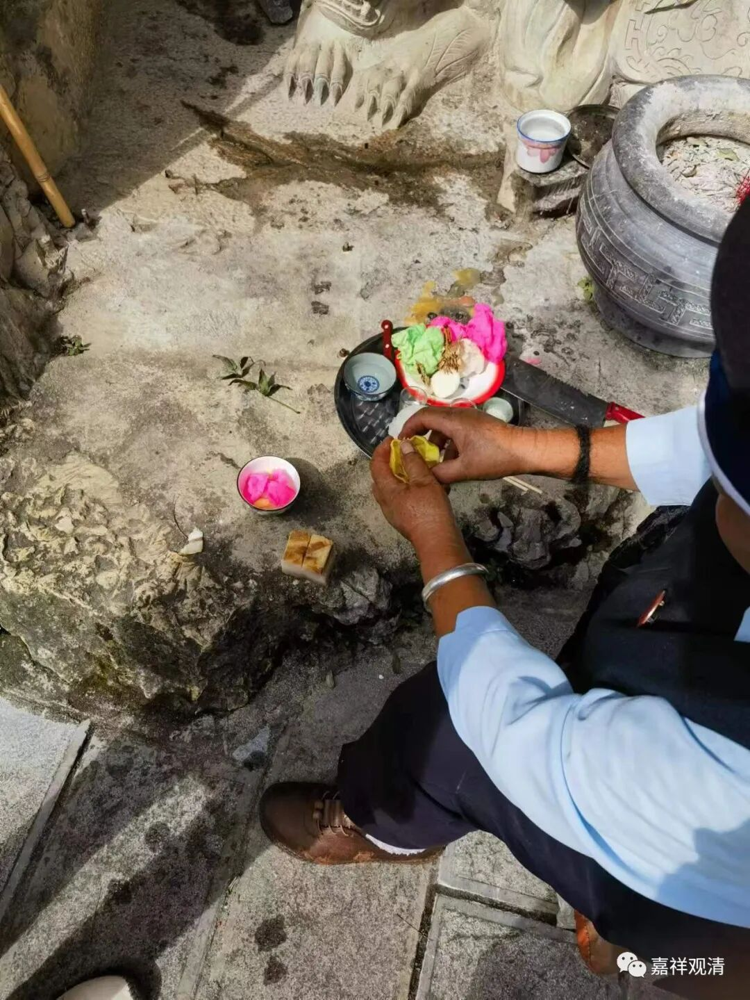

这是在供财神，红黄绿色的是染色的饵块，碗里还有腌肉。

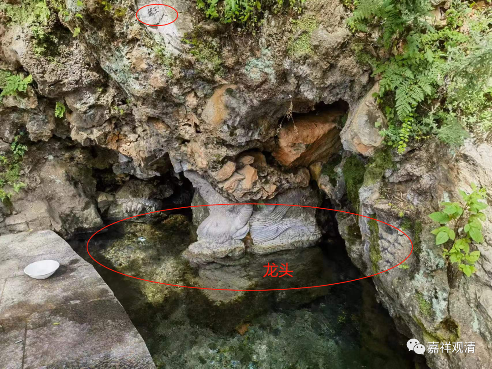

这是黑龙潭出水的泉眼，雕了龙。水很清，水量大。当地人说是因为前两天下雨。

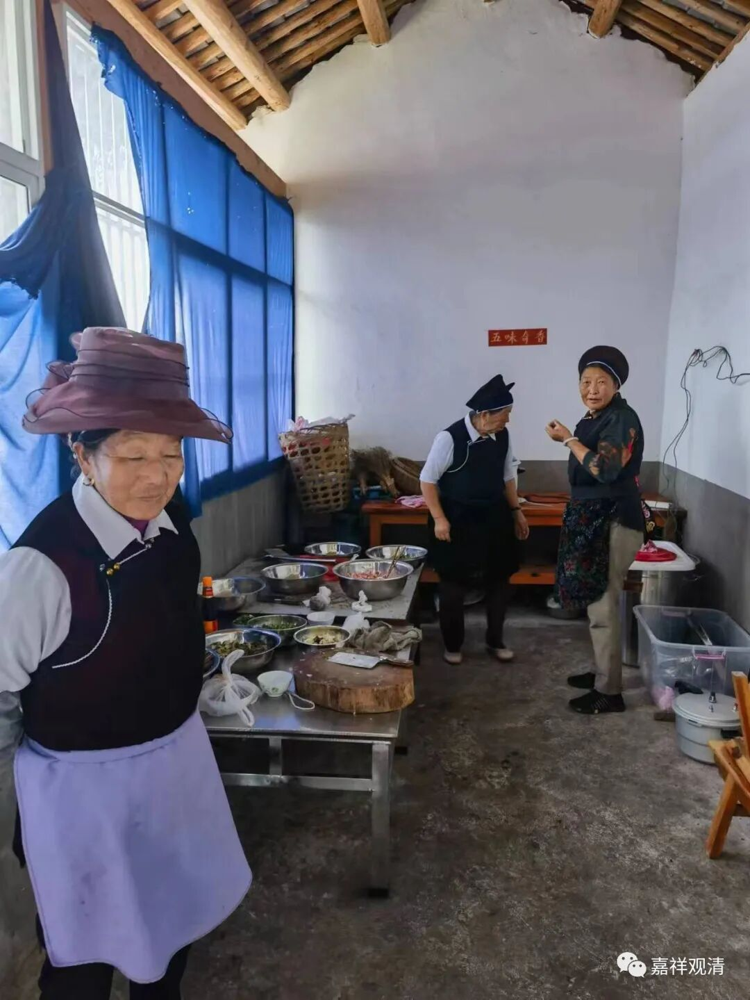

厨房里在准备午饭。

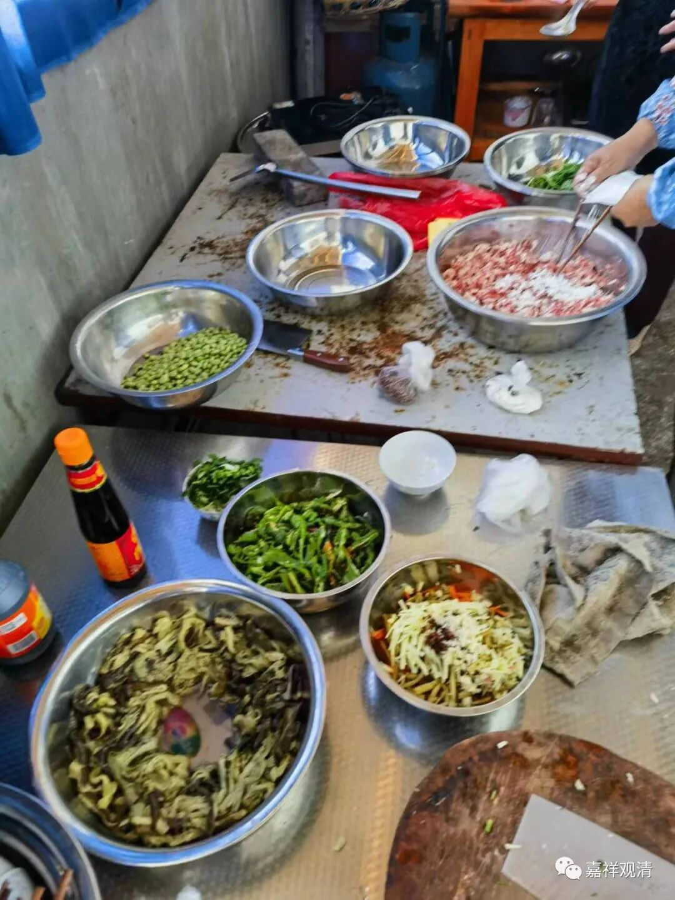

有肉糜

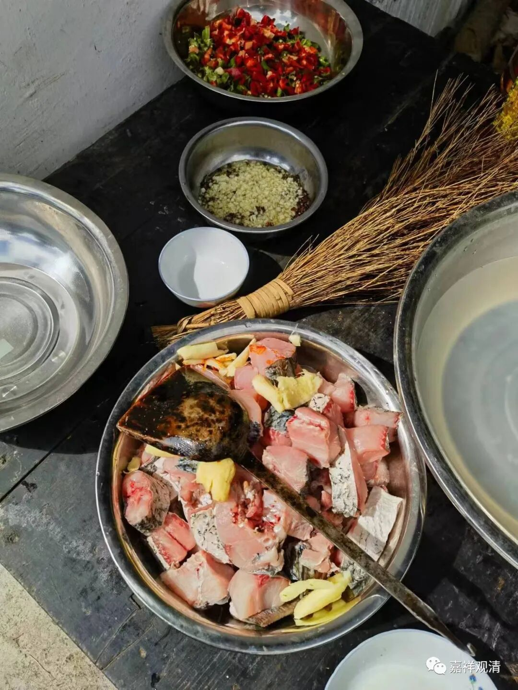

这是鱼段

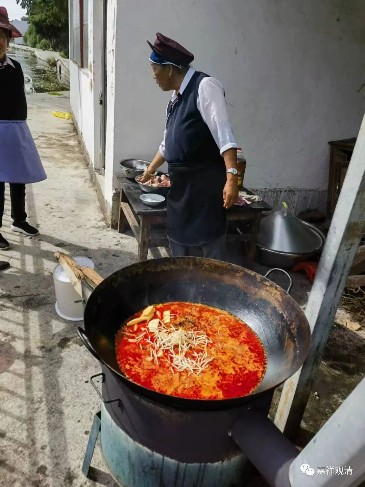

外面在做饭

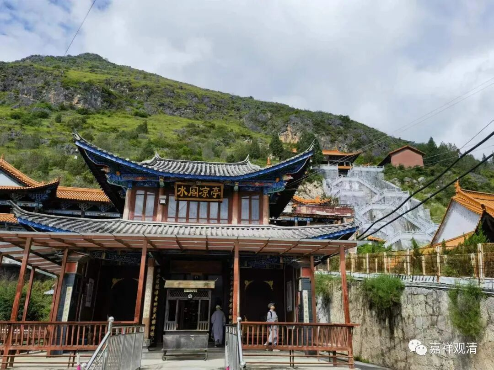

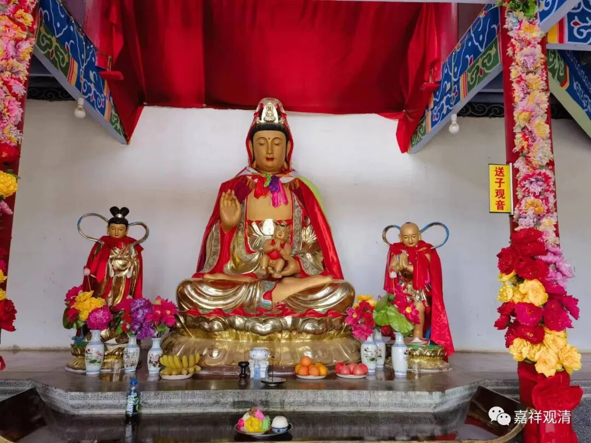

本主庙前面有个“水阁凉亭”，供的是送子观音。

昨天，延寿寺寂照法师约我过去喝普洱茶，我说我要去剑川。今天下午我又准备去喝茶，他去参加佛协组织的笔会了……这普洱茶得留到下次再尝啦。

预告：

明天聊沙溪古镇的本主庙。（参访团午饭的时候，我去本主庙采风去了。）

