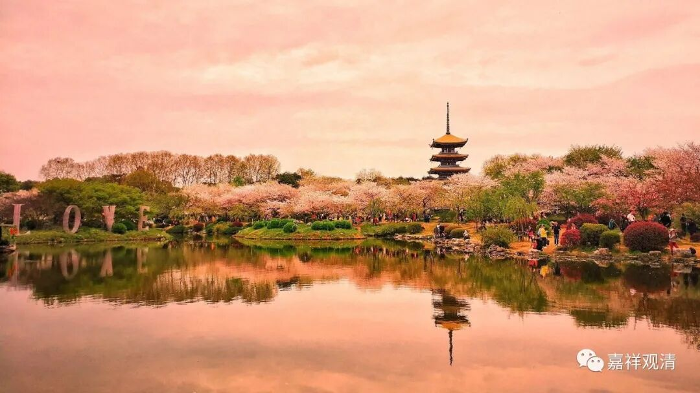

**微课佛教史406·2**

白云禅师怕别人笑，我们用哪个词呢？就是有点怯场。比如说,释迦牟尼佛有四无所畏，十八不共法，是吧？他自己讲的东西，说正道法无所畏，说这个是苦也无所畏。他所讲的苦集灭道等佛法的内容，不管别人懂还是不懂，不管别人是不是大师等等，释迦牟尼佛很确定地讲出心中的东西。

但是，如我们前面好多次所讲过的，如果你不是“己心中所出法门”，确实心里面有点慌，讲出来也不是那么有把握（，除非你被催眠了，那是另外一回事）。如果讲起来的话，一种是闻所成慧，另外一种至少是思所成慧以上的，能真正变成自己的东西，是有把握的东西，而不是被人家一笑就慌了。

这个情况其实反映在现实的禅师这里也是一样。这些禅师到了皇帝门前是什么样子，包括前面讲到的佛印了元禅师的故事，就是高丽国的僧统过来的时候，照样不给面子，该怎么样就怎么样。这种气魄，你到底有没有？

那么，我已经无数次讲过这个问题了，就是在禅宗里面，到底最后一句话（“开悟”那会儿的电光火石）有多重要？就好比在最后把这个菜给端上来的时候，我们会觉得上来摆盘的人最重要，其实做菜的人可能最重要，刀工可能很也重要，大厨他能做这个菜也很重要。

我们现在看起来，禅宗的公案都是很玄的，其实公案记录的仅仅是最后一招，前面他在师父门下学了很久，经论上下过很多功夫，可能坐了几十年眼睛都不眨一下（不倒单）——这些基础可能才是最重要的。实际上在那里长期地打坐才是最重要的，但是打坐这事儿你没法写出来。你要是这样去写禅宗里的这些禅师的话，谁谁谁坐了十年，谁谁谁又坐了二十年，这个写出来没有意义，没有表现力。

另外一方面，我们也讲了，禅宗的公案是一种新的写作方式，就是一种全新的传记的写作方式，非常的“世说新语”化——它通过一两个故事，就把人物给立住了。结果到了江湖上，就像唐宋时期一个人要出名，很有可能就是一两首诗，这个人就出了名了。同样地，在禅宗里面的这些禅师们，重要的是江湖上传他一两个故事，就把一个人物给立住了。但是其实这些故事的背后绝对不是这么肤浅、这么表面的东西，可是到了后来，就变成好像禅宗就剩下这么机智问答了，于是大家都玩佛教脑筋急转弯——其实佛法不是这样学的啊，禅宗也不是。

好，今天我们就先讲到这里，谢谢大家！

