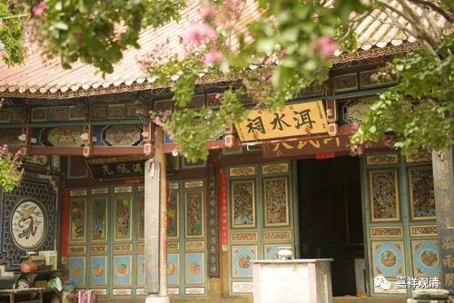

**云南游之聊聊云南的龙神信仰**

这次在云南走了些地方，丽江、大理、鹤庆、剑川、昆明，发现，龙王信仰在这里很“富集”，到处都是“龙潭”“龙王庙”“龙神会”。我们看看这一路上看到过的——

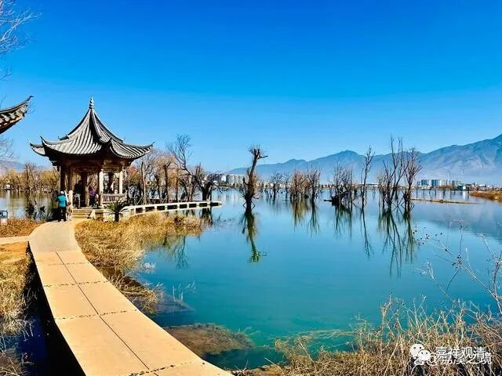

鹤庆黄龙潭公园

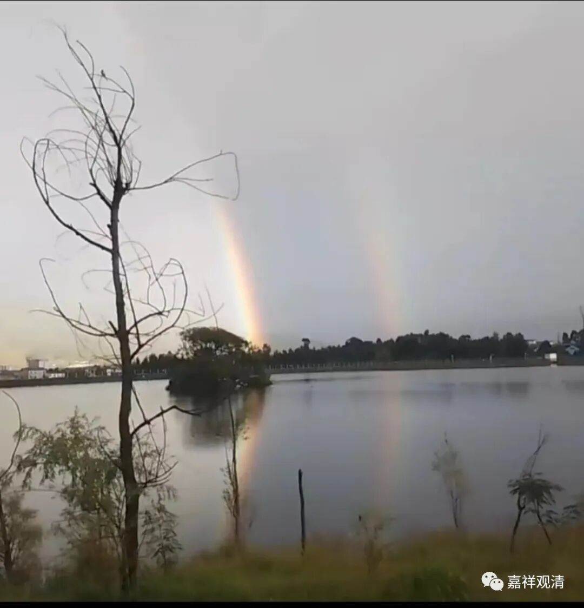

鹤庆西龙潭

鹤庆黑龙潭

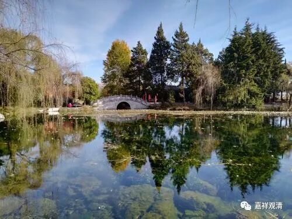

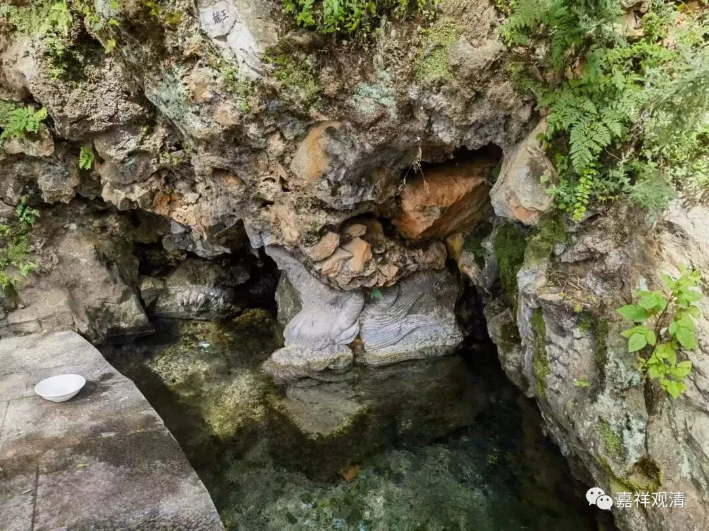

鹤庆白龙潭

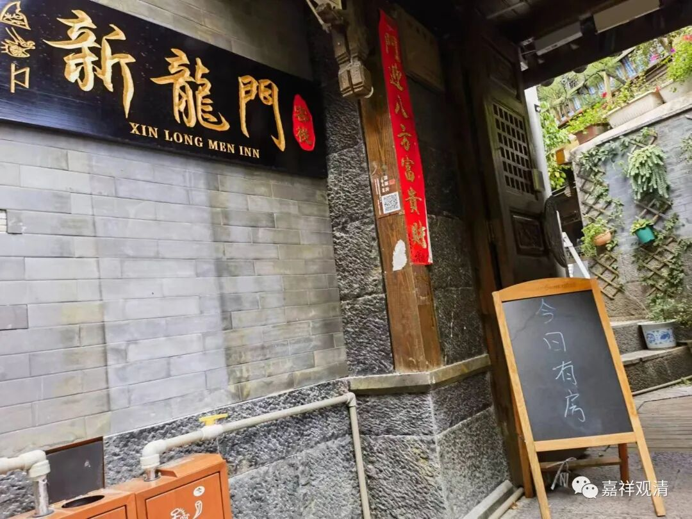

新龙门客栈，哦，这个不是

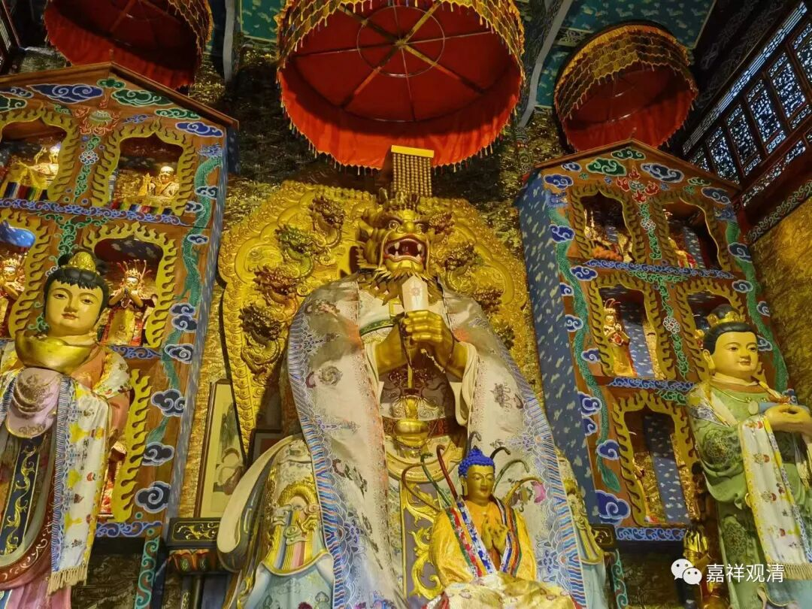

白马龙潭财神庙供的龙王

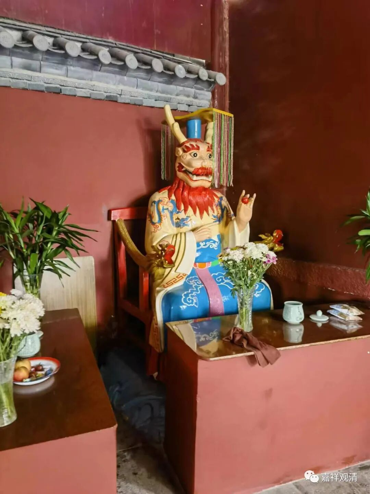

白马龙潭寺供的龙王

白马龙潭

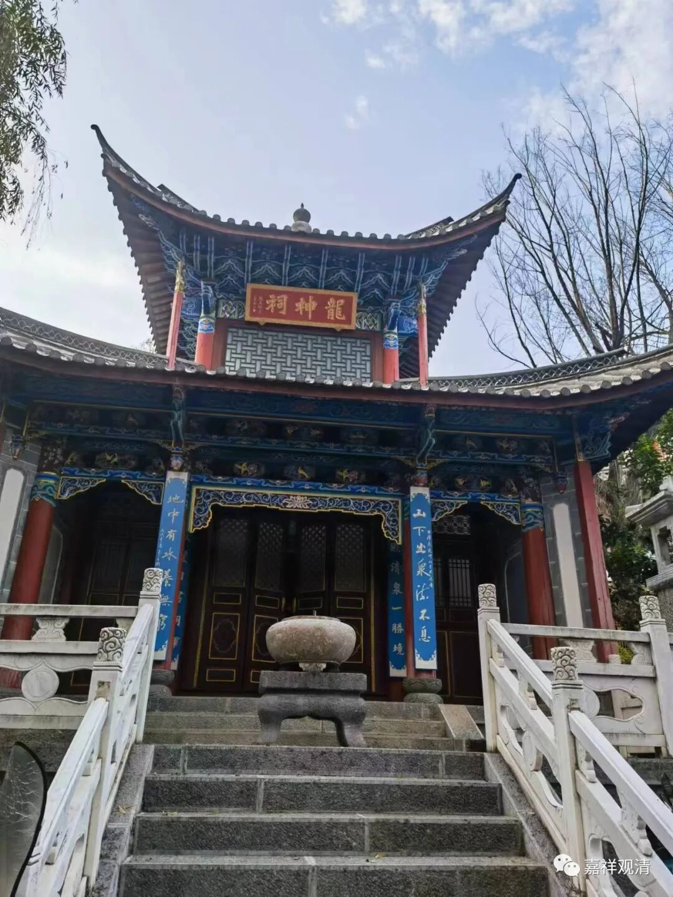

丽江，龙神祠

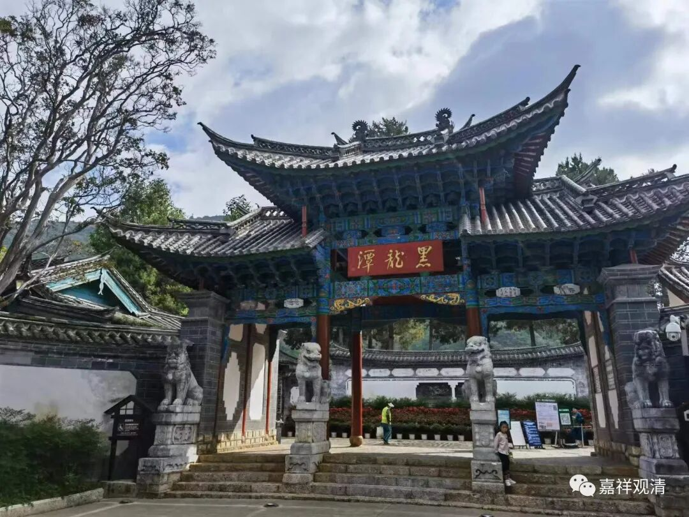

丽江黑龙潭

有纳西人告诉我，丽江确实有龙神信仰（同时有金翅鸟信仰），经常有阿婆们在龙潭边上祭拜、烧香、“野炊”的仪式，但确实没有专门吃素的习惯。按理说龙族比较欣赏素食者……不过也能理解，汉文化里面供龙也经常有血祀，经典的有“哪吒闹海”里表现的血祀——“送童男童女来！”。

丽江的东巴人，有东巴教，现存。

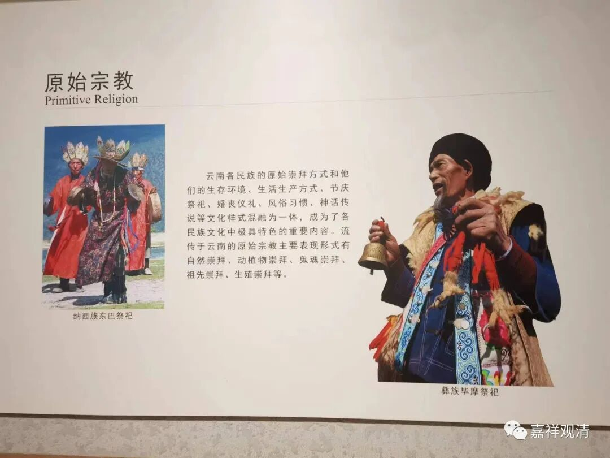

东巴教说：有一个“水界”，和我们“人界”相对独立，是另一个生物“世界”。人类要避免生病之类，就要祭祀“署”，“署”就是水界的神……

这里东巴教说的“水界”和“署”，非常类似佛教里说的“旁生界”和“龙族”（东巴教有佛教、道教、苯教、东巴本土文化的多重来源）。旁生道主要在水里，龙族是旁生当中福报较大的，龙族和疾病、和水、和环境有关，炸山、开矿、排污、破坏森林……都会影响到龙族的生存，而遭到龙族强烈的报复。祈竹仁宝哲也说，以后龙族的栖息环境被人类大破坏，龙族要报之以各种怪病的……不用治，根本治不好——现在看来，是越来越真实了。

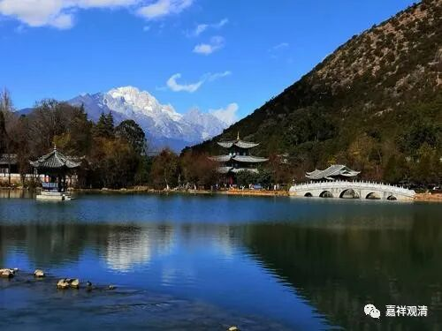

丽江黑龙潭

现在丽江的水系已经明显地被破坏了，很多泉眼干枯，一些“龙泉”的出水量比起三、四十年前已经有了明显的下降，中年人说：小一辈的年轻人根本想象不到以前的水量有多大……乃至如果某次大雨后黑龙潭的某个干涸的泉眼重新出水，当地人都要兴奋很久，但这样的事也很少见了。

由于泉水数、量都下降，当地甚至规划了一个拉市海通海工程，引流入黑龙潭，再到古城……

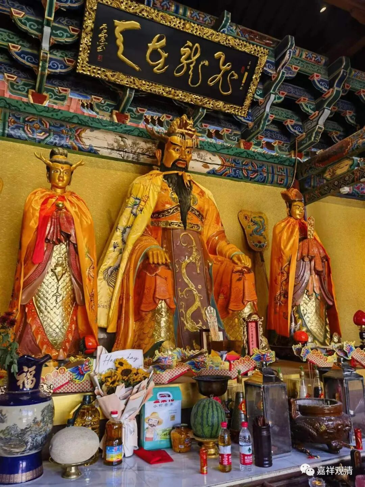

“飞龙在天”·昆明滇池的龙王庙

“龙王们”的具体事情我们不太了解，但以前朴素的龙王信仰（的敬畏）保护了山川和环境，比起现在“人定胜天”的预设，要美好得多。

我问过对宗教圈对龙族比较了解的“专家”，我问是否隔壁排污水会……回答是：伤害很大，报复也会很大！

人类终究是太自信了！

