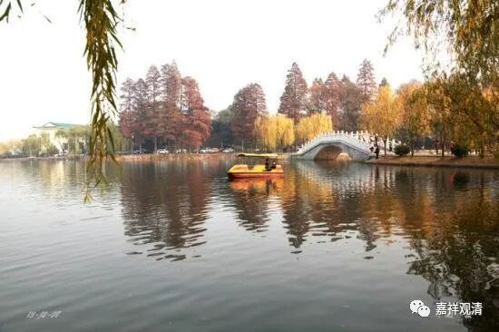

**微课佛教史407·3**

云游中的五祖法演禅师来到了慧林院，到了宗本禅师门下。说是在宗本禅师门下，其他的问题都解决了，只有一个公案没有解决。我还是觉得这是后期的说法，你要说其他公案都解决了，一个公案解决不了，假如这个公案是假的，难道你前面已经完全开悟了吗？可能不是这个意思。可能也就是有一个公案没有解决，没有理解。

我先把这个公案说了吧，是什么呢？说是兴化存奖禅师的故事，我们好像没有讲过。这个故事说有人问：“四方八面来时如何？”兴化存奖禅师回答说：“打中间底。”然后这个提问的人就磕头作礼了。兴化存奖禅师就说：“昨日赴个村斋（我昨天去赶个斋），中途遇一阵卒风暴雨，却向古庙里躲避得过。”

这个公案，五祖法演禅师一开始没搞清楚，就去问宗本禅师。宗本禅师说：“兴化存奖禅师是临济宗的，这个问题你要去问临济宗。”所以五祖法演禅师就跑去找临济宗的人问了，他找了谁呢？找了浮山法远禅师。

过两天我们会讲浮山法远禅师这个人，因为临济门下比较重要的就是，在他门下开出了——这个有点麻烦，其实不是在他的门下，是他指导了曹洞宗的投子义青禅师。浮山法远禅师也是当时的一位大禅师，他的子嗣不济，反而是他帮人家代培训的投子义青禅师下面开枝散叶，把整个曹洞宗都接过去了。

那么，我们今天就讲了五祖法演禅师出家以后，先学习《唯识》和《百法》，然后再去学禅宗。因为兴化存奖禅师讲的一个问题没有解决，他就去找到了临济门下的浮山法远禅师。

那我继续讲下去吧，浮山法远禅师就说：“你问我这个问题，就像村里的老头挑了一担柴去卖，结果在十字路口却去问人家中书堂里今天在谈什么。”他的意思就是说，卖柴的老头挑了一担柴，在路口问人家今天联合国大会讨论在什么事情，或者说今天宰辅首相们在讨论什么事情。这什么意思呢？都跟你没关系！

这种情况真的很常见，我已经说过很多次了。有时候真的就是拾人牙秽，别人的事情其实根本不是你的问题，跟你完全一点关系都没有，根本不是你的问题。

好，今天我们先讲到这里吧，谢谢大家！

