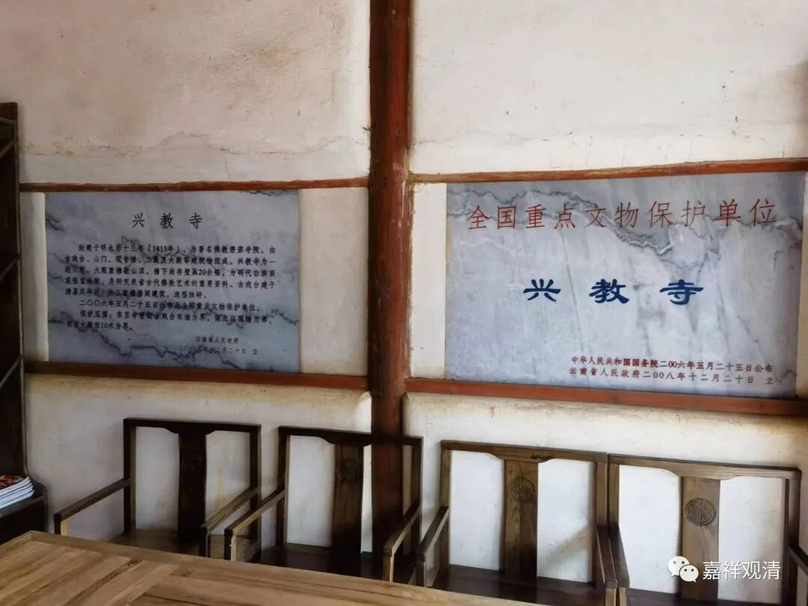

**沙溪古镇的兴教寺

上次说了沙溪古镇的本主庙，继续聊聊兴教寺。

出家人比较多，有人提起西安的兴教寺。西安的兴教寺比较有名，玄奘法师塔院就在那里。

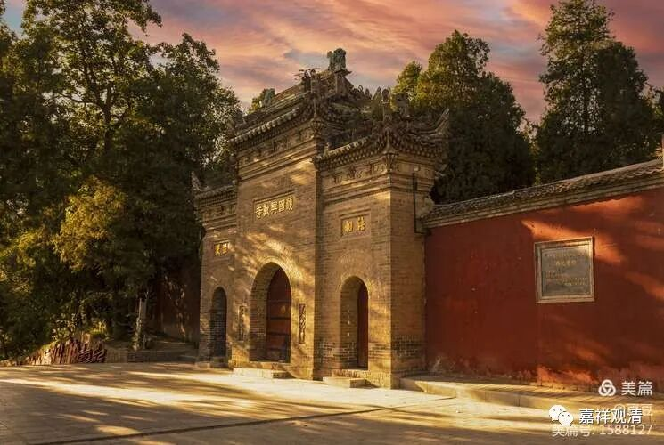

塔院里有三座塔，分别是玄奘大师塔（中间）、圆测大师塔（玄奘塔右手边）和基大师塔（玄奘塔左手边）。

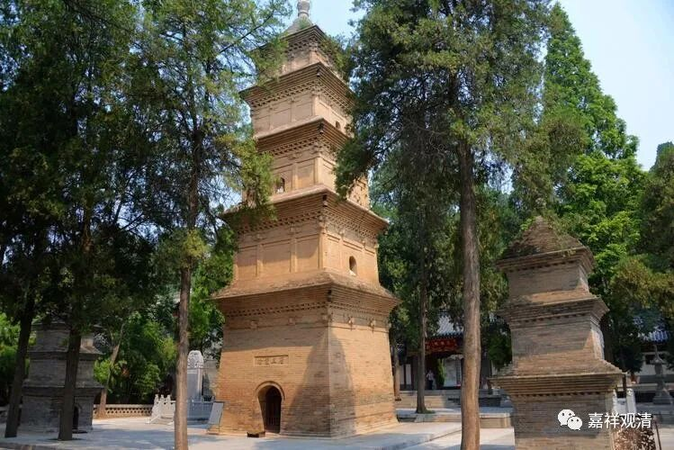

近些年全国各地纷纷冒出“玄奘法师头骨舍利”，简直莫名其妙——玄奘法师全身在西安兴教寺，自唐高宗时代建塔以后就再没有变动过，不知道其他寺院的舍利是如何“击穿”信史记载的……不过“刘项原来不读书”，教界大佬和基础信众也“一向不读书”，他们那种可怜的信仰建立在虚构的舍利之上……呵呵，拜假舍利的要远多于拜“真舍利”的——玄奘法师翻译的书有几个人看呢？

谈回沙溪的兴教寺。

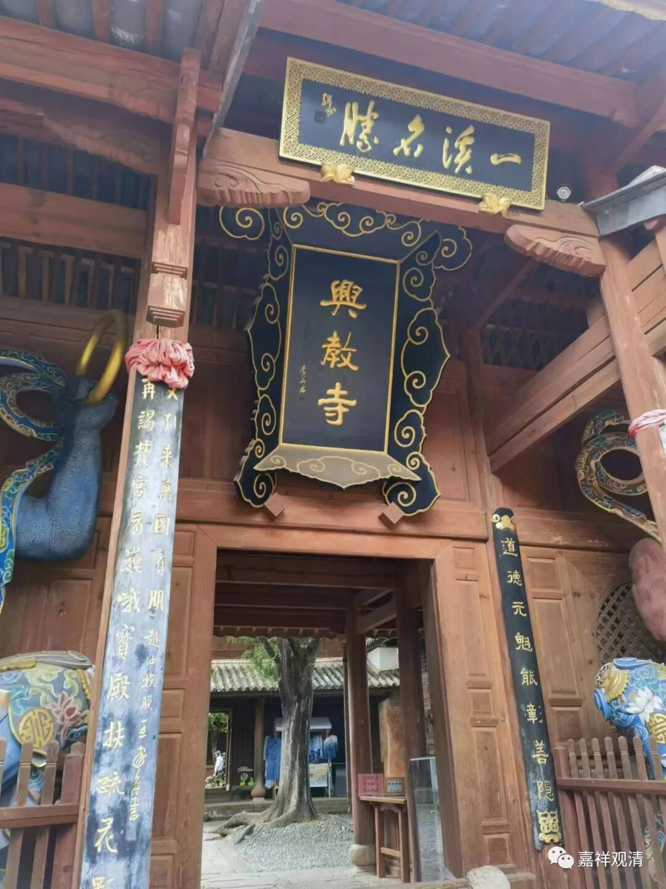

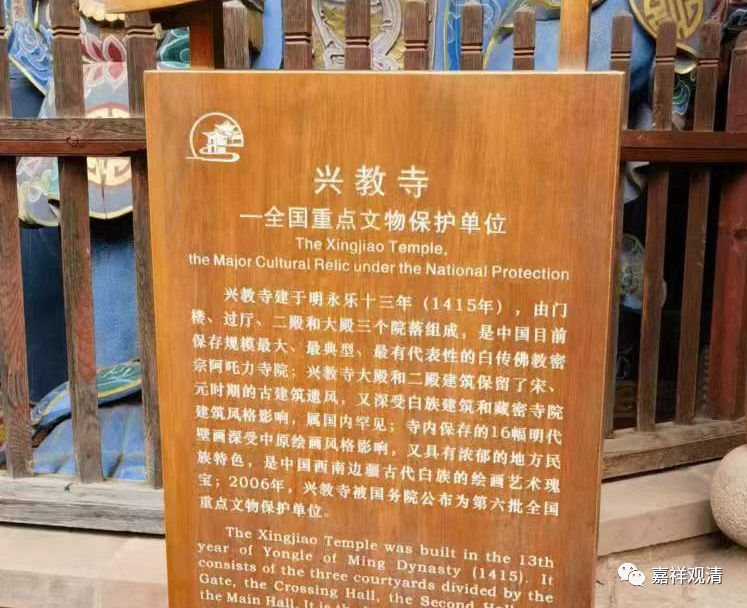

看图

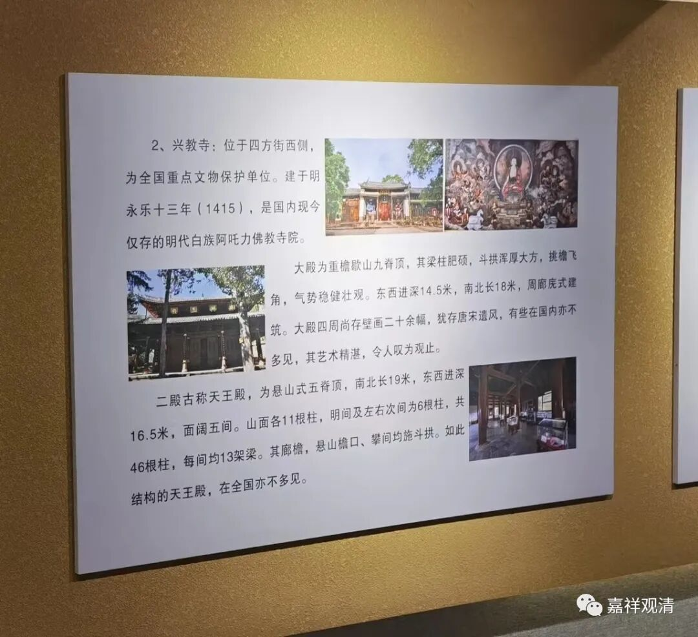

沙溪兴教寺是全国第六批文保单位，它是白族阿吒力教（佛教在云南“地方”的一种存在，有汉传佛教、密宗、藏传佛教、民间宗教的混合背景）的寺院。

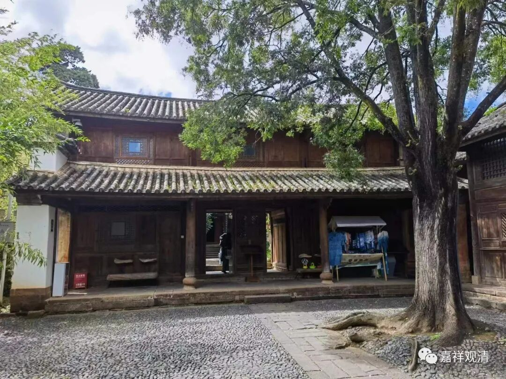

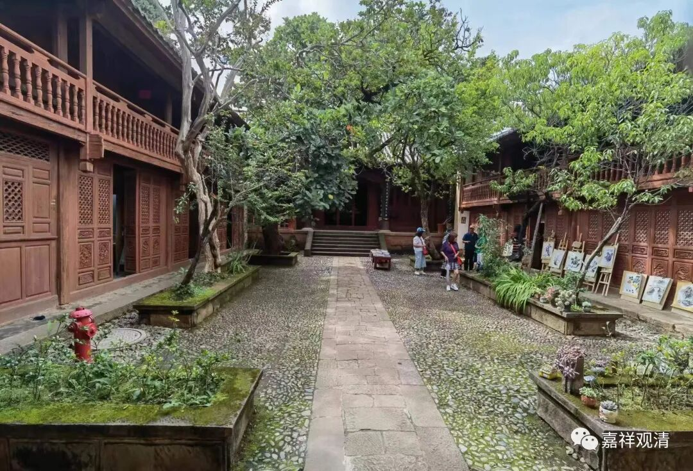

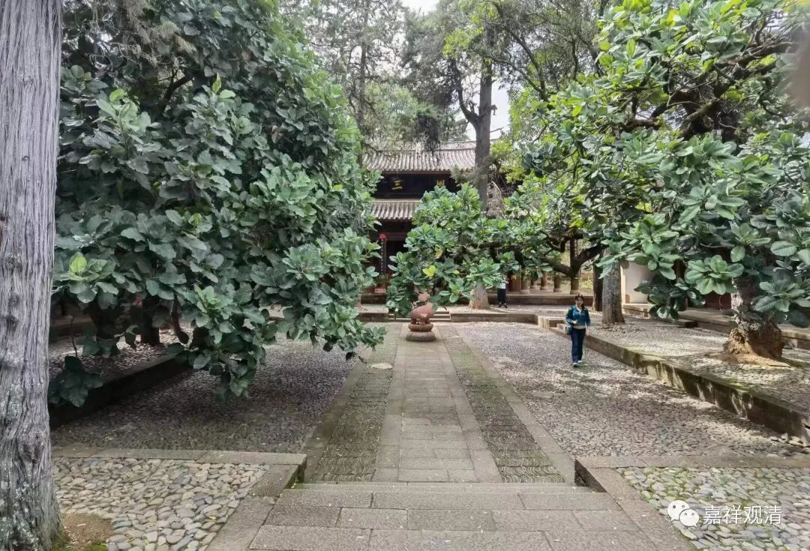

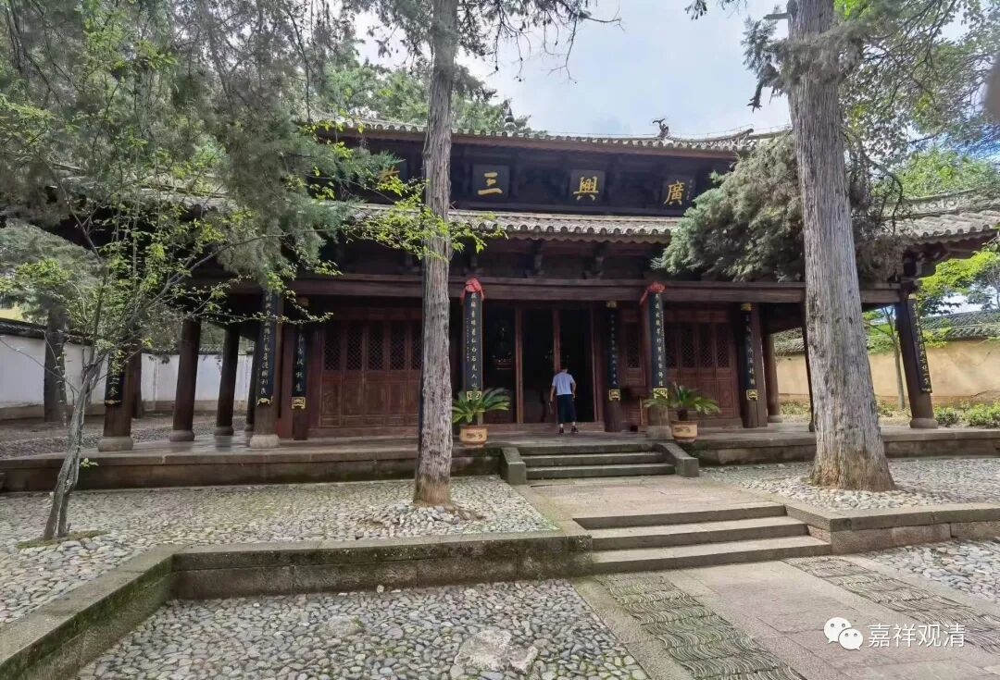

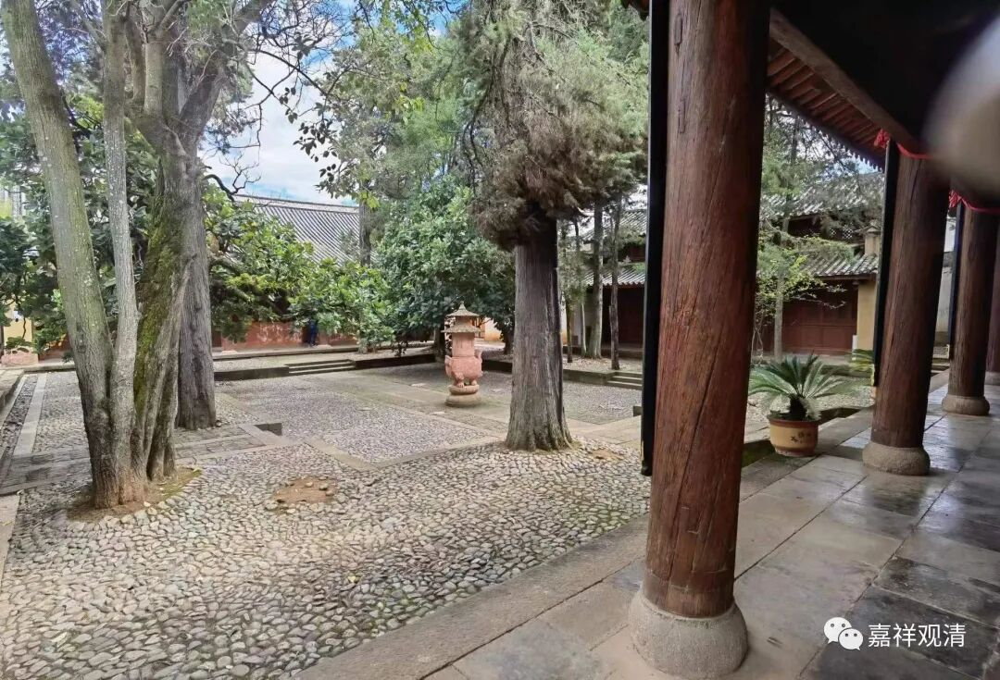

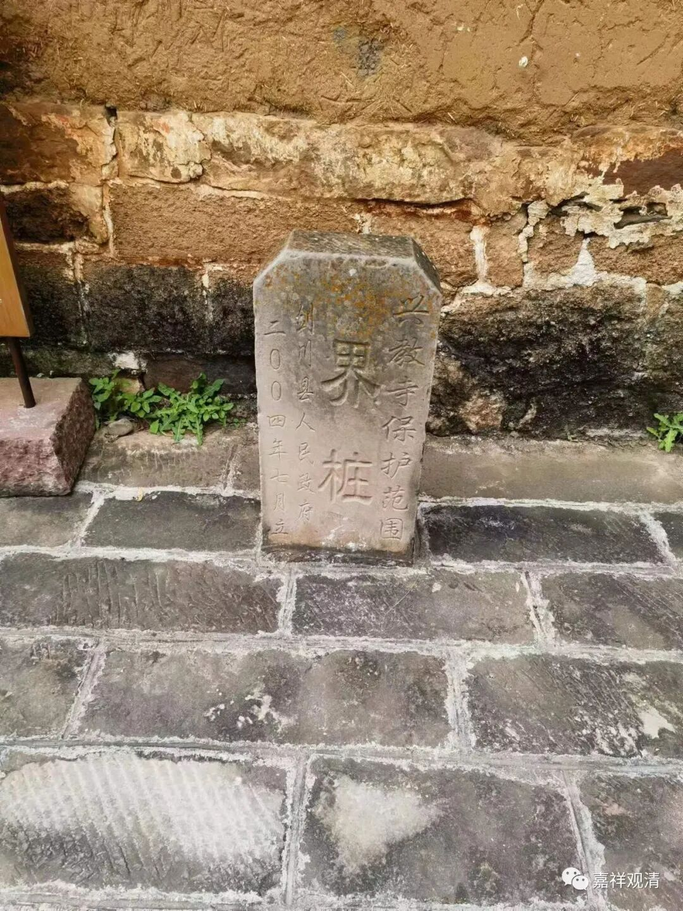

网上的各种介绍“阿吒力”的比较令人懵圈，有写“阿阁梨”的（这里的“阁”应该是“阇”），也有写“阿托黎”的（这里的“托”当作“吒”），其实就是梵文里的“阿奢黎”acarya，简单说就是师父的意思。

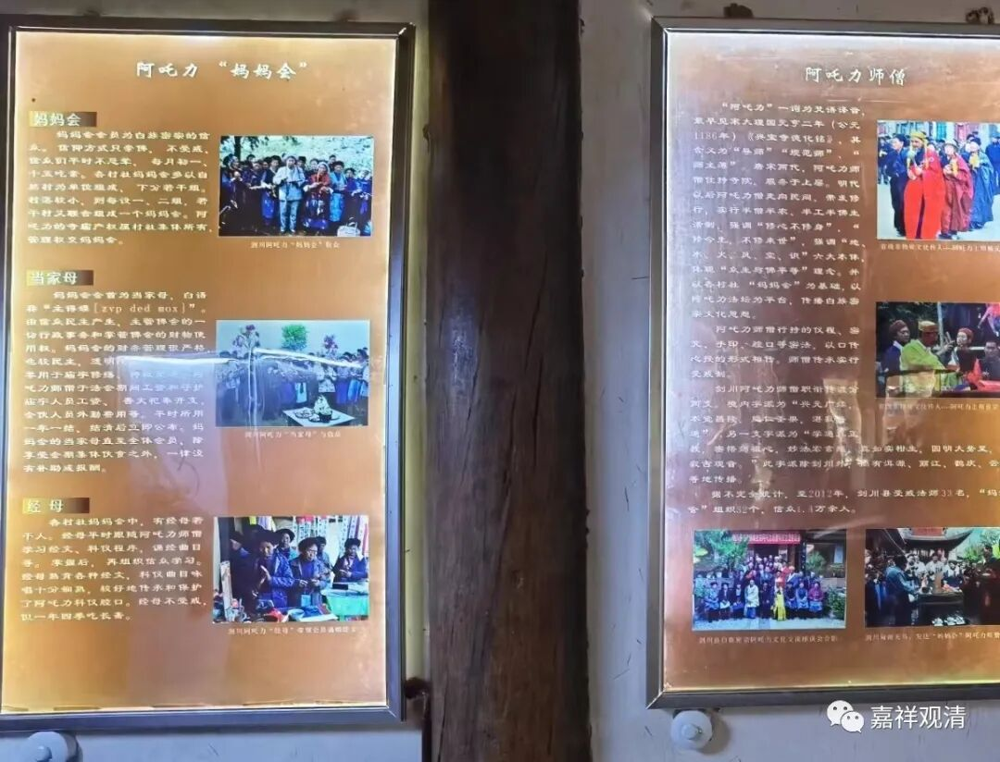

现在有人管这个阿吒力教叫“滇密”，我觉得这个名词有过于拔高之嫌，毕竟现存的、可考的“滇密”“阿吒力教”（如上）基本都属于民间佛教一类，最好的归类也不过属于“在民间”的佛教，给一个“高大上”的名词“滇密”无法真正拔高它的实际水准。

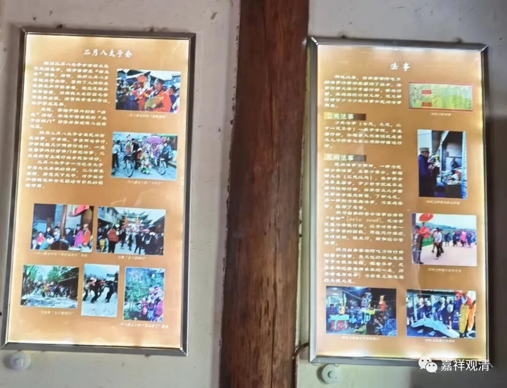

从我这个外行简单的“唯物史观”朴素地看来，明代傅友德、沐英南征云南，对当地的宗教自然进程是起了破坏作用的——和整个明代汉传佛教迅速降阶基本同时，云南地区的佛教也在明代断崖式地民间化、去智化，到明末已经是不折不扣的“边地”了。

